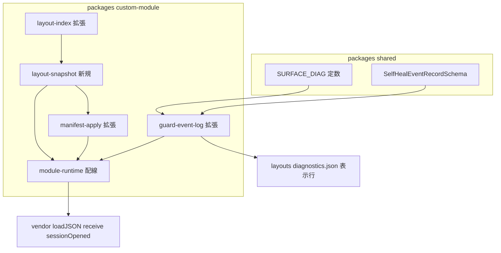
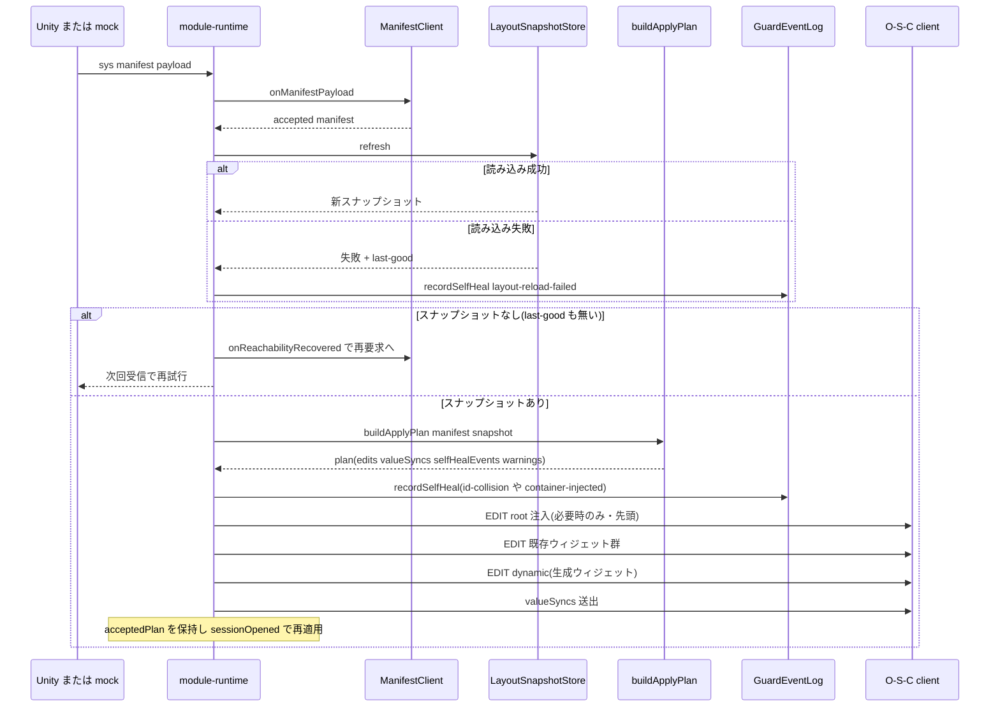

# Technical Design — layout-convention-enforcement

## Overview

**Purpose**: 本機能は、レイアウト規約 2 件(id `dynamic` のコンテナ必須、`dyn` プレフィックス予約)を「人間が警告ログを見て守る運用」から「custom module が構造的に違反を無害化する仕組み」へ置き換える。レイアウト作成者は任意の ID・構成でレイアウトを編集でき、規約違反は自動修復(ID 一意化・コンテナ注入)とレイアウト照合表の適用直前再読み込みにより silent な機能喪失にならない。

**Users**: レイアウト作成者は規約を意識せずレイアウト JSON を編集・保存し、再起動なしで次のマニフェスト適用に反映される。運用者は自己修復の発動を診断パネルとサーバーログで把握する。

**Impact**: `packages/custom-module` のマニフェスト適用経路を変更する。`layout-convention.ts` を廃止して新規 `layout-snapshot.ts` に吸収し、`buildApplyPlan` のシグネチャを `LayoutIndex` から `LayoutSnapshot` へ変更する。O-S-C 本体(`vendor/open-stage-control`)は無改造。

### Goals
- 生成ウィジェット ID をレイアウト既存 ID と決定的に一意化し、予約プレフィックス規約と関連警告を廃止する(Req 1, 2)
- dynamic コンテナ欠落時に `/EDIT root` でモーダル型コンテナを自動注入する(Req 3)
- マニフェスト適用直前にレイアウトファイルを再読み込みし、失敗時は last-good で継続する(Req 6)
- 自己修復の発動をサーバーログ + 診断パネルへ配信する(Req 4-4)
- 衝突なし・コンテナ存在の正常系では従来と同一の適用結果を維持する(Req 5)

### Non-Goals
- O-S-C 本体の改造、`/sys/*` プロトコルおよび Unity 側実装の変更
- マニフェストスキーマ(`packages/shared` のマニフェスト関連型)の変更
- `layouts/` 既存レイアウトのウィジェット構成変更(diagnostics.json への表示行 1 追加を除く)
- レイアウトファイルの常時監視(ファイルウォッチャ)。再読み込みは適用直前のみ(D-4)
- 注入発動時のマニフェスト対象外ウィジェット値の完全保存(緊急回避の許容コスト。research.md 参照)

## Boundary Commitments

### This Spec Owns
- マニフェスト適用計画の構築経路全体: レイアウトスナップショット取得(読み込み・検証・ID 集合・last-good)→ 計画構築(ID 一意化・注入 edit)→ 適用・イベント配信
- 生成ウィジェット ID の割り当て規則(決定性を含む)
- 自己修復イベントの定義・記録・診断配信(`SURFACE_DIAG.SELF_HEAL` アドレスと `SelfHealEventRecord` スキーマ)
- レイアウト規約検証の存続分(重複アドレス警告、重複 dynamic コンテナ警告)

### Out of Boundary
- 誤接続ガードの判定ロジック(`ManifestClient` の projectId 照合)— 既存のまま流用
- 診断エンジン(`diagnostics-engine.ts`)・NDJSON writer/quota の内部 — 既存 API を利用するのみ
- Unity 側のマニフェスト送出仕様(`docs/UNITY_PROTOCOL.md`)— 不変
- O-S-C の /EDIT・sessionOpened の挙動 — vendor v1.30.4 固定の既知挙動に依存するのみ

### Allowed Dependencies
- `@osc-surface/shared`(定数・zod スキーマ。本 spec で SELF_HEAL 定数と SelfHealEventRecordSchema を追加)
- vendor 提供のグローバル: `loadJSON`(キャッシュなし読み込み)、`receive`(/EDIT 送出)、`settings.read('load')`、`app`(sessionOpened)
- 既存モジュール: `widget-catalog.ts`、`ndjson-writer.ts` / `ndjson-quota.ts`(guard-event-log 経由)
- 制約: `vendor/open-stage-control` への import・改変は禁止。依存方向(後述)への違反は禁止

### Revalidation Triggers
- `ApplyPlan` / `buildApplyPlan` のシグネチャ変更(consumer: module-runtime、テスト群)
- `SURFACE_DIAG` 定数の追加・変更(consumer: diagnostics.json、E2E)
- 注入モーダルの props 形状変更(consumer: E2E フィクスチャ、docs/VERIFICATION.md)
- vendor submodule のタグ更新(root id 固定・/EDIT 配列置換・loadJSON 挙動の再確認が必要)

## Architecture

### Existing Architecture Analysis
- 現行フロー: `init()` でレイアウトを 1 回だけ読み込み `validateLayoutConventions`(警告のみ)+ `buildLayoutIndex`(address→id)。`/sys/manifest` 受信で `buildApplyPlan(manifest, layout)` → `/EDIT` 群 + valueSyncs を `receive` へ流し、`acceptedPlan` を保持。`sessionOpened` で `applyPlanToClient(acceptedPlan, clientId)` により新クライアントへ再現
- ギャップ: (a) レイアウト全体の ID 集合が存在しない、(b) レイアウトは起動時に固定、(c) コンテナ欠落は警告のみ、(d) 生成 ID の正規化衝突(`/a/b` vs `/a_b`)が未処理
- 維持する既存パターン: plan の純関数構築 + runtime での副作用実行、`acceptedPlan` 再適用機構、guard-event-log の publish/publishTo/NDJSON 配線、DI 可能な `CustomModuleRuntimeDeps`

### Architecture Pattern & Boundary Map



**Architecture Integration**:
- 採用パターン: ハイブリッド分割(validate-gap 推奨)。読み込み+検証+last-good を `layout-snapshot.ts` に集約し、`buildApplyPlan` は純関数のまま拡張、イベント配信は `guard-event-log.ts` の最小拡張
- 依存方向(左からのみ import 可。違反はエラー扱い): `shared` → `widget-catalog` / `layout-index` → `layout-snapshot` → `manifest-apply` → `module-runtime`。`guard-event-log` は `shared` のみに依存し、plan/snapshot からのイベントは module-runtime が仲介する(イベントログは適用経路を知らない)
- 廃止: `layout-convention.ts` / `layout-convention.test.ts`(検証責務は layout-index の警告と snapshot の重複コンテナ警告へ移管)
- Steering 準拠: steering ディレクトリは空のため、CLAUDE.md の絶対規律(vendor 無改造・案件差分はデータ・Unity が真実の源)を規範とする

### Technology Stack

| Layer | Choice / Version | Role in Feature | Notes |
|-------|------------------|-----------------|-------|
| Custom module | TypeScript + esbuild 単一バンドル(既存) | 全変更の実装先 | 新規依存なし |
| Schema | zod(既存、shared) | SelfHealEventRecord の検証 | GuardEventRecordSchema と同型パターン |
| Vendor runtime | Open Stage Control v1.30.4(submodule 固定・無改造) | /EDIT・loadJSON・sessionOpened | 挙動は research.md で vendor ソース検証済み |
| Test | vitest(unit)+ Playwright chromium(E2E)(既存) | 決定性・注入・再読み込みの検証 | 新規依存なし |

## File Structure Plan

### Directory Structure
```
packages/
├── shared/src/
│   ├── index.ts            # 変更: SURFACE_DIAG.SELF_HEAL 追加
│   └── schemas.ts          # 変更: SelfHealEventRecordSchema 追加、NDJSON union へ組み込み
├── custom-module/src/
│   ├── layout-index.ts     # 変更: widgetIds / excludedContainerHits を追加収集
│   ├── layout-snapshot.ts  # 新規: 読み込み + 検証 + ID 集合 + rootWidgets + last-good
│   ├── manifest-apply.ts   # 変更: buildApplyPlan(manifest, snapshot) へ拡張
│   ├── guard-event-log.ts  # 変更: recordSelfHeal 追加(最小拡張、改名なし)
│   ├── module-runtime.ts   # 変更: 適用直前 refresh、イベント配信、init 挙動変更
│   ├── layout-convention.ts        # 削除(layout-snapshot へ吸収)
│   └── *.test.ts           # 対応テスト追加・更新(layout-convention.test.ts は削除)
layouts/
└── diagnostics.json        # 変更: diag_self_heal 表示行を 1 行追加
tests/e2e/
└── *.e2e.test.ts           # 変更: 規約違反レイアウトの自己修復シナリオを追加
docs/
└── VERIFICATION.md         # 変更: 手動検証手順の追記(プロジェクト規律)
```

### Modified Files(責務の要点)
- `layout-index.ts` — 既存の address→id 走査と同一トラバーサルで「除外コンテナ配下を除く全ウィジェット ID 集合」と「除外コンテナ id の出現回数」を収集(二重走査を回避)
- `module-runtime.ts` — `layout` 変数と起動時 `validateLayoutConventions` 呼び出しを `LayoutSnapshotStore` に置換。`applyManifest` 内で `refresh()` を呼び、plan の自己修復イベントを guard-event-log へ仲介

## System Flows

### マニフェスト適用フロー(再読み込み・一意化・注入)



フロー上の決定:
- edits の順序は plan 内で固定: 注入 edit(あれば先頭)→ 既存ウィジェット edit → dynamic コンテナ edit。valueSyncs は全 edit の後。root 全再構築による値リセットを、マニフェスト対象アドレスについては valueSyncs で復元する(research.md の Decision 参照)
- スナップショット取得に一度も成功していない状態で適用不能になった場合は、その適用をスキップし `ManifestClient` を requesting に戻して次回受信で再試行する(UI を誤った照合表で構築しない)
- 警告・自己修復のスパム抑制: guard-event-log は「kind + detail」キーのリピートを内部判定して NDJSON/サーバーログを抑制(診断パネルの累計は更新)。snapshot 警告は module-runtime が直前スナップショットとの差分のみログする

## Requirements Traceability

| Requirement | Summary | Components | Interfaces | Flows |
|-------------|---------|------------|------------|-------|
| 1.1 | 生成 ID を既存 ID 集合と照合 | layout-index, layout-snapshot, manifest-apply | `LayoutSnapshot.index.widgetIds`, `buildApplyPlan` | 適用フロー |
| 1.2 | 衝突時サフィックス一意化 | manifest-apply | `buildApplyPlan`(used-set + `_2`, `_3`…) | 適用フロー |
| 1.3 | 割り当ての決定性 | manifest-apply | 純関数(入力のみ依存、乱数・時刻不使用) | — |
| 1.4 | 生成 ID 同士も重複なし | manifest-apply | グループ panel / 見出し ID も同一 used-set を通す | — |
| 1.5 | ID 変更後も address・値同期不変 | manifest-apply | `ValueSync` は address ベース(ID 非依存) | 適用フロー |
| 2.1 | 予約プレフィックス制約なし | layout-convention 削除 | — | — |
| 2.2 | dyn ID を警告しない | layout-convention 削除, module-runtime | init から `validateLayoutConventions` 除去 | — |
| 2.3 | dyn ID 手動ウィジェットを破壊しない | manifest-apply | 1.2 の一意化で生成側が譲る | 適用フロー |
| 3.1 | 欠落時に root へモーダル注入 | manifest-apply, layout-snapshot | `rootWidgets` + 注入 edit(props は後述) | 適用フロー |
| 3.2 | 注入コンテナへ生成ウィジェット配置 | manifest-apply | 注入 edit の後に dynamic コンテナ edit | 適用フロー |
| 3.3 | 既存コンテナ時は注入しない | manifest-apply | `dynamicContainerCount >= 1` で注入スキップ | 適用フロー |
| 3.4 | 新クライアントへ再現 | module-runtime | 既存 `applyPlanToClient(acceptedPlan, clientId)`(注入 edit を plan に含める) | sessionOpened |
| 3.5 | O-S-C 無改造で完結 | 全コンポーネント | vendor は loadJSON/receive/settings/app のみ利用 | — |
| 4.1 | 廃止規約の警告を出さない | layout-convention 削除 | — | — |
| 4.2 | 重複コンテナは警告 + 継続 | layout-snapshot | `dynamicContainerCount > 1` で警告(/EDIT の同 ID 一括反映に委ねる) | — |
| 4.3 | 存続検証の継続 | layout-index, layout-snapshot | 重複アドレス等の warnings(refresh 毎に再実行) | — |
| 4.4 | 自己修復をログ + 診断配信 | guard-event-log, shared, diagnostics.json | `recordSelfHeal` → `SURFACE_DIAG.SELF_HEAL` → `diag_self_heal` | 適用フロー |
| 5.1 | 正常系の適用結果不変 | manifest-apply | 衝突なし時は基底 ID をそのまま採用、コンテナ edit 挙動維持 | — |
| 5.2 | 警告ログ + 継続 | module-runtime | `logWarnings` 維持(差分ログ化) | — |
| 5.3 | /sys プロトコル不変 | module-runtime | oscInFilter/oscOutFilter のプロトコル分岐は無変更 | — |
| 6.1 | 適用直前の再読み込み | layout-snapshot, module-runtime | `LayoutSnapshotStore.refresh()` を applyManifest 冒頭で呼ぶ | 適用フロー |
| 6.2 | 失敗時 last-good 継続 + 記録 | layout-snapshot, guard-event-log | `SnapshotRefreshResult`(失敗 + lastGood)、`layout-reload-failed` イベント | 適用フロー |
| 6.3 | 再起動なしで最新反映 | layout-snapshot | vendor loadJSON はキャッシュなし(検証済み) | 適用フロー |
| 6.4 | 失敗継続中も既存機能維持 | module-runtime | init を best-effort 化、ping/値同期/再適用は snapshot 非依存 | — |

## Components and Interfaces

| Component | Domain/Layer | Intent | Req Coverage | Key Dependencies | Contracts |
|-----------|--------------|--------|--------------|------------------|-----------|
| LayoutIndex 拡張 | custom-module / 解析 | 1 回の走査で address 索引 + ID 集合 + 除外コンテナ出現数を返す | 1.1, 4.2, 4.3 | なし | Service |
| LayoutSnapshotStore | custom-module / 解析 | 読み込み + 検証 + last-good 保持の唯一の入口 | 3.1, 4.2, 4.3, 6.1–6.4 | loadLayout (P0), LayoutIndex (P0) | Service, State |
| buildApplyPlan 拡張 | custom-module / 計画 | ID 一意化と注入 edit を含む決定的な適用計画の構築 | 1.1–1.5, 2.3, 3.1–3.3, 5.1, 5.2 | LayoutSnapshot (P0), widget-catalog (P0) | Service |
| GuardEventLog 拡張 | custom-module / 診断 | 自己修復イベントの記録・診断配信・スパム抑制 | 4.4, 6.2 | shared 定数/スキーマ (P0), ndjson-writer (P0) | Service, Event |
| ModuleRuntime 配線 | custom-module / ランタイム | refresh → plan → 適用 → イベント仲介の実行順制御 | 2.2, 3.4, 3.5, 5.2, 5.3, 6.1, 6.4 | 上記全コンポーネント (P0), vendor globals (P0) | Service |
| Shared 定数・スキーマ | shared | SELF_HEAL アドレスと NDJSON レコード型の追加 | 4.4 | zod (P0) | Event |
| diagnostics.json 表示行 | layouts | 自己修復イベントの表示先 `diag_self_heal` | 4.4 | SURFACE_DIAG.SELF_HEAL (P0) | — |

### 解析レイヤ

#### LayoutIndex 拡張(layout-index.ts)

| Field | Detail |
|-------|--------|
| Intent | 既存トラバーサルを拡張し、address 索引に加えて ID 集合と除外コンテナ出現数を収集する |
| Requirements | 1.1, 4.2, 4.3 |

**Responsibilities & Constraints**
- `excludeContainerIds` に一致したノードは従来どおり配下を索引から除外するが、**出現回数はカウント**し、コンテナ id 自体は ID 集合に含める(生成 ID が `dynamic` と衝突しないため)
- 重複アドレス警告など既存の warnings 生成は不変(4.3)

**Contracts**: Service [x]

##### Service Interface
```typescript
export interface LayoutIndex {
  idByAddress: ReadonlyMap<string, string>
  /** 除外コンテナ配下を除く、レイアウト全体のウィジェット ID 集合(除外コンテナ id 自体は含む) */
  widgetIds: ReadonlySet<string>
  /** excludeContainerIds に指定した id ごとの出現回数 */
  excludedContainerHits: ReadonlyMap<string, number>
  warnings: readonly string[]
}

export function buildLayoutIndex(
  layoutJson: unknown,
  options: { excludeContainerIds: readonly string[] },
): LayoutIndex
```
- Preconditions: なし(非オブジェクト入力は空索引 + 警告)
- Postconditions: 同一入力に対して同一出力(純関数)
- Invariants: `idByAddress` の値はすべて `widgetIds` に含まれる

#### LayoutSnapshotStore(layout-snapshot.ts、新規)

| Field | Detail |
|-------|--------|
| Intent | レイアウトファイルの読み込み・存続検証・rootWidgets 抽出・last-good フォールバックを一括提供する唯一の入口 |
| Requirements | 3.1, 4.2, 4.3, 6.1, 6.2, 6.3, 6.4 |

**Responsibilities & Constraints**
- 読み込み失敗の定義: `loadLayout()` が **throw した場合**と **undefined/非オブジェクトを返した場合**の両方(vendor loadJSON は失敗時 undefined を返すため)
- スナップショット構築時に実施する検証: layout-index の warnings + 「`dynamic` コンテナ重複(hits > 1)」警告。旧 `validateLayoutConventions`(prefix 禁止・コンテナ必須)は移管せず廃止(2.1, 4.1)
- last-good は直近の正常スナップショットを 1 世代のみ保持。`refresh()` 失敗時も `current()` は last-good を返し続ける
- `rootWidgets` はレイアウトファイルの `content.widgets` 配列(v1.30.4 セッション形式)。形式外の場合は空配列 + 警告(注入は「root 子ゼロ + モーダル 1 個」として成立させ、機能喪失より表示回復を優先)

**Dependencies**
- Inbound: module-runtime — init ウォームアップと適用直前 refresh(P0)
- Outbound: layout-index — 索引・ID 集合構築(P0)
- External: vendor `loadJSON` + `settings.read('load')` — DI 済みの `loadLayout` 経由(P0)

**Contracts**: Service [x] / State [x]

##### Service Interface
```typescript
export interface LayoutSnapshot {
  index: LayoutIndex
  /** id "dynamic" のコンテナ出現数。0 = 欠落(注入対象)、2 以上 = 重複警告 */
  dynamicContainerCount: number
  /** レイアウトファイル content.widgets の生 JSON(注入 edit の土台) */
  rootWidgets: readonly Record<string, unknown>[]
  warnings: readonly string[]
}

export type SnapshotRefreshResult =
  | { ok: true; snapshot: LayoutSnapshot }
  | { ok: false; error: string; lastGood: LayoutSnapshot | null }

export interface LayoutSnapshotStore {
  /** 適用直前に呼ぶ。成功時は last-good を更新する */
  refresh(): SnapshotRefreshResult
  /** 直近の正常スナップショット(一度も成功していなければ null) */
  current(): LayoutSnapshot | null
}

export function createLayoutSnapshotStore(deps: {
  loadLayout: () => unknown
}): LayoutSnapshotStore
```
- Preconditions: なし
- Postconditions: `refresh()` が ok を返した後、`current()` はそのスナップショットを返す
- Invariants: `current()` は正常読み込み済みスナップショット以外を返さない(失敗値で汚染されない)

##### State Management
- State model: `lastGood: LayoutSnapshot | null` の単一フィールド。プロセス内メモリのみ(永続化なし)
- Concurrency: custom module はシングルスレッド実行のため排他不要

**Implementation Notes**
- Integration: module-runtime の `layout: LayoutIndex | null` 変数を本 store に置換。init では `refresh()` を best-effort 実行(失敗してもランタイム継続 — 起動時挙動の変更は research.md の Decision 参照)
- Validation: unit テストで「初回失敗 → current null」「成功 → 失敗 → last-good 維持」「dynamic 重複カウント」「content.widgets 欠如時の空配列 + 警告」を検証
- Risks: last-good と実ファイルの乖離 — 失敗イベントを診断表示し続けることで緩和(6.2)

### 計画レイヤ

#### buildApplyPlan 拡張(manifest-apply.ts)

| Field | Detail |
|-------|--------|
| Intent | ID 一意化と dynamic コンテナ注入 edit を含む、決定的な適用計画を純関数で構築する |
| Requirements | 1.1, 1.2, 1.3, 1.4, 1.5, 2.3, 3.1, 3.2, 3.3, 5.1, 5.2 |

**Responsibilities & Constraints**
- **ID 一意化**: used-set を `snapshot.index.widgetIds ∪ { 'root', DYNAMIC_CONTAINER_ID }` で初期化。マニフェストのエントリ順に基底 ID `dynamicWidgetId(address)` を照合し、使用済みなら `_2`, `_3`, … の最小空き番号を付与して used-set へ登録。グループ panel ID(`dyn_group_*_panel`)と見出し ID(`*__heading`)も同一 used-set を通す(1.4)。乱数・時刻を使わないため決定的(1.3)。衝突なし時は基底 ID がそのまま使われ既存出力と一致(5.1)
- **注入判定**: `snapshot.dynamicContainerCount === 0` かつ dynamic エントリが 1 件以上のときのみ、edits の**先頭**に注入 edit を置く。エントリ 0 件 + コンテナ欠落時は注入もコンテナ edit も発行しない(research.md の Decision)。コンテナ存在時は従来どおりエントリ 0 件でもコンテナ edit を発行(5.1)
- **注入 edit の形**: `{ widgetId: 'root', props: { widgets: [...snapshot.rootWidgets, INJECTED_MODAL] } }`。/EDIT の配列丸ごと置換仕様のため既存 root 子を必ず含める
- ID 変更はウィジェットの `id` プロパティのみに作用し、`address`・valueSyncs・Unity 通信内容には一切影響しない(1.5)
- 既存ウィジェット edit(idByAddress 由来)は無変更(2.3: 手動ウィジェット側は常に不変で、生成側が譲る)

**Dependencies**
- Inbound: module-runtime — 適用時呼び出し(P0)
- Outbound: layout-snapshot — `LayoutSnapshot` 型(P0)、widget-catalog — ウィジェット定義(P0)

**Contracts**: Service [x]

##### Service Interface
```typescript
export type PlanSelfHealEvent =
  | { kind: 'id-collision'; address: string; requestedId: string; assignedId: string }
  | { kind: 'container-injected' }

export interface ApplyPlan {
  edits: EditCommand[]          // 順序保証: [注入 edit?] → 既存 edit 群 → dynamic コンテナ edit?
  valueSyncs: ValueSync[]
  warnings: readonly string[]
  selfHealEvents: readonly PlanSelfHealEvent[]
}

export function buildApplyPlan(manifest: Manifest, snapshot: LayoutSnapshot): ApplyPlan
```
- Preconditions: `snapshot` は LayoutSnapshotStore が返した正常スナップショット
- Postconditions: 同一 `(manifest, snapshot)` に対して常に同一の `ApplyPlan`(1.3)。plan 内の全生成 ID は相互かつ `widgetIds` と非衝突(1.1, 1.2, 1.4)
- Invariants: `valueSyncs` は ID 割り当て結果に依存しない(1.5)

**注入モーダルの props(決定値)**:

| Prop | 値 | 根拠 |
|------|-----|------|
| type / id | `modal` / `dynamic` | D-1。modal は widgets を持てる(diag_modal で実証済み) |
| label / popupLabel | `Generated` / `Generated Widgets` | 小型ボタン + ポップアップ見出し |
| layout | `vertical` | 既存 dynamic panel と同じ |
| left / top / width / height | `78%` / `92%` / `20%` / `40` | 画面右下隅の小ボタン。既存ウィジェットとの重なりは緊急回避として許容(research.md) |
| popupWidth / popupHeight | `80%` / `80%` | modal 既定値を明示 |
| scroll | `true` | 生成ウィジェット多数時の逃げ |
| widgets | `[]` | 中身は後続の dynamic コンテナ edit が投入(3.2。経路を 5.1 と共通化) |

**Implementation Notes**
- Integration: シグネチャ変更(`LayoutIndex` → `LayoutSnapshot`)に伴い manifest-apply.test / module-runtime.test を同時更新
- Validation: 決定性(同一入力 2 回で deepEqual)、正規化衝突(`/a/b` と `/a_b`)、手動 ID 衝突(`dyn_avatar_generated_wave` を手動配置)、注入スキップ 3 パターン(存在時 / 欠落 + 0 件 / 欠落 + 1 件以上)
- Risks: 注入 edit による root 子全再構築の値リセット — edits → valueSyncs の順序で対象アドレスは復元。対象外は許容(research.md の Decision、E2E で確認)

### 診断レイヤ

#### GuardEventLog 拡張(guard-event-log.ts)

| Field | Detail |
|-------|--------|
| Intent | 自己修復イベントの NDJSON 記録・サーバーログ・診断パネル配信を、誤接続ガードの既存配線に相乗りして提供する |
| Requirements | 4.4, 6.2 |

**Responsibilities & Constraints**
- 破壊的改名はしない(`createGuardEventLog` / ファイル名維持)。`recordSelfHeal` メソッドと自己修復用の内部状態(最新イベント + 累計回数 + 直前キー)を追加
- リピート判定は**内部で**行う: キー = `kind + detail`。直前記録と同一キーなら NDJSON 追記とサーバーログを抑制し、累計カウント更新 + パネル publish のみ行う(スパム抑制)
- publish 先: `SURFACE_DIAG.SELF_HEAL`。`publishTo(clientId)` は guard 行と self-heal 行の両方を新規クライアントへ配信する(sessionOpened 経由)
- NDJSON レコードは `SelfHealEventRecordSchema`(shared)で parse してから追記。guard と同一ファイル(`osc-guard` prefix)・同一 quota 制御に相乗り

**Dependencies**
- Inbound: module-runtime — plan の selfHealEvents と reload 失敗の仲介(P0)
- Outbound: shared — `SURFACE_DIAG.SELF_HEAL` / `SelfHealEventRecordSchema`(P0)、ndjson-writer / ndjson-quota — 既存配線(P0)

**Contracts**: Service [x] / Event [x]

##### Service Interface
```typescript
export type SelfHealLogEvent = {
  kind: 'container-injected' | 'id-collision' | 'layout-reload-failed'
  /** パネル・ログ・リピート判定に使う人間可読の詳細(例: 割り当て結果、エラーメッセージ) */
  detail: string
}

export interface GuardEventLog {
  recordRejection(event: { /* 既存のまま */ }): void
  recordSelfHeal(event: SelfHealLogEvent): void
  publishTo(clientId: string): void   // guard 行 + self-heal 行の両方を配信
  getCurrentFileName(): string
  dispose(): void
}
```
- Preconditions: なし(dispose 後は no-op、既存と同じ)
- Postconditions: `recordSelfHeal` 呼び出し後、パネルの self-heal 行は最新イベント + 累計回数を表示する

##### Event Contract
- Published events: `SURFACE_DIAG.SELF_HEAL`(`/surface/diag/self-heal`)— string 1 引数(整形済みパネルテキスト。イベント未発生時は `-`)。既存の `SURFACE_DIAG.GUARD` と同一の receiveFn 経路
- Ordering / delivery: O-S-C の receive 経由でベストエフォート配信。`sessionOpened` 時に `publishTo` で最新状態を再送(3.4 と同機構)
- oscOutFilter の `/surface/` プレフィックス遮断により外部送信されない(既存ガードが自動適用)

**Implementation Notes**
- Integration: module-runtime は plan 適用時に `selfHealEvents` を、refresh 失敗時に `layout-reload-failed` を本コンポーネントへ渡す。イベントログは適用経路を import しない(依存方向の維持)
- Validation: unit テストで「初回は NDJSON + ログ + publish」「同一キー連続は publish のみ」「publishTo が guard/self-heal 両行を配信」を検証
- Risks: guard と自己修復のレコードが同一 NDJSON ファイルに混在 — `kind` フィールドで判別可能(スキーマ参照)

### ランタイムレイヤ

#### ModuleRuntime 配線(module-runtime.ts)

| Field | Detail |
|-------|--------|
| Intent | スナップショット refresh → plan 構築 → /EDIT 適用 → イベント仲介の実行順を制御する |
| Requirements | 2.2, 3.4, 3.5, 5.2, 5.3, 6.1, 6.4 |

**Responsibilities & Constraints**
- `init()`: `validateLayoutConventions` 呼び出しを削除(2.2, 4.1)。`createLayoutSnapshotStore` を生成し `refresh()` を best-effort 実行。レイアウト読み込み失敗でもランタイムは起動継続(6.4。config 失敗時の停止は従来どおり)
- `applyManifest()`: manifest 受理後、`store.refresh()` を実行(6.1)。失敗時は `layout-reload-failed` を記録し `current()`(last-good)で継続(6.2)。last-good も無い場合は適用をスキップし、`manifestClient.onReachabilityRecovered()` で requesting に戻して次回受信で再試行
- plan の `selfHealEvents` を `guardEventLog.recordSelfHeal` へ変換して仲介(detail 文字列の整形はここで行う)
- snapshot warnings は直前スナップショットの警告集合と比較し、新規分のみ `logWarnings`(5.2 のログ + 継続は維持しつつスパム抑制)
- `oscInFilter` / `oscOutFilter` のプロトコル分岐(/sys/*、/surface/*)は無変更(5.3)。`applyPlanToClient` も無変更(plan に注入 edit が含まれるため 3.4 は既存機構で成立)

**Dependencies**
- Inbound: index.ts(バンドルエントリ)— 既存のまま(P2)
- Outbound: LayoutSnapshotStore / buildApplyPlan / GuardEventLog(P0)、vendor globals: receive・settings・app(P0)

**Contracts**: Service [x](公開 API `CustomModuleRuntime` は無変更)

**Implementation Notes**
- Integration: `CustomModuleRuntimeDeps.loadLayout` は既存 DI をそのまま store へ注入。テストは loadLayout を差し替えて失敗系を再現
- Validation: module-runtime.test で「適用直前 refresh の呼び出し」「失敗 → last-good 適用 + イベント」「last-good なし → スキップ + 再要求」「sessionOpened で注入 edit 再適用」を検証
- Risks: init 挙動変更(レイアウト失敗でも起動)による既存テストの期待値変更 — 意図的変更として requirements 6.4 にトレースする

### 共有・データ層(サマリのみ)

- **Shared 定数・スキーマ**(`packages/shared/src/index.ts`, `schemas.ts`): `SURFACE_DIAG.SELF_HEAL = '/surface/diag/self-heal'` を追加(`SurfaceDiagAddress` 型に自動反映)。`SelfHealEventRecordSchema` を追加し `DiagnosticsNdjsonRecord` union に組み込む。マニフェスト関連型は不変(Out of scope 遵守)
- **diagnostics.json 表示行**: `diag_guard` の直後に text ウィジェット `diag_self_heal`(label「自己修復」、address `/surface/diag/self-heal`、default `-`、interaction false)を 1 行追加。既存行の変更なし

## Data Models

### Data Contracts & Integration

**SelfHealEventRecord(NDJSON、shared/schemas.ts)**:
```typescript
export const SelfHealEventRecordSchema = z.object({
  ts: iso8601Timestamp,
  kind: z.literal('self-heal'),
  healKind: z.enum(['container-injected', 'id-collision', 'layout-reload-failed']),
  detail: z.string().min(1),
})
```
- 既存 `GuardEventRecord`(kind: 'guard-reject')と同一ファイルに混在し、`kind` で判別する
- スキーマバージョニング: 追加のみ(既存レコードの後方互換を維持)

**診断パネルテキスト(SURFACE_DIAG.SELF_HEAL の payload)**: `{ISO時刻} {種別の日本語表記} {detail} (計N回)` 形式の単一文字列。guard 行(`formatPanelText`)と同型のフォーマッタを用いる

## Error Handling

### Error Strategy
本機能のエラーはすべて「UI を止めない」方向へ倒す(Graceful Degradation)。適用経路の失敗は自己修復イベントとして可視化し、修復不能な場合のみ適用をスキップして再試行に委ねる。

### Error Categories and Responses
- **レイアウト読み込み失敗**(fs エラー・JSON 不正・settings 解決不能): last-good で適用継続 + `layout-reload-failed` イベント(6.2)。last-good なし → 適用スキップ + ManifestClient 再要求。ping・値同期・acceptedPlan 再配信は影響を受けない(6.4)
- **ID 衝突**: エラーではなく自動修復(サフィックス付与)+ `id-collision` イベント。適用は常に完走(1.2)
- **dynamic コンテナ欠落**: 自動修復(注入)+ `container-injected` イベント(3.1)
- **dynamic コンテナ重複**: 警告のみで継続。/EDIT の同 ID 一括反映に委ね、custom module は選別しない(4.2)
- **plan 構築中の警告**(range 非対応など既存分): 従来どおりログ + 継続(5.2)

### Monitoring
- サーバーログ: 初回イベントのみ `(WARN/ERROR, CUSTOM MODULE)` 形式で出力(リピート抑制)
- 診断パネル: `diag_self_heal` 行に最新イベント + 累計回数を常時表示。`sessionOpened` で新規クライアントにも再送
- NDJSON: `SelfHealEventRecord` として guard と同一ファイル・同一 quota 管理で永続化

## Testing Strategy

### Unit Tests(vitest)
1. layout-index: `widgetIds` 収集(除外コンテナ配下の除外、コンテナ id 自体は含む)、`excludedContainerHits` の重複カウント
2. layout-snapshot: refresh 成功/失敗(throw と undefined の両方)、last-good 維持、`content.widgets` 欠如時の空配列 + 警告
3. manifest-apply: 決定性(同一入力 2 回で deepEqual)、正規化衝突(`/a/b` vs `/a_b`)、手動 ID との衝突時サフィックス、グループ/見出し ID の一意性、注入 3 パターン(存在/欠落+0 件/欠落+1 件以上)、衝突なし時の出力が旧実装と一致(5.1 回帰)
4. guard-event-log: `recordSelfHeal` の初回/リピート挙動、`publishTo` の 2 行配信、NDJSON レコードのスキーマ適合
5. module-runtime: 適用直前 refresh、失敗 → last-good + イベント、last-good なし → スキップ + 再要求、`validateLayoutConventions` 由来の警告が出ないこと(2.2)

### Integration / E2E Tests(Playwright + O-S-C headless + mock-unity)
1. 既存ループバック E2E(`mock-unity-loopback.e2e.test.ts`)が無修正またはアサート追加のみで緑(5.1, 5.3: `dyn_avatar_generated_*` の ID 不変)
2. 新規フィクスチャレイアウト(dynamic コンテナなし + `dyn_avatar_generated_wave` を手動配置)で起動 → マニフェスト適用 → 注入モーダル `dynamic` が root に出現し生成ウィジェットが表示される・手動ウィジェットが破壊されない・生成側がサフィックス ID になる(2.3, 3.1, 3.2)
3. 注入発動後の新規クライアント接続で注入 edit が再現される(3.4)
4. レイアウトファイルをテスト中に書き換え → 次の適用(mock 再起動による再ハンドシェイク)で最新照合表が反映される(6.3)。ファイルを不正 JSON に書き換え → last-good で継続 + `diag_self_heal` に表示(6.2)

### 手動検証(docs/VERIFICATION.md へ追記)
- 実 Unity または mock との GUI 起動で、コンテナ削除 → 保存 → マニフェスト再適用 → 右下に Generated ボタンが出現することの確認手順
