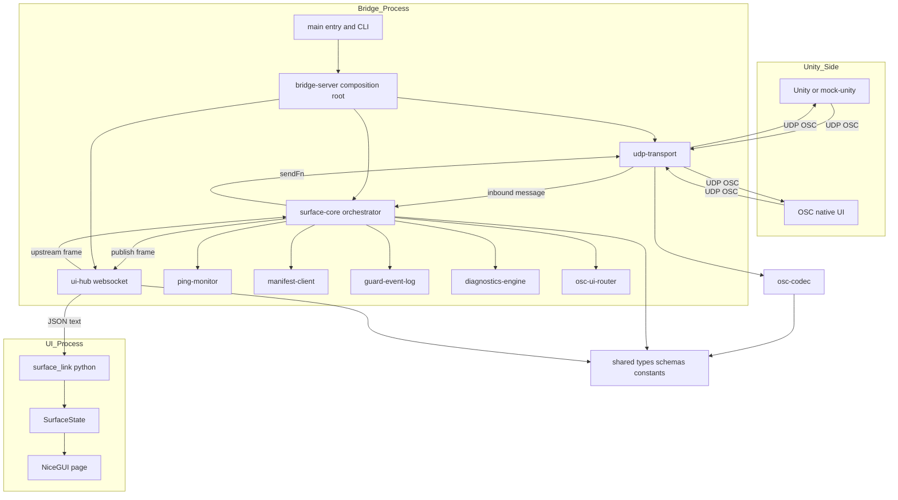
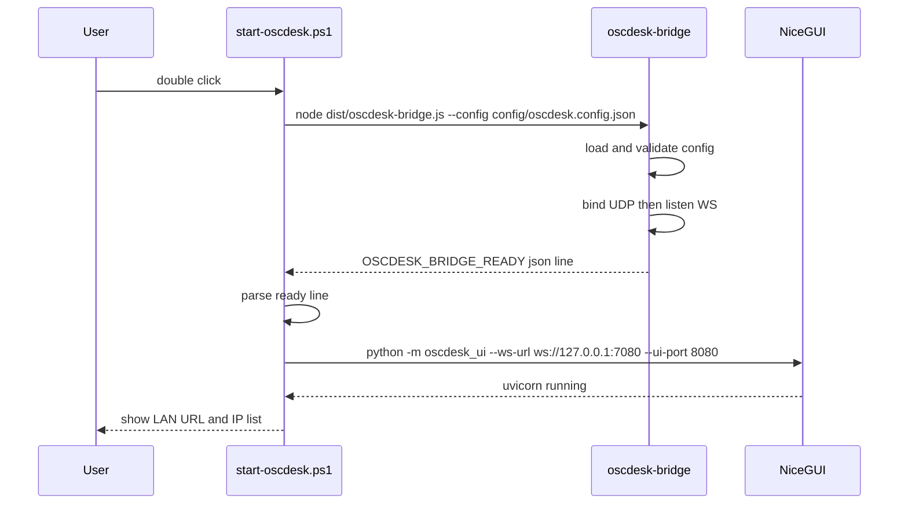
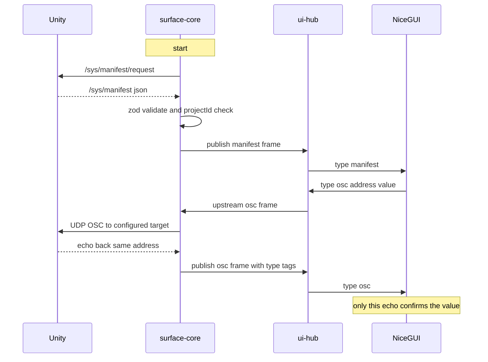
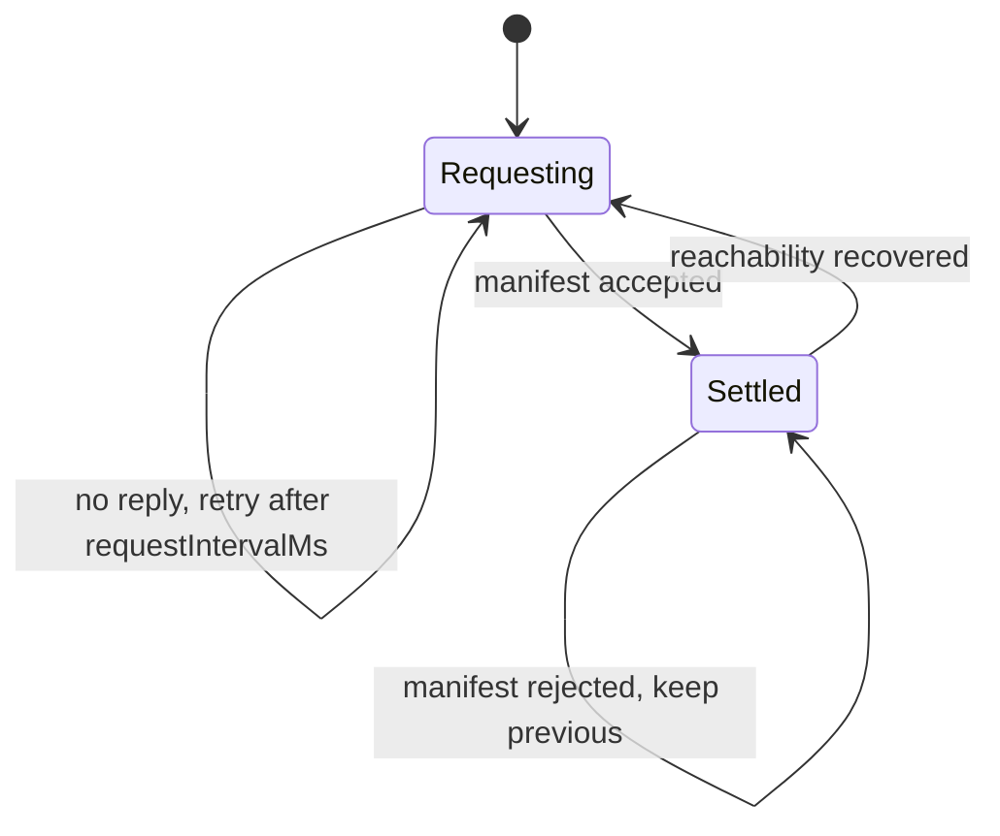
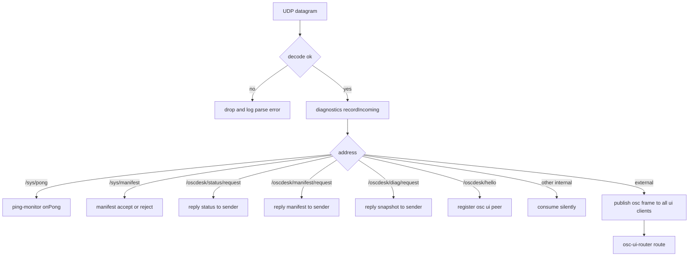
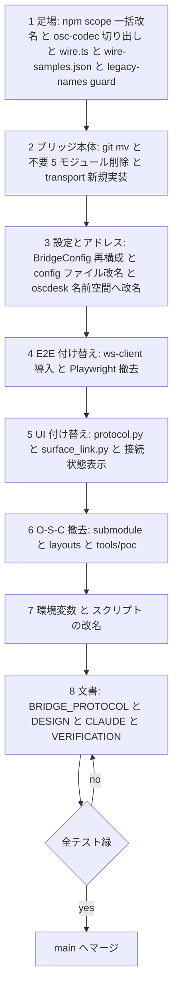

# Technical Design Document

## Overview

**Purpose**: Open Stage Control(O-S-C)への依存をリポジトリ全体から取り除き、`node:dgram` + `osc` による OSC UDP I/O と `ws` による WebSocket サーバーで構成する自前のブリッジサーバー(`@oscdesk/bridge`)と、NiceGUI 製 UI の 2 プロセスだけで成立する OSC コントロールサーフェスへ再構成する。あわせて名称を osc-surface / OSC Surface から oscdesk / OscDesk へ改める。

**Users**: サーフェス運用者は `start-oscdesk.bat` のダブルクリックだけでブリッジと UI を起動し、LAN 内の端末から Unity を操作する。サーフェス開発者は submodule 取得も vendor ビルドもブラウザバイナリの導入も無しに、クローン直後から `corepack pnpm test` で全体を検証できる。

**Impact**: 現在は「O-S-C 本体(vendor submodule)が custom module をホストし、OSC UDP と WebSocket と内蔵 UI を提供する」構成である。これを「ブリッジが UDP と WebSocket を直接持ち、NiceGUI が唯一の UI である」構成へ置き換える。Unity との契約(`/sys/*`)は不変で、内部名前空間 `/surface/*` は `/oscdesk/*` へ改名する。UI との WebSocket フレームは O-S-C 互換の配列形式から、OSC 型タグを保持する独自の JSON オブジェクト形式へ置き換える。

### Goals

- O-S-C 本体・Electron・ブラウザバイナリのいずれにも依存せず、Node.js 単体でブリッジが起動できる
- 移植 12 モジュールの振る舞いを機能等価に保ちつつ、O-S-C 内蔵 UI 専用の 5 モジュールを削除する
- OSC の型タグが欠落しない WebSocket フレーム形式を定義し、TypeScript 側と Python 側のずれを継続的に検出できる仕組みを持つ
- 設定・アドレス・パッケージ名・環境変数・起動スクリプト・文書のすべてを oscdesk 体系へ統一し、旧名称を残さない
- 自動テスト(TypeScript / Python)を 1 コマンドで実行し、両方の成否を 1 か所で判定できる

### Non-Goals

- `/sys/*` プロトコルの仕様変更(アドレス・引数・意味は据え置き)
- NiceGUI のウィジェット設計・操作調停ロジックの作り直し(接続方式と名称、および接続状態表示の追加のみ)
- GitHub リポジトリ名およびローカルディレクトリ名の実変更(手順の文書化までが範囲)
- 同居する Unity プロジェクト `OscSurface/` の実改修(影響の手順化までが範囲)
- 認証・暗号化の導入(LAN 内利用を前提とする。現行と同じ無認証を維持する)

## Boundary Commitments

### This Spec Owns

- **ブリッジサーバー(`packages/bridge`)の全責務**: OSC UDP の待受と送出、WebSocket サーバー、ping 監視、マニフェスト受理と誤接続ガード、診断、OSC ネイティブ UI 中継、実行時設定の解釈
- **WebSocket フレーム形式の正典**: `packages/shared/src/wire.ts` の zod スキーマと `protocol/wire-samples.json` の見本、および `docs/BRIDGE_PROTOCOL.md` の記述
- **内部 OSC 名前空間 `/oscdesk/*` の定義**: アドレス値、引数仕様、UDP へ出さないという規律
- **実行時設定スキーマ**: `BridgeConfigSchema`(Unity 宛先・ブリッジ待受・UI 待受・診断・OSC ネイティブ UI)
- **`expectedProjectId` 照合の唯一の実施主体**
- **起動・セットアップスクリプトの構成**とプロセス生存管理

### Out of Boundary

- `/sys/*` の仕様(`docs/UNITY_PROTOCOL.md` が正典。本スペックは名称追従のみ行う)
- マニフェストの zod スキーマ構造(`ManifestSchema` は不変)
- NiceGUI のウィジェット生成・値の間引き・ホールド調停(`widgets.py` / `value_store.py` / `page.py` のロジック本体)
- Unity 側の OSC 実装(`OscSurface/`)
- ブリッジの認証・認可

### Allowed Dependencies

- `packages/shared`(プロトコル型・zod スキーマ・アドレス定数)— 全パッケージが依存してよい唯一の基盤
- `packages/osc-codec`(OSC バイト列 ↔ 型付きオブジェクト)— ブリッジと mock-unity が依存する
- 外部: `osc@^2.4.5`(`readPacket` / `writePacket` のみ)、`ws@^8.18.0`、`zod@^3.23`、Node.js 標準モジュール
- Python 側: `nicegui>=2.0`、`websockets>=12.0`(いずれも既存)
- **禁止**: `packages/bridge` が `packages/mock-unity` に依存すること、`packages/shared` が `osc` / `ws` に依存すること、Python 側が実行時設定ファイルを直接読むこと

### Revalidation Triggers

- `packages/shared/src/wire.ts` のフレームスキーマ変更(`WIRE_PROTOCOL_VERSION` の増加を伴う)→ NiceGUI 側 `protocol.py` / `surface_link.py`、`protocol/wire-samples.json`、`docs/BRIDGE_PROTOCOL.md` の同時更新が必須
- `BridgeConfigSchema` のキー変更 → `config/*.json` 3 本、起動スクリプト、`hello` フレーム、テストフィクスチャの再確認
- `hello` フレームのフィールド追加・削除 → UI の起動時要件(何を引数で渡す必要があるか)が変わる
- READY 行(`OSCDESK_BRIDGE_READY`)のフィールド変更 → 起動スクリプト、E2E の `ProcessHarness`、pytest fixture の 3 者が同時に影響を受ける
- `/oscdesk/*` アドレスの追加・変更 → `docs/BRIDGE_PROTOCOL.md`、`docs/TOUCHOSC_EVAL.md`、OSC ネイティブ UI 側の設定

## Architecture

### Existing Architecture Analysis

現行は O-S-C が 4 つの役割(UDP OSC I/O、WebSocket サーバー、custom module のホスト、内蔵ブラウザ UI とレイアウト配信)を担い、`packages/custom-module` がそのプラグインとして機能本体を実装している。維持すべき性質と、廃棄する性質は次のとおり。

| 現行の性質 | 扱い | 理由 |
|---|---|---|
| 12 モジュールが `sendFn` / `receiveFn` / `fs` / `now` の注入で抽象化されている | **維持** | トランスポートを差し替えるだけで大半がそのまま動く。Option C(research.md)の前提 |
| `metadata: true` / `unpackSingleArgs: false` による OSC 型タグ保持 | **維持** | リポジトリ標準。`packages/osc-codec` として明示的な資産にする |
| Unity が真実の源。UI 送信値は確定値にしない | **維持** | プロジェクトの絶対規律 |
| 案件差分は設定 / マニフェストで表現する | **維持** | プロジェクトの絶対規律。設定の集約(D-8)でむしろ強化される |
| `oscInFilter` が `false` を返して内部消費を表す | **廃棄** | O-S-C のフック契約。返り値ではなくメソッド分岐で表現する |
| `oscOutFilter` が `data.clientId` を持つ | **廃棄** | O-S-C 独自拡張。WebSocket コネクション ID で置き換える |
| `receive(addr, ...args, {clientId})` による UI 配信 | **廃棄** | フレーム配信 `publish(frame, target?)` に置き換える |
| `settings.read('load')` + レイアウト JSON | **廃棄** | レイアウトの概念自体を廃止する |
| `nativeRequire` によるモジュール解決 | **廃棄** | O-S-C の bundler 都合。素の `import` にする |
| レイアウト不在時の強制マニフェスト再要求 | **廃棄** | O-S-C 内蔵 UI 都合の分岐(research.md の Decision 参照) |
| 診断パネル配信(`diag-panel-sink`)と手動ログ削除 | **廃棄** | D-3。容量上限は自動パージへ置き換える |

### Architecture Pattern & Boundary Map

選定パターンは **レイヤード + 明示的な依存方向**。ブリッジ内部を「トランスポート非依存のオーケストレータ(`surface-core`)」と「トランスポート束ね役(`udp-transport` / `ui-hub`)」に分割し、両者を合成ルート(`bridge-server`)が結線する。



**Architecture Integration**:

- **選定パターン**: レイヤード。`surface-core` は Node の I/O を一切知らず、`sendFn` / `publish` / `now` / タイマーの注入だけで完結する。これにより既存の結合レベルテストが「`sendFn` = UDP 送信の抽象、`publish` = UI 配信の抽象」と読み替えるだけで生き残る(D-6 / Option C)。
- **境界の分け方**: 「OSC の意味を知っている層(core とドメイン群)」と「バイト列・ソケット・コネクションを知っている層(transport)」を分ける。両者の受け渡しは `InboundOscMessage` と `WireFrame` の 2 つの型だけ。
- **維持する既存パターン**: 依存注入によるテスタビリティ、zod による境界検証、NDJSON による構造化ログ、`ProcessHarness` によるプロセス起動同期。
- **新規コンポーネントの根拠**: `udp-transport` と `ui-hub` は O-S-C が担っていた役割の代替であり不可避。`bridge-server` は「どこで結線するか」を 1 か所に閉じるために必要。`packages/osc-codec` はコーデックの二重実装を避けるために必要(research.md)。
- **規律の遵守**: 「案件差分はデータ」は設定の 3 ブロック化で強化。「Unity が真実の源」は `surface-core` が UI 由来の値を一切保持しないことで担保。「特定 Unity OSC ライブラリに依存しない」は OSC 1.0 の `i` / `f` / `s` / `b` のみを扱う方針で維持。

### Dependency Direction

```
shared (types / zod / constants)
  └→ osc-codec (osc byte <-> typed object)
       └→ bridge/domain (ping-monitor, manifest-client, guard-event-log, diagnostics-engine, osc-ui-router, ndjson-*, ring-buffer, subnet-check, link-health)
            └→ bridge/surface-core (orchestrator)
                 └→ bridge/transport (udp-transport, ui-hub)
                      └→ bridge/bridge-server (composition root)
                           └→ bridge/main (CLI, config load, exit codes)
```

- 各層は左の層のみを import する。右方向への import は設計違反として扱う。
- `surface-core` から `transport` への import は禁止(`surface-core` は `sendFn` / `publish` を受け取るだけ)。結線は `bridge-server` の責務。
- `packages/shared` は `zod` 以外の外部パッケージに依存しない。
- Python 側の依存方向は `protocol.py` → `surface_link.py` → `state.py` → `page.py` / `widgets.py` の一方向を維持する。

### Technology Stack

| Layer | Choice / Version | Role in Feature | Notes |
|-------|------------------|-----------------|-------|
| Frontend | NiceGUI >= 2.0 (Python 3.11+) | 唯一の UI。マニフェスト駆動でウィジェットを生成 | 既存。接続方式と名称のみ改修 |
| Frontend 接続 | `websockets` >= 12.0 | ブリッジへの WebSocket クライアント | 既存。`ping_interval=None` / `proxy=None` を維持(D-023) |
| Backend | Node.js >= 20 / TypeScript 5.5 | ブリッジサーバー | 新規。Electron 不要 |
| Messaging (UDP) | `node:dgram` + `osc@^2.4.5` | OSC 1.0 のバイト列変換と UDP 送受信 | `UDPPort` は使わない(research.md)。`serialport` は optional のため未導入 |
| Messaging (WS) | `ws@^8.18.0` | UI との WebSocket サーバー | `osc` の推移依存として既に存在。直接依存として宣言する |
| Validation | `zod@^3.23` | 設定・マニフェスト・WebSocket フレームの境界検証 | 既存 |
| Build | `esbuild@^0.24` | `dist/oscdesk-bridge.js` への単一バンドル | `--external:osc --external:ws` が必須 |
| Test (TS) | `vitest@^3` | unit / e2e の 2 プロジェクト | Playwright は撤去 |
| Test (Py) | `pytest` >= 8 / `pytest-asyncio` >= 0.24 | UI 側単体 + 実ブリッジ結合 | 実ブリッジ fixture を新設 |
| Runtime scripts | PowerShell 5.1 (`.ps1`) + 薄い `.bat` | 起動 / セットアップ | `.bat` は非 ASCII 禁止(Req 7-5) |

## File Structure Plan

### Directory Structure

```
protocol/
└── wire-samples.json            # 新規: フレーム見本(TS/Python 双方が読む唯一の場所, D-5)

packages/
├── shared/src/
│   ├── index.ts                 # SYS / OSCDESK / OSCDESK_DIAG / INTERNAL_PREFIXES と再エクスポート
│   ├── osc-types.ts             # 変更なし
│   ├── schemas.ts               # SurfaceConfigSchema -> BridgeConfigSchema へ再構成。Manifest 系は不変
│   └── wire.ts                  # 新規: WebSocket フレームの zod スキーマ / 型 / WIRE_PROTOCOL_VERSION
│
├── osc-codec/src/               # 新規パッケージ (@oscdesk/osc-codec)
│   ├── index.ts
│   ├── osc-codec.ts             # mock-unity/src/osc-adapter.ts を git mv
│   └── osc-codec.test.ts        # 同テストを git mv
│
├── bridge/                      # packages/custom-module を git mv (D-6)
│   ├── package.json             # name: @oscdesk/bridge, build に --external:osc --external:ws
│   └── src/
│       ├── main.ts              # 新規: CLI 解析 / 設定読込 / 起動 / READY 行 / 終了コード
│       ├── cli.ts               # 新規: 引数パース(mock-unity/src/index.ts の様式に倣う)
│       ├── bridge-server.ts     # 新規: 合成ルート。core と 2 トランスポートを結線
│       ├── udp-transport.ts     # 新規: dgram + osc-codec。rinfo から送信元を得る
│       ├── ui-hub.ts            # 新規: ws サーバー / クライアント台帳 / 心拍 / フレーム検証
│       ├── surface-core.ts      # module-runtime.ts を git mv し接合面を除去
│       ├── config.ts            # loadJSON 依存を fs へ。CLI 上書きの合成を担う
│       ├── ping-monitor.ts      # 無改造移植
│       ├── manifest-client.ts   # 無改造移植
│       ├── ring-buffer.ts       # 無改造移植
│       ├── subnet-check.ts      # 無改造移植
│       ├── link-health.ts       # 無改造移植
│       ├── osc-ui-router.ts     # 無改造移植(コメント内アドレス表記のみ追従)
│       ├── ndjson-writer.ts     # nativeRequire 削除のみ
│       ├── ndjson-quota.ts      # nativeRequire 削除のみ
│       ├── diagnostics-engine.ts# receiveFn 廃止 / 自動パージ / 内部判定を定数化
│       └── guard-event-log.ts   # publishTo 廃止 / snapshot 追加
│
├── mock-unity/src/              # osc-adapter.ts を osc-codec へ移管。import 1 行の変更
└── nicegui-ui/
    ├── pyproject.toml           # name: oscdesk-nicegui-ui, packages: src/oscdesk_ui
    ├── package.json             # 新規: pnpm ワークスペースへ載せる薄い定義(D-9)
    ├── src/oscdesk_ui/          # osc_surface_ui を git mv
    │   ├── protocol.py          # 新フレーム形式へ全面書換(zod .strict() 相当の手書きバリデータを含む)
    │   ├── surface_link.py      # 心拍 / 宛先なし送信 / hello・link の取り込み
    │   ├── config.py            # CLI と環境変数のみ。設定ファイル解析を削除
    │   ├── state.py             # link/hello フレームの取り込み。projectId 照合を削除
    │   ├── page.py              # 接続状態(RTT / 連続喪失)の常時表示を追加
    │   ├── manifest.py          # 名称のみ
    │   ├── value_store.py       # 変更なし
    │   └── widgets.py           # 変更なし
    └── tests/
        ├── conftest.py          # bridge_process / mock_unity_process fixture を新設
        ├── test_wire_samples.py # 新規: 見本 JSON の検証(D-5 a)
        └── test_bridge_link.py  # 新規: 実ブリッジとの往復(D-5 b)

tests/
├── e2e/
│   ├── helpers/ws-client.ts     # 新規: browser-client.ts の代替
│   ├── helpers/bridge.ts        # 新規: ブリッジ起動と READY 行の待機
│   ├── helpers/{osc-client,process,ports}.ts   # 維持
│   ├── bridge-loopback.e2e.test.ts             # mock-unity-loopback を改名 / 改修
│   ├── ws-protocol.e2e.test.ts                 # widget-inspector の代替(Req 3-3 / 9-3)
│   ├── diagnostics.e2e.test.ts / osc-native-ui.e2e.test.ts / osc-client.e2e.test.ts / process-harness.e2e.test.ts  # 維持・改修
│   └── fixtures/                # レイアウト JSON 2 本を削除
└── guards/
    └── legacy-names.test.ts     # 新規: /surface/ と旧名称の再混入検出(Req 4-8)

scripts/
└── run-python-tests.mjs         # 新規: venv 検出と pytest 実行 / スキップ警告(D-9)

config/
├── oscdesk.config.json          # surface.config.json を git mv + 構造変更
├── oscdesk.debug.config.json
└── oscdesk.touchosc.config.json

docs/
├── BRIDGE_PROTOCOL.md           # CUSTOM_UI_INTEGRATION.md を git mv + 全面改訂(Req 3-9 / 10-2)
├── UNITY_PROTOCOL.md            # 名称のみ追従(Req 10-1)
├── TOUCHOSC_EVAL.md             # アドレス改名の書き換え手順を追記(Req 10-6-a)
├── VERIFICATION.md              # O-S-C 非依存の手動検証手順を追記(Req 9-6)
└── MIGRATION_OSCDESK.md         # 新規: ユーザー操作が必要な改名手順(Req 7-8 / 10-6)
```

### Deleted Files

- `vendor/open-stage-control`(submodule)、`.gitmodules`、`.git/modules/vendor/`
- `layouts/main.json`、`layouts/diagnostics.json`、`layouts/` ディレクトリ
- `tools/poc/` 一式
- `packages/custom-module/src/{layout-index,layout-snapshot,manifest-apply,widget-catalog,diag-panel-sink}.ts` と各テスト
- `packages/custom-module/src/{index.ts,osc-globals.d.ts}`(O-S-C の custom module 入口と global 宣言)
- `tests/e2e/helpers/{browser-client.ts,widget-inspector.ts}`、`tests/e2e/widget-inspector.e2e.test.ts`、`tests/e2e/fixtures/*.json`
- `packages/nicegui-ui/tests/stub_server.py`(実ブリッジ fixture に置き換え)
- ルートの `start-osc-surface*.bat/.ps1`、`setup-osc-surface.*`、`start-nicegui-ui.*`、`start-touchosc-eval.*`(oscdesk 名で再構成)
- `package.json` の `osc:build` スクリプトと `playwright` 依存

### Modified Files (主要な変更点のみ)

- `package.json` — `name: oscdesk`、`test` を「build → vitest → python」の 3 段に。`playwright` / `osc:build` を削除
- `pnpm-workspace.yaml` — 変更不要(`packages/*` グロブが新パッケージを含む)
- `vitest.config.ts` — unit プロジェクトの include に `tests/guards/**/*.test.ts` を追加
- `CLAUDE.md` — 規律の置換(Req 10-4)とリポジトリ構成・開発コマンドの更新(Req 10-5)
- `DESIGN.md` — D-025 以降を追記(Req 10-3)。既存記述は履歴として不変
- `AGENTS.md` / `HANDOVER.md` / `README.md` — 名称と構成の更新

## System Flows

### 起動と設定解決



設定の解釈はブリッジ 1 か所に閉じる。起動スクリプトも UI も設定ファイルを読まず、READY 行と `hello` フレームから解決済みの値を受け取る。いずれかのプロセスが READY に至らなければ、スクリプトは既に起動した側を停止して終了する(Req 8-3)。

### マニフェスト取得と値の往復



UI が送った値は `surface-core` の内部状態に一切残らない。表示の確定は Unity のエコーバックのみで行う(Req 2-9 / 6-4)。UI の再接続時は接続直後に `hello` → `link` → `manifest` の順で配信され、値はエコーバックで埋め直される(Req 3-7 / 6-6)。

### 到達性とマニフェスト再要求の状態遷移



- `Requesting` 中の再送は `ManifestClient.shouldRequest()` が最小間隔(2000 ms)を守る(Req 2-6)。
- ping が 1 回でも落ちると `refreshManifestOnNextAcceptedPong` が立ち、次に受理された pong で `Settled → Requesting` へ戻す(Req 2-5)。
- 拒否(`project-mismatch` / `schema-error` / `json-parse-error`)は採用済みマニフェストを置き換えない。拒否の事実は `link` フレームの `lastRejection` として UI へ届く(Req 2-4)。
- レイアウト不在を理由とする強制再要求は廃止した(research.md の Decision 参照)。

### 受信 OSC の振り分け



内部名前空間の判定は `packages/shared` の `INTERNAL_PREFIXES` を参照して行い、プレフィクスの直書きはしない(Req 4-7)。外部アドレスは WebSocket 全クライアントへ配信し、さらに OSC ネイティブ UI ルーターへ渡す(Req 2-8 / D-7)。

## Requirements Traceability

| Requirement | Summary | Components | Interfaces | Flows |
|---|---|---|---|---|
| 1.1, 1.3 | UDP 待受と送出、型タグ保持 | UdpTransport, OscCodec | `startUdpTransport`, `decodeOscPacket` | 受信 OSC の振り分け |
| 1.2 | WebSocket サーバー開始 | UiHub | `startUiHub` | 起動と設定解決 |
| 1.4 | 起動完了行 | BridgeMain | `BridgeReadyLine` | 起動と設定解決 |
| 1.5 | ポート使用中はエラー終了 | BridgeMain, BridgeServer | `startBridgeServer` の失敗経路 | 起動と設定解決 |
| 1.6, 1.7 | vendor / Electron / ブラウザ非依存 | 全体 | — | — |
| 1.8, 1.9 | 全ポートを設定から。引数が優先 | BridgeConfig, BridgeCli | `BridgeConfigSchema`, `parseCliArgs`, `applyCliOverrides` | 起動と設定解決 |
| 1.10 | 設定不備でエラー終了 | BridgeConfig, BridgeMain | `loadBridgeConfig` | 起動と設定解決 |
| 2.1, 2.10 | 12 機能の提供と単体テスト | SurfaceCore と移植ドメイン群 | `SurfaceCore` | 全フロー |
| 2.2 | ping 送出と RTT / 喪失集計 | SurfaceCore, PingMonitor | `PingMonitor.snapshot` | 到達性の状態遷移 |
| 2.3, 2.4 | マニフェスト検証と誤接続ガード | SurfaceCore, ManifestClient, GuardEventLog | `onManifestPayload`, `recordRejection` | マニフェスト取得 |
| 2.5, 2.6 | 回復時の再要求と最小間隔 | SurfaceCore, ManifestClient | `onReachabilityRecovered`, `shouldRequest` | 到達性の状態遷移 |
| 2.7 | debug 時の診断と NDJSON 容量上限 | DiagnosticsEngine, NdjsonWriter, NdjsonQuota | `DiagnosticsEngine` | — |
| 2.8 | OSC ネイティブ UI 中継 | OscUiRouter, SurfaceCore | `OscUiRouter.route` | 受信 OSC の振り分け |
| 2.9 | UI 送信値を確定値にしない | SurfaceCore | 状態を持たない設計 | 値の往復 |
| 2.11 | 内蔵 UI 専用機能を含まない | — (削除) | — | — |
| 3.1, 3.5 | 旧形式を受理せず不正フレームを破棄(上り = UiHub / 下り = Python 側受信の両方) | WireSchemas, UiHub, SurfaceLinkPy | `UpstreamFrameSchema` (`.strict()`), `decode_frame` の明示的拒否 | — |
| 3.2, 3.3 | 型タグ保持・単一引数を縮約しない | WireSchemas, SurfaceCore | `WireArgSchema`, `OscFrame` | 値の往復 |
| 3.4 | 宛先指定なしで Unity へ | SurfaceCore | `handleUiFrame` | 値の往復 |
| 3.6 | WebSocket 死活監視 | UiHub | `heartbeat` / `heartbeatAck` | — |
| 3.7 | 接続時のマニフェスト配信 | SurfaceCore, UiHub | `onUiConnected` | マニフェスト取得 |
| 3.8 | 再配信要求を内部消費 | SurfaceCore | `manifestRequest` フレーム | マニフェスト取得 |
| 3.9 | フレーム仕様の正典化 | `docs/BRIDGE_PROTOCOL.md` | — | — |
| 4.1 | `/sys/*` 不変 | SharedConstants | `SYS` | — |
| 4.2, 4.5 | 内部アドレス改名 | SharedConstants | `OSCDESK`, `OSCDESK_DIAG` | — |
| 4.3 | 内部アドレスを UDP へ出さない | SurfaceCore | `sendMessage` の抑止 | 受信 OSC の振り分け |
| 4.4, 4.8 | 旧プレフィクス残存の検出 | LegacyNameGuardTest | `tests/guards/legacy-names.test.ts` | — |
| 4.6 | E2E / UI の追従 | E2E helpers, oscdesk_ui | — | — |
| 4.7 | プレフィクス直書き禁止 | SharedConstants | `INTERNAL_PREFIXES`, `isInternalAddress` | 受信 OSC の振り分け |
| 5.1, 5.2, 5.3, 5.5 | O-S-C 資産の撤去 | — (削除) | — | 移行フロー |
| 5.4 | Playwright 撤去と E2E 書き直し | WsE2eClient | `tests/e2e/helpers/ws-client.ts` | — |
| 5.6 | セットアップで vendor を取らない | SetupScript | `setup-oscdesk.ps1` | — |
| 5.7 | 失う検証観点の記録 | `DESIGN.md` D-025 以降 | — | — |
| 6.1 | Python パッケージ改名 | oscdesk_ui | `pyproject.toml` | — |
| 6.2, 6.3 | 新フレームのみ / 型付き解釈 | protocol.py, surface_link.py | `decode_frame`, `parse_osc_frame` | 値の往復 |
| 6.4, 6.5 | エコーバックのみで確定 / ホールド | state.py, value_store.py | 既存(変更なし) | 値の往復 |
| 6.6 | 再接続とマニフェスト取り直し | surface_link.py | `run` の再接続ループ | 値の往復 |
| 6.7 | プロキシ非経由 | surface_link.py | `websockets.connect(proxy=None)` | — |
| 6.8 | pytest 全件成功 | nicegui-ui/tests | — | — |
| 6.9, 6.10 | 接続状態の常時表示 | page.py, state.py | `link` フレーム | 到達性の状態遷移 |
| 6.11 | 詳細診断機能を持たない | — (削除) | — | — |
| 7.1 | npm scope 改名 | 全 package.json | `@oscdesk/*` | 移行フロー |
| 7.2 | 設定ファイル命名と拡張 | config/*.json, BridgeConfig | `BridgeConfigSchema` | — |
| 7.3 | 環境変数改名 | BridgeConfig, SurfaceCore | `OSCDESK_CONFIG`, `OSCDESK_TEST_NETWORK_INTERFACES` | — |
| 7.4, 7.5 | 起動スクリプトの改名と ASCII 規律 | LaunchScripts | `start-oscdesk.bat/.ps1` | — |
| 7.6 | 文書の名称更新 | docs, CLAUDE.md ほか | — | — |
| 7.7 | 後方互換エイリアスなし | BridgeConfig | — | — |
| 7.8 | 手動改名手順の文書化 | `docs/MIGRATION_OSCDESK.md` | — | — |
| 8.1, 8.2 | 2 プロセス起動と接続案内 | LaunchScripts | READY 行 | 起動と設定解決 |
| 8.3, 8.4 | 起動失敗時と終了時のプロセス回収 | LaunchScripts | `finally` + `taskkill /T /F` | 起動と設定解決 |
| 8.5, 8.6 | セットアップの縮小と冪等性 | SetupScript | `setup-oscdesk.ps1` | — |
| 8.7 | debug / OSC ネイティブ UI 評価の入口 | LaunchScripts | `start-oscdesk-debug.bat`, `start-oscdesk-touchosc.bat` | — |
| 9.1, 9.11 | ブラウザ / O-S-C 準備なしで完走 | 全テスト | — | — |
| 9.2, 9.4 | ループバック E2E と診断 / ガード検証 | E2E suite, BridgeE2eHelper | `tests/e2e/*.e2e.test.ts` | — |
| 9.3 | WebSocket 往復の型付き検証 | WsE2eClient | `ws-protocol.e2e.test.ts` | 値の往復 |
| 9.5, 9.5-a | 1 コマンドで両方 / venv 未作成はスキップ警告 | PythonTestRunner | `scripts/run-python-tests.mjs` | — |
| 9.6 | 手動検証手順 | `docs/VERIFICATION.md` | — | — |
| 9.7 | 完了時に全テスト成功 | — | — | 移行フロー |
| 9.8 | 見本 JSON を双方が読む | WireSamples | `protocol/wire-samples.json` | — |
| 9.9, 9.10 | 実ブリッジ結合と前提欠如時の明示 | PytestBridgeFixture | `conftest.py` の `bridge_process` | — |
| 10.1, 10.2 | プロトコル文書の維持と差し替え | docs | — | — |
| 10.3 | 主要判断の記録 | `DESIGN.md` D-025 以降 | — | — |
| 10.4, 10.5 | CLAUDE.md の規律と構成更新 | `CLAUDE.md` | — | — |
| 10.6, 10.6-a | Unity 側 / OSC ネイティブ UI 側の追従手順 | `docs/MIGRATION_OSCDESK.md`, `docs/TOUCHOSC_EVAL.md` | — | — |
| 10.7 | 3 規律の明記 | `CLAUDE.md`, `README.md` | — | — |

## Components and Interfaces

| Component | Domain/Layer | Intent | Req Coverage | Key Dependencies (P0/P1) | Contracts |
|---|---|---|---|---|---|
| SharedConstants | Types | OSC アドレス定数と内部判定 | 4.1, 4.2, 4.5, 4.7 | — | State |
| WireSchemas | Types | WebSocket フレームの正典スキーマ | 3.1–3.3, 3.5, 9.8 | zod (P0) | Event |
| OscCodec | Codec | OSC バイト列 ↔ 型付きオブジェクト | 1.3 | osc (P0) | Service |
| BridgeConfig | Config | 実行時設定の読込・検証・CLI 合成 | 1.8–1.10, 7.2, 7.3, 7.7 | SharedConstants (P0) | Service |
| BridgeCli | Config | 引数解析と上書き | 1.9 | — | Service |
| SurfaceCore | Core | トランスポート非依存のオーケストレータ | 2.1–2.9, 2.11, 3.4, 3.7, 3.8, 4.3 | 移植ドメイン群 (P0) | Service, Event |
| UdpTransport | Transport | UDP 待受・送出 | 1.1, 1.3, 1.5 | OscCodec (P0) | Service |
| UiHub | Transport | WebSocket サーバー・クライアント台帳・心拍 | 1.2, 1.5, 3.1, 3.5–3.7 | ws (P0), WireSchemas (P0) | Service, Event |
| BridgeServer | Composition | core と 2 トランスポートの結線 | 1.1, 1.2, 1.5 | SurfaceCore (P0), UdpTransport (P0), UiHub (P0) | Service |
| BridgeMain | Entry | CLI 起動 / READY 行 / 終了コード | 1.4, 1.5, 1.10 | BridgeServer (P0) | Service |
| DiagnosticsEngine | Domain | 診断スナップショットと NDJSON 容量管理 | 2.7 | NdjsonWriter (P0), NdjsonQuota (P0) | Service |
| GuardEventLog | Domain | 誤接続(拒否)イベントの記録。自己修復イベントは呼び出し元消滅により記録しない | 2.4 | NdjsonWriter (P0) | Service |
| PingMonitor / ManifestClient / OscUiRouter / RingBuffer / SubnetCheck / LinkHealth | Domain | 無改造移植 | 2.2, 2.3, 2.5, 2.6, 2.8 | SharedConstants (P1) | Service |
| SurfaceLinkPy | UI | ブリッジへの WebSocket 接続 | 6.2, 6.6, 6.7 | websockets (P0) | Service, Event |
| SurfaceStatePy | UI | フレームの取り込みと表示状態 | 6.3, 6.4, 6.9, 6.10 | SurfaceLinkPy (P0) | State |
| LaunchScripts | Ops | 2 プロセス起動と回収 | 8.1–8.4, 8.7 | BridgeMain の READY 行 (P0) | Batch |
| SetupScript | Ops | 冪等なセットアップ | 5.6, 8.5, 8.6 | — | Batch |
| PythonTestRunner | Ops | pytest の起動とスキップ判定 | 9.5, 9.5-a | — | Batch |
| WireSamples | Test | フレーム見本の単一の置き場 | 9.8 | — | State |
| LegacyNameGuardTest | Test | 旧プレフィクス / 旧名称の検出 | 4.4, 4.8 | — | Batch |

### Types Layer

#### SharedConstants

| Field | Detail |
|---|---|
| Intent | OSC アドレス定数を集約し、内部名前空間の判定を 1 か所に閉じる |
| Requirements | 4.1, 4.2, 4.5, 4.7 |

**Responsibilities & Constraints**
- `/sys/*` の値は一切変更しない。`/surface/*` を `/oscdesk/*` へ改名する。
- 内部名前空間かどうかの判定関数を提供し、実装側でのプレフィクス直書きを不要にする。
- 診断パネル専用だった定数(`REACHABILITY` / `RTT` / `LOSS_RATE` / `SUBNET` / `MESSAGES` / `LOG_USAGE` / `GUARD` / `SELF_HEAL` / `PURGE`)は Req 2-11 により削除する。

**Contracts**: State [x]

```typescript
export const SYS = {
  PING: '/sys/ping', PONG: '/sys/pong',
  STATS_REQUEST: '/sys/stats/request', STATS: '/sys/stats',
  MANIFEST_REQUEST: '/sys/manifest/request', MANIFEST: '/sys/manifest',
} as const

export const OSCDESK = {
  HELLO: '/oscdesk/hello',
  STATUS_REQUEST: '/oscdesk/status/request',
  STATUS: '/oscdesk/status',
  MANIFEST_REQUEST: '/oscdesk/manifest/request',
  MANIFEST: '/oscdesk/manifest',
} as const

export const OSCDESK_DIAG = {
  REQUEST: '/oscdesk/diag/request',
  SNAPSHOT: '/oscdesk/diag',
} as const

export const INTERNAL_PREFIXES = ['/sys/', '/oscdesk/'] as const

export function isInternalAddress(address: string): boolean
export function isOscdeskAddress(address: string): boolean
```

**Implementation Notes**
- 統合: `/oscdesk/manifest/request`(UDP)は OSC ネイティブ経路からのマニフェスト要求として残し、`/oscdesk/manifest` で応答する。`/oscdesk/status/request` → `/oscdesk/status` と対称になり、Req 4-2 の全アドレスが実体を持つ。
- 検証: `isInternalAddress` は `SurfaceCore` の送出抑止(4.3)と `DiagnosticsEngine` の記録除外の双方から使う。
- リスク: `isOscdeskAddress` と `isInternalAddress` の使い分けを誤ると `/sys/ping` の送出まで止まる。送出抑止側は `isOscdeskAddress` を使う。

#### WireSchemas

| Field | Detail |
|---|---|
| Intent | WebSocket フレームの構造・型・版数を単一定義する |
| Requirements | 3.1, 3.2, 3.3, 3.5, 9.8 |

**Responsibilities & Constraints**
- 下り(ブリッジ → UI)6 種、上り(UI → ブリッジ)3 種の判別ユニオンを定義する。
- 上りスキーマは `.strict()` とし、未知キーを不正フレームとして扱う。
- `args` は常に配列。引数が 1 個でも素値へ縮約しない(3.3)。
- `type: 'b'` の `value` は base64 文字列(research.md の Decision)。

**Dependencies**
- Outbound: SharedConstants — マニフェスト型の再利用 (P1)
- External: zod — スキーマ定義 (P0)

**Contracts**: Event [x]

```typescript
export const WIRE_PROTOCOL_VERSION = 1

export type WireArg =
  | { type: 'i'; value: number }
  | { type: 'f'; value: number }
  | { type: 's'; value: string }
  | { type: 'b'; value: string }   // base64

export type DownstreamFrame =
  | { v: 1; type: 'hello';     clientId: string; protocolVersion: number;
      server: { name: string; version: string };
      unity: { host: string; sendPort: number };
      bridge: { oscListenPort: number; wsPort: number };
      expectedProjectId: string | null;
      heartbeat: { intervalMs: number; timeoutMs: number };
      pingIntervalMs: number; debug: boolean }
  | { v: 1; type: 'manifest';  manifest: Manifest }
  | { v: 1; type: 'osc';       address: string; args: WireArg[];
      from: { host: string; port: number } }
  | { v: 1; type: 'link';      unity: LinkUnityStatus; manifest: LinkManifestStatus;
      lastRejection: LinkRejection | null }
  | { v: 1; type: 'heartbeat'; t: number }
  | { v: 1; type: 'notice';    level: 'info' | 'warn' | 'error'; code: string; detail: string }

export type UpstreamFrame =
  | { v: 1; type: 'osc'; address: string; args: WireArg[] }
  | { v: 1; type: 'manifestRequest' }
  | { v: 1; type: 'heartbeatAck'; t: number }

export interface LinkUnityStatus {
  reachability: 'unknown' | 'reachable' | 'lost'
  lastRttMs: number | null
  consecutiveLosses: number
  lastPongSeq: number | null
}
export type LinkManifestStatus =
  | { state: 'none' }
  | { state: 'accepted'; projectId: string; entryCount: number }
export interface LinkRejection {
  ts: string
  reason: 'project-mismatch' | 'schema-error' | 'json-parse-error'
  detail: string
  receivedProjectId: string | null
}

export const DownstreamFrameSchema: z.ZodType<DownstreamFrame>
export const UpstreamFrameSchema: z.ZodType<UpstreamFrame>
export function parseUpstreamFrame(raw: string): Result<UpstreamFrame, FrameRejectReason>
```

- Preconditions: `raw` は UTF-8 テキスト(バイナリフレームは受理前に破棄)
- Postconditions: 成功時は `v === WIRE_PROTOCOL_VERSION` が保証される
- Invariants: `args.length` は保存され、順序も保存される

##### Event Contract

- **Published(下り)**: `hello`(接続直後 1 回)、`manifest`(採用時ブロードキャスト + 接続直後に既存分)、`osc`(外部アドレスの受信ごと)、`link`(接続直後 + 状態更新時、最短 ping 間隔で間引き)、`heartbeat`(`intervalMs` ごと)、`notice`(不正フレーム検出時など)
- **Subscribed(上り)**: `osc`、`manifestRequest`、`heartbeatAck`
- **順序保証**: 単一 WebSocket 接続内では送信順で到達する。接続直後は必ず `hello` → `link` → `manifest`(あれば)の順。
- **配送保証**: at-most-once。切断中のフレームは保持せず捨てる(値は Unity のエコーバックで復元されるため再送不要)。

**Implementation Notes**
- 統合: Python 側は `protocol.py` に同じ構造を写す。ずれの検出は `protocol/wire-samples.json` の双方読みと実結合テストで行う(D-5)。
- 検証: `notice` は UI が無視してよい。E2E とデバッグの観測点として使う。
- リスク: 版数 `v` の増加ルールを決めておかないと後方互換の判断がぶれる。**本スペックでは `v` は常に 1 とし、破壊的変更時のみ増やす。UI は `v !== 1` のフレームを無視してログに残す**、と定める。

### Codec Layer

#### OscCodec

| Field | Detail |
|---|---|
| Intent | OSC 1.0 バイト列と型付きオブジェクトの相互変換を 1 か所で持つ |
| Requirements | 1.3 |

**Responsibilities & Constraints**
- `packages/mock-unity/src/osc-adapter.ts` をそのまま移設。`metadata: true` / `unpackSingleArgs: false` を維持。
- 対応型タグは `i` / `f` / `s` / `b` のみ。未対応タグは例外を投げる(呼び出し側が破棄を決める)。

**Dependencies**
- Outbound: SharedConstants — `OscArg` / `OscPacket` 型 (P0)
- External: osc@^2.4.5 — `readPacket` / `writePacket` (P0)

**Contracts**: Service [x]

```typescript
export function encodeOscPacket(packet: OscPacket): Uint8Array
export function decodeOscPacket(data: Uint8Array): OscPacket
export class OscDecodeError extends Error { readonly cause: unknown }
```

**Implementation Notes**
- 統合: `mock-unity` の `import` を `@oscdesk/osc-codec` へ差し替える。`packages/mock-unity/src/osc-adapter.ts` の再エクスポートは残さない(旧経路を残すと import 元が二系統になる)。
- リスク: `git mv` 時にテストのパス解決(`@osc-surface/shared` → `@oscdesk/shared`)を忘れると単体テストが落ちる。

### Config Layer

#### BridgeConfig

| Field | Detail |
|---|---|
| Intent | 実行時設定の読込・検証と、CLI 上書きの合成 |
| Requirements | 1.8, 1.9, 1.10, 7.2, 7.3, 7.7 |

**Responsibilities & Constraints**
- 設定ファイルの解釈はプロセス内でここだけが行う。Python 側・PowerShell 側は解釈しない。
- `nativeRequire` と `loadJSON`(O-S-C の global)への依存を排し、`node:fs` + `JSON.parse` へ置き換える。
- 読み込み失敗と検証失敗を区別してメッセージ化する。

**Dependencies**
- Outbound: SharedConstants — `BridgeConfigSchema` (P0)
- External: node:fs, zod (P0)

**Contracts**: Service [x]

```typescript
export const BRIDGE_CONFIG_ENV_VAR = 'OSCDESK_CONFIG'

export type ConfigLoadError =
  | { kind: 'not-found'; path: string }
  | { kind: 'read-failed'; path: string; detail: string }
  | { kind: 'invalid-json'; path: string; detail: string }
  | { kind: 'schema-invalid'; path: string; issues: readonly string[] }

export function resolveBridgeConfigPath(
  env?: NodeJS.ProcessEnv, cliPath?: string,
): string

export function loadBridgeConfig(
  options: { path: string; readFile: (p: string) => string },
): Result<BridgeConfig, ConfigLoadError>

export function applyCliOverrides(
  config: BridgeConfig, overrides: BridgeCliOverrides,
): BridgeConfig
```

- Preconditions: `path` は絶対パスへ解決済み
- Postconditions: 成功時は全ポートが 1–65535 の整数であることが保証される
- Invariants: 上書きの優先順位は CLI 引数 > 環境変数(パス指定のみ)> 設定ファイル > スキーマ既定値

**Implementation Notes**
- 統合: 既存の `JsonLoader`(`(path, errorCallback?) => unknown`)は O-S-C の `loadJSON` に合わせた形。`readFile` 注入 + `Result` 返却へ変更し、`config.test.ts` のモックもこれに合わせて書き換える。例外ではなく `Result` にすることで `main.ts` の終了コード分岐が素直になる。
- 検証: 3 つの設定ファイル(通常 / デバッグ / TouchOSC 評価)がすべてスキーマを通ることを単体テストで確認する。
- 移行時の注意: 上記の `BRIDGE_CONFIG_ENV_VAR = 'OSCDESK_CONFIG'` は最終形。移行中は段 3(スキーマ再構成と設定ファイル改名)では**この定数に触れず旧名のまま残し**、段 7(環境変数とスクリプト)でまとめて改名する。段 3 のコミットで `config.ts` を二度触らないための取り決め(Migration Strategy の段 3 / 段 7 担当表を参照)。
- リスク: `boolFallbackToInt` は現状どこからも参照されていないが、スキーマからは削除しない(Req の範囲外であり、Unity 側の想定に影響しうるため)。

#### BridgeCli

**Contracts**: Service [x]

```typescript
export interface BridgeCliOverrides {
  configPath?: string
  wsPort?: number
  oscListenPort?: number
  unityHost?: string
  unitySendPort?: number
  debug?: boolean
}
export function parseCliArgs(argv: readonly string[]): BridgeCliOverrides
```

**Implementation Notes**
- 統合: `packages/mock-unity/src/index.ts` の `while (args.length > 0) { switch (flag) ... }` 様式に倣う。未知フラグは例外(終了コード 2)。
- フラグ: `--config` / `--ws-port` / `--osc-port` / `--unity-host` / `--unity-port` / `--debug` / `--no-debug`。

### Core Layer

#### SurfaceCore

| Field | Detail |
|---|---|
| Intent | ping / マニフェスト / ガード / 診断 / OSC UI 中継の状態機械を、トランスポートを知らずに駆動する |
| Requirements | 2.1–2.9, 2.11, 3.4, 3.7, 3.8, 4.3 |

**Responsibilities & Constraints**
- `module-runtime.ts` から O-S-C 接合面(`oscInFilter` / `oscOutFilter` / `settings.read` / `app.on('sessionOpened')` / `nativeRequire`)を除去した結果として成立する。
- `sendFn` の形は現行のまま維持する(`(host, port, address, ...args)`)。これにより既存の結合テストの大半が生き残る。
- `receiveFn` は `publish(frame, target?)` へ置換する。`/EDIT` 適用と診断パネル配信は削除する。
- **UI 由来の値を保持しない**。`handleUiFrame` の `osc` は検証と送出のみを行う。
- 内部名前空間(`/oscdesk/*`)宛の送出は、`sendMessage` の 1 か所で抑止する(初回のみ警告)。

**Dependencies**
- Inbound: BridgeServer — 生成と駆動 (P0)
- Outbound: PingMonitor / ManifestClient / GuardEventLog / DiagnosticsEngine / OscUiRouter (P0)
- Outbound: SharedConstants / WireSchemas (P0)

**Contracts**: Service [x] / Event [x]

```typescript
export type ClientId = string

export interface InboundOscMessage {
  address: string
  args: readonly OscArg[]
  from: { host: string; port: number }
}

export interface SurfaceCoreDeps {
  config: BridgeConfig
  sendFn: (host: string, port: number, address: string, ...args: OscArg[]) => void
  publish: (frame: DownstreamFrame, target?: ClientId) => void
  now?: () => number
  setIntervalFn?: (cb: () => void, ms: number) => TimerHandle
  clearIntervalFn?: (handle: TimerHandle) => void
  logInfo?: LogFn
  logWarn?: LogFn
  logError?: LogFn
  fs?: NdjsonFs
  networkInterfaces?: () => readonly NetworkInterfaceInfo[]
  createDiagnosticsEngine?: typeof createDiagnosticsEngine
  createGuardEventLog?: typeof createGuardEventLog
}

export interface SurfaceCore {
  start(): void
  stop(): void
  handleOscIn(message: InboundOscMessage): void
  handleUiFrame(frame: UpstreamFrame, clientId: ClientId): void
  onUiConnected(clientId: ClientId): void
  onUiDisconnected(clientId: ClientId): void
  linkSnapshot(): { unity: LinkUnityStatus; manifest: LinkManifestStatus; lastRejection: LinkRejection | null }
  helloFrame(clientId: ClientId): DownstreamFrame
}

export function createSurfaceCore(deps: SurfaceCoreDeps): SurfaceCore
```

- Preconditions: `start()` は 1 回のみ。`handleOscIn` はデコード済みのメッセージのみを受ける
- Postconditions: `stop()` 後はタイマー・NDJSON ライタが解放される
- Invariants: `handleUiFrame` は `deps.config.unity` 以外の宛先へ送らない(3.4)

##### Event Contract

- **Published**: `manifest`(採用時ブロードキャスト / 接続時と再要求時は個別)、`osc`(外部アドレス受信時ブロードキャスト)、`link`(状態更新時、ping 間隔で間引き)、`notice`(内部アドレス送出の抑止など)
- **Subscribed**: `osc`(→ Unity へ送出)、`manifestRequest`(→ 内部消費して当該クライアントへ再配信、3.8)
- **冪等性**: `manifestRequest` は何度来ても副作用は再配信のみ。UDP へは一切出ない。

**Implementation Notes**
- 統合: `onSessionOpened` は `onUiConnected(clientId)` になる。`guardEventLog.publishTo` の呼び出しは削除し、代わりに `publish(linkFrame, clientId)` が拒否情報を伝える。`acceptedPlan` / `layoutSnapshotStore` / `buildApplyPlan` の参照はすべて削除する。
- 統合: `refreshManifestOnNextAcceptedPong` は `handleOscIn` の `/sys/pong` 分岐にそのまま残す(純粋な状態フラグであり、抽出先の変更は不要)。
- 検証: `module-runtime.test.ts` を `surface-core.test.ts` へ `git mv` し、下記の変換規則を適用する。**ただし規則の機械適用だけでは足りないケースがあるため、全ケースの棚卸しを「`module-runtime.test.ts` の全ケース棚卸し」節に置き、そこを唯一の作業指示とする**。
- リスク: この 1 ファイルの変換が本移行で最も回帰リスクが高い。変換タスクは「削る」「置き換える」だけに限定し、振る舞いの変更(自動パージ、強制再要求の廃止)は別タスクへ分ける。

##### 変換規則

| 規則 | 旧(O-S-C 接合面) | 新(`SurfaceCore`) |
|---|---|---|
| (a) | `receiveFn` へのアサーション | `publish` へのアサーション(`target` の有無で全体配信 / 個別配信を区別) |
| (b) | `runtime.oscInFilter(data)` の呼び出し | `core.handleOscIn(message)` の呼び出し(`host` / `port` は `from` へ移す) |
| (c) | `runtime.oscOutFilter(data)` の呼び出し | `core.handleUiFrame(frame, clientId)`、または `sendMessage` 抑止の確認 |
| (d) | `appEvents.emit('sessionOpened', {}, { id })` | `core.onUiConnected(id)` |
| (e) | `loadConfig: () => SURFACE_CONFIG` / `loadLayout` / `settingsRead` / `runtime.init()` / `runtime.unload()` | `config: BRIDGE_CONFIG`(`unity.receivePort` → `bridge.oscListenPort`)/ `loadLayout` と `settingsRead` は削除 / `core.start()` / `unload` は廃止 |

**規則が届かない 2 種類**(棚卸しで個別に扱う):

1. **返り値を観測点にしているケース** — `expect(oscInFilter(...)).toBe(false)`(内部消費の表明)と `.toBe(externalMessage)`(パススルーの表明)。`handleOscIn` は `void` なので機械変換できない。内部消費は「`publish` に当該 `osc` フレームが出ないこと」、パススルーは「`publish` に当該 `osc` フレームが出ること」へ観測点を作り直す。
2. **`oscOutFilter` のパススルー表明** — 新設計に対応概念が無い(UI からの送信は `handleUiFrame` の `osc` フレームのみで、素通し経路が存在しない)。該当箇所は削除するか、`handleUiFrame` → `sendFn` の表明として作り直す。

##### `module-runtime.test.ts` の全ケース棚卸し

実測 **33 ケース**(`it(...)` の数。ファイル内の `describe` 2 本を含めると 35 行が一致するため、レビューの「34 ケース」は数え方の差)。以下がこのファイルの変換作業の完全な内訳であり、tasks.md の分割線とする。Req 2-10(移植前と同等以上のカバレッジ)の事後検証は、この表の「担保先」列を根拠に行う。

**describe('createCustomModuleRuntime')**

| # | ケース名 | 行 | 分類 | 新設計での扱い / 削除時の担保先 |
|---|---|---|---|---|
| 1 | requests the manifest on init, then starts a 2 second loop for ping and manifest retries | 89 | そのまま | 表明は `sendFn` のみ。規則 (e) の deps 組み替えだけで通る |
| 2 | does not run the removed layout convention validation at init | 136 | 削除 | レイアウト規約検証が「無いこと」の表明。`layout-index` / `layout-snapshot` ごと削除されるため、ファイル不在が担保(Req 2-11) |
| 3 | continues startup when the initial layout snapshot cannot be loaded | 164 | 削除 | 起動時にレイアウトを読まない設計そのものが担保(Req 2-11)。起動継続の観点は #1 が保持 |
| 4 | swallows pong messages and updates the status snapshot only for matching integer seq values | 185 | 観測点の作り直し | `.toBe(false)` 2 か所を廃し、`expect(publish).not.toHaveBeenCalledWith(objectContaining({ type: 'osc', address: SYS.PONG }))` で内部消費を観測。`/oscdesk/status` 応答の `sendFn` 表明はそのまま |
| 5 | swallows other internal addresses and passes through non-internal messages | 250 | 観測点の作り直し | 内部アドレスは上記と同じ否定表明へ。`oscInFilter(external).toBe(external)` は `expect(publish).toHaveBeenCalledWith({ v: 1, type: 'osc', address: '/avatar/position', args: [{ type: 'f', value: 1.25 }], from: { host, port } })` へ。`oscOutFilter(external).toBe(external)` は対応概念が無いので削除 |
| 6 | keeps diagnostics fully disabled when debug is false | 277 | 機械変換 | 規則 (b)。`createDiagnosticsEngine` 未呼び出し・`logInfo`・`sendFn` 呼び出し回数の表明が本体で、返り値表明を落とすだけ |
| 7 | enables diagnostics hooks only in debug mode and records module/widget traffic plus ping loss state | 305 | 観測点の作り直し | **単一ケースのまま移せない。3 本へ分割する**: (7-1) `recordOutgoing` / `onPingCycle` / `recordIncoming` / `onPongAccepted` と `/oscdesk/diag/request` 応答 = 規則 (b) で移送、(7-2) `oscOutFilter(outbound).toBe(outbound)` + `recordOutgoing` = `handleUiFrame` の `osc` フレーム → `sendFn` + `recordOutgoing` へ作り直し、(7-3) `SURFACE_DIAG.PURGE` の抑止と `purgeLogs` 呼び出し = **削除**(手動パージ廃止・D-3 / D-031)。`/surface/diag/custom` の抑止表明は `/oscdesk/*` へ改名のうえ #23 と同じ `sendMessage` 抑止テストへ集約 |
| 8 | applies an accepted manifest to the runtime and swallows /sys/manifest | 428 | 削除 | `/EDIT` 適用プランの表明が本体(Req 2-11)。「`/sys/manifest` を内部消費して UI へ配る」の観点は #19 の変換版が担保 |
| 9 | refreshes the layout immediately before applying an accepted manifest | 474 | 削除 | レイアウト再読込の概念ごと廃止。代替不要(Req 2-11) |
| 10 | uses last-good layout data and records a reload failure when refresh fails | 511 | 削除 | 同上。`recordSelfHeal({kind:'layout-reload-failed'})` の 2 つの結合レベル表明の 1 つ。これと #12 が消えることで `recordSelfHeal` は呼び出し元ゼロになり、**メソッドごと削除する**(GuardEventLog の判断を参照)。代替の担保は不要 |
| 11 | skips applying without last-good layout data and requests the manifest again | 543 | 削除 | レイアウト不在時の強制再要求は D-030 で廃止 |
| 12 | logs only new snapshot warnings and mediates plan self-heal events | 577 | 削除 | `id-collision` / `container-injected` は `/EDIT` 適用プラン由来(Req 2-11)。#10 とあわせて `recordSelfHeal` の呼び出し元が消えるため、代替の担保は不要。`SelfHealEventRecordSchema` は読み取り互換のため `packages/shared` に残す(Req 4-5) |
| 13 | records mismatched manifests without regenerating UI or changing the accepted plan | 630 | 機械変換 | 規則 (a)(b)。`receiveFn` 呼び出し回数不変 → `publish` 呼び出し回数不変。`recordRejection` の表明が本体(Req 2-4) |
| 14 | creates the guard log with debug disabled, republishes it on session start, and disposes it | 679 | 観測点の作り直し | `publishTo(clientId)` は廃止。規則 (d) で `onUiConnected('client-1')` へ変えたうえで、`expect(publish).toHaveBeenCalledWith(objectContaining({ type: 'link' }), 'client-1')` を観測点にする。`createGuardEventLog` 1 回 / `dispose` 1 回の表明はそのまま |
| 15 | re-applies the accepted manifest only to the newly opened client session | 708 | 削除 | `/EDIT` の個別再適用と `/surface/diag/guard` パネル配信が本体(Req 2-11 / D-3)。「新規接続クライアントにのみ配る」の観点は #22 が保持 |
| 16 | refreshes and rebuilds an injected plan before applying it to a newly opened session | 766 | 削除 | 同上 |
| 17 | keeps the accepted injected plan when session refresh fails | 817 | 削除 | 同上 |
| 18 | logs non-repeated manifest validation failures and keeps retrying while requesting | 855 | 機械変換 | 規則 (b)。`logError` 回数と `sendFn.mock.calls` の完全一致が本体(Req 2-3 / 2-6) |
| 19 | broadcasts the accepted manifest to websocket clients as /surface/manifest | 918 | 機械変換 | 規則 (a)(b)。`receiveFn(SURFACE.MANIFEST, json)` → `publish({ v: 1, type: 'manifest', manifest })`。`toHaveLength(2)`(= clientId 引数なし)は `target === undefined` の表明へ。ケース名からアドレス表記を外す(Req 3-7 の全体配信) |
| 20 | publishes the manifest to websocket clients even without any layout to edit | 942 | 削除 | 「レイアウトが無くても」という前提が消えるため #19 と同一表明になる。#19 に吸収 |
| 21 | keeps the layout-less manifest retry at the request interval instead of answering every reply | 966 | 削除 | レイアウト不在時の強制再要求(D-030)の間隔制御。Req 2-6 の最小間隔そのものは `manifest-client.test.ts` L90 に単体レベルの等価テストが実在するため削除して安全 |
| 22 | publishes the accepted manifest to a newly opened session only | 1005 | 機械変換 | 規則 (a)(d)。`onUiConnected('client-1')` で `publish(manifestFrame, 'client-1')` が呼ばれること(Req 3-7) |
| 23 | answers a websocket manifest request without leaking it to the network | 1031 | 機械変換 | 規則 (c)。`handleUiFrame({ v: 1, type: 'manifestRequest' }, 'nicegui-1')` → `publish(manifestFrame, 'nicegui-1')` かつ `sendFn` へ出ないこと(Req 3-8 / 4-3) |
| 24 | stays silent on a manifest request received before any manifest is accepted | 1065 | 機械変換 | 規則 (c)。未採用時は `publish` も `sendFn` も呼ばれない(Req 3-8) |
| 25 | clears the ping timer on stop and unload | 1091 | 観測点の作り直し | `unload()` は O-S-C ライフサイクルで新設計に無い。`core.stop()` を 2 回呼んでも `clearIntervalFn` が 1 回だけ・引数 99、という停止の冪等性の表明へ作り直す |
| 26 | resolves relative layout paths against the workspace before loading layout JSON | 1110 | 削除 | `settings.read('load')` と global `loadJSON` の廃止に伴い前提ごと消滅。設定パスの解決は `BridgeConfig` の `resolveBridgeConfigPath` 単体テストが担う(Req 1-8 / 1-10) |

**describe('createCustomModuleRuntime OSC-native UI routing')**

| # | ケース名 | 行 | 分類 | 新設計での扱い / 削除時の担保先 |
|---|---|---|---|---|
| 27 | swallows the announcement and registers the UI peer | 1180 | 機械変換 | 規則 (b)。`logInfo` の表明が本体。`.toBe(false)` は落とし、`publish` が呼ばれないこと(内部消費)を足す(Req 2-8 / 4-3) |
| 28 | falls back to the source port when the announcement carries no port | 1190 | そのまま | 表明は `sendFn` のみ |
| 29 | forwards messages from a registered UI peer to Unity | 1199 | 観測点の作り直し | `oscInFilter(...).toEqual({...})` のパススルー表明を、`publish` に当該 `osc` フレームが出ることへ作り直す。`sendFn` による Unity 転送の表明はそのまま |
| 30 | fans Unity echo-back out to the registered UI peer | 1212 | そのまま | 表明は `sendFn` のみ |
| 31 | drops traffic from peers that never announced themselves | 1221 | そのまま | 表明は `sendFn` 未呼び出しのみ |
| 32 | does not route at all while oscUi is disabled | 1229 | 機械変換 | 規則 (b)。`logWarn` の文言中の `/surface/hello` を `/oscdesk/hello` へ改名する(Req 4-2) |
| 33 | stops routing once the runtime is stopped | 1243 | そのまま | 表明は `sendFn` 未呼び出しのみ |

**内訳**: そのまま 5 / 機械変換 9 / 観測点の作り直し 6(うち #7 は 3 本へ分割し 1 本を削除)/ 削除 13。削除 13 件はすべて Req 2-11(内蔵 UI 専用機能を含まない)・D-030(強制再要求の廃止)・D-3(手動パージの廃止)のいずれかに直接対応し、機能等価性を落とすものは含まない。

**追加が必要な新規ケース**(Req 2-10 の「同等以上」を満たすための増分。既存 33 ケースの変換とは別タスク):

- `onUiConnected` で `hello` → `link` → `manifest` の順に配信されること(Req 3-7 / D-2)
- `helloFrame` が設定の解決値(`unity` / `bridge` / `heartbeat` / `debug`)を載せること(Req 1-8)
- `handleUiFrame` の `osc` が `deps.config.unity` 宛にのみ送出されること(Req 3-4)
- `handleUiFrame` に内部アドレス(`/oscdesk/*`)の `osc` が来ても `sendFn` へ出ず、初回のみ warn すること(Req 4-3)
- `link` フレームが ping 周期を上限に間引かれること(Req 6-9)

**フィクスチャの扱い**: `SURFACE_CONFIG` は `BRIDGE_CONFIG`(`unity.receivePort` → `bridge.oscListenPort`、`bridge.wsPort` / `ui` を追加)へ書き換える。`LAYOUT_JSON` は削除。`VALID_MANIFEST_JSON` と `DIAGNOSTICS_SNAPSHOT` は `projectId` の値以外そのまま維持する。

### Transport Layer

#### UdpTransport

| Field | Detail |
|---|---|
| Intent | UDP ソケットの生成・受信デコード・送信エンコードを担う |
| Requirements | 1.1, 1.3, 1.5 |

**Responsibilities & Constraints**
- `node:dgram` の `udp4` ソケット 1 本で待受と送出を兼ねる(送信元ポートが待受ポートと一致するため、Unity 側の返信先設定が単純になる)。
- デコード失敗は握りつぶさず `onDecodeError` へ渡す。接続は維持する。
- バインド失敗(`EADDRINUSE` 等)は `startUdpTransport` の reject として上位へ返す。

**Dependencies**
- Outbound: OscCodec (P0)
- External: node:dgram (P0)

**Contracts**: Service [x]

```typescript
export interface UdpTransport {
  readonly port: number
  send(host: string, port: number, address: string, args: readonly OscArg[]): void
  close(): Promise<void>
}

export function startUdpTransport(options: {
  host?: string          // 既定 '0.0.0.0'
  port: number
  onMessage: (message: InboundOscMessage) => void
  onDecodeError: (error: unknown, from: { host: string; port: number }) => void
  onSocketError: (error: Error) => void
}): Promise<UdpTransport>
```

- Preconditions: `port` は 1–65535
- Postconditions: resolve 時点で待受が確立している
- Invariants: バンドル(`OscBundlePacket`)を受信した場合は含まれるメッセージを順に `onMessage` へ渡す

**Implementation Notes**
- 統合: `packages/mock-unity/src/server.ts` の `bindSocket` / `closeSocket` / `sendPacket` の実装様式をそのまま踏襲する。
- リスク: `send` は非同期完了を待たない(現行 O-S-C の `send()` も同様)。送信失敗は `onSocketError` に流れる。

#### UiHub

| Field | Detail |
|---|---|
| Intent | WebSocket サーバーとクライアント台帳、フレーム検証、死活監視 |
| Requirements | 1.2, 1.5, 3.1, 3.5, 3.6, 3.7 |

**Responsibilities & Constraints**
- 接続ごとに `clientId`(`crypto.randomUUID()`)を採番する。URL パスは無視する(O-S-C の `/<clientId>/<auth>` 方式は廃止)。
- 受信フレームは `parseUpstreamFrame` で検証し、失敗時は**接続を維持したまま**破棄・ログ・`notice` 返信を行う(3.5)。
- バイナリフレームは無条件で破棄する(D-2 によりテキストのみ)。
- 心拍: `intervalMs`(既定 15000)ごとに `heartbeat` を送り、最後に受信したフレームからの経過が `timeoutMs`(既定 30000)を超えたら `terminate()` する(3.6)。
- 接続確立時は `onConnect` を呼ぶだけで、何を送るかは `SurfaceCore` が決める(3.7 の実装点は core 側)。

**Dependencies**
- Inbound: BridgeServer (P0)
- Outbound: WireSchemas (P0)
- External: ws@^8.18.0 (P0)

**Contracts**: Service [x] / Event [x]

```typescript
export interface UiHub {
  readonly port: number
  readonly clientCount: number
  broadcast(frame: DownstreamFrame): void
  sendTo(clientId: ClientId, frame: DownstreamFrame): void
  close(): Promise<void>
}

export function startUiHub(options: {
  host?: string          // 既定 '0.0.0.0'
  port: number
  heartbeat?: { intervalMs: number; timeoutMs: number }
  onConnect: (clientId: ClientId, peer: { host: string; port: number }) => void
  onDisconnect: (clientId: ClientId, reason: 'client-closed' | 'heartbeat-timeout' | 'server-closed') => void
  onFrame: (frame: UpstreamFrame, clientId: ClientId) => void
  onInvalidFrame: (clientId: ClientId, reason: FrameRejectReason, rawPreview: string) => void
  now?: () => number
  setIntervalFn?: (cb: () => void, ms: number) => TimerHandle
  clearIntervalFn?: (handle: TimerHandle) => void
}): Promise<UiHub>
```

- Preconditions: `heartbeat.timeoutMs > heartbeat.intervalMs`
- Postconditions: `close()` 後は全コネクションが閉じ、待受ソケットが解放される
- Invariants: `sendTo` は未知の `clientId` に対して何もしない(例外を投げない)

**Implementation Notes**
- 統合: `notice` 返信は `onInvalidFrame` のコールバック内ではなく Hub 自身が行う(core を経由させない)。理由は「フレームの妥当性は Hub の責務であり、core にトランスポート都合を持ち込まない」ため。
- 検証: `rawPreview` は先頭 200 文字に切る(ログ肥大の防止)。
- リスク: ブロードキャストは同期ループ。クライアント数が数個の前提で、バックプレッシャ制御は行わない。`ws` の `readyState !== OPEN` はスキップする。

#### BridgeServer / BridgeMain

| Field | Detail |
|---|---|
| Intent | 合成ルートと起動入口。結線・READY 行・終了コードを持つ |
| Requirements | 1.1, 1.2, 1.4, 1.5, 1.10 |

**Responsibilities & Constraints**
- 起動順は「UDP バインド → WS listen → READY 行出力」。途中で失敗したら既に確立した側を必ず閉じてから終了する(部分起動を残さない)。
- `SIGINT` / `SIGTERM` で `close()` してから終了する(E2E とスクリプトの停止経路)。

**Contracts**: Service [x]

```typescript
export interface BridgeServer {
  readonly wsPort: number
  readonly oscListenPort: number
  close(): Promise<void>
}

export function startBridgeServer(options: {
  config: BridgeConfig
  logInfo?: LogFn; logWarn?: LogFn; logError?: LogFn
}): Promise<BridgeServer>

export interface BridgeReadyLine {
  wsPort: number
  oscListenPort: number
  unity: { host: string; sendPort: number }
  uiPort: number
  protocolVersion: number
  debug: boolean
  configPath: string
}
// 標準出力へ: `OSCDESK_BRIDGE_READY ${JSON.stringify(readyLine)}\n`
```

**Implementation Notes**
- 統合: `uiPort` はブリッジ自身が使わないが、起動スクリプトに渡すために READY 行へ載せる(設定の解決点を 1 か所にするため)。
- 統合: 結線は `core.publish = (frame, target) => target === undefined ? hub.broadcast(frame) : hub.sendTo(target, frame)`、`core.sendFn = (host, port, address, ...args) => udp.send(host, port, address, args)`。
- 検証: 終了コードは 0(正常)/ 2(CLI・設定)/ 3(ポートバインド)/ 1(その他)。

### Domain Layer(移植モジュールの変更点のみ)

#### DiagnosticsEngine

| Field | Detail |
|---|---|
| Intent | 診断スナップショットの生成と NDJSON の容量管理 |
| Requirements | 2.7 |

**変更点**
- `receiveFn` 依存を削除する。`diag-panel-sink` は削除、`/NOTIFY` によるログ超過通知は `logWarn` 1 行へ置き換える。
- `record()` の `/surface/` 直書き除外を `isOscdeskAddress(address)` へ置き換える(4.7)。
- 容量ポーリング(60 秒)で `overLimit` を検出したら `purgeLogs()` を自動実行する(手動パージの廃止に伴う代替。research.md の Decision)。
- `snapshot()` は現状のまま `/oscdesk/diag/request` への応答として使う。

```typescript
export function createDiagnosticsEngine(deps: {
  config: BridgeConfig
  getStatus: () => SurfaceStatus
  interfacesProvider: OsInterfacesProvider
  fs: NdjsonFs
  protectedFileNames?: readonly string[]
  now: () => number
  setIntervalFn?: SetIntervalFn
  clearIntervalFn?: ClearIntervalFn
  logWarn?: LogFn
  logError?: LogFn
}): DiagnosticsEngine
```

#### GuardEventLog

**変更点**
- `publishTo(clientId)` と `publish()`(日本語整形文字列のパネル配信)を削除する。
- 代わりに `snapshot()` を公開し、`SurfaceCore` が `link` フレームの `lastRejection` を組み立てられるようにする。
- **`recordSelfHeal()` を削除する**(判断の根拠は下記)。
- NDJSON 記録とログ出力、`quota` による自動パージは維持する。debug 有効時に `quota` を無効化していた条件分岐は、`DiagnosticsEngine` 側の自動パージ導入に合わせて**常に有効**へ変更する(現在の `protectedFileNames` により相互のカレントファイルは保護される)。

```typescript
export interface GuardSnapshot {
  rejectCount: number
  latest: { ts: string; expectedProjectId: string; receivedProjectId: string;
            peer?: { host: string; port: number } } | null
}
export interface GuardEventLog {
  recordRejection(event: {...}): void
  snapshot(): GuardSnapshot
  getCurrentFileName(): string
  dispose(): void
}
```

**判断: `recordSelfHeal` はメソッドのみ削除し、スキーマは維持する**

- 現状の呼び出し元は `module-runtime.ts` の 2 か所のみで、いずれもレイアウト / `/EDIT` に束縛されている。L291 が `layout-reload-failed`(レイアウトスナップショットの再読込失敗)、L319 が `buildApplyPlan` の `selfHealEvents`(`container-injected` / `id-collision`)。**レイアウト概念と `/EDIT` 適用プランを Req 2-11 により削除すると、呼び出し元はゼロになる**。
- したがって `recordSelfHeal` は死にコードになる。`GuardSnapshot` の `selfHealCount` / `latestSelfHeal` も常に `0` / `null` の死にフィールドになるため、あわせて削除する(`link` フレームは `lastRejection` のみを運ぶので UI 側への影響は無い)。
- 一方 `packages/shared` の `SelfHealEventRecordSchema` は**変更しない**。既存の NDJSON ログを後から読む際の互換に必要であり、`packages/shared` のスキーマ構造を変えないという Req 4-5 の趣旨とも整合する。「書く側は消すが、読む形は残す」という非対称を意図的に採る。
- 影響: `guard-event-log.test.ts` の自己修復関連 3 ケース(L97 `records a self-heal event through NDJSON, server logging, and panel publishing` / L118 `suppresses consecutive self-heal records and server logs while publishing the updated count` / L132 `replays both guard and self-heal rows to a new client`)は削除する。なお L49 / L57 / L81 のパネル配信(`publishTo`)関連の表明も同時に落ちるため、これら 3 ケースは `snapshot()` の表明へ書き換える。Req 2-10 の「同等以上のカバレッジ」は残存コードに対する基準であり、コードごと消える経路のテスト削除はこれに反しない。この対応関係は `module-runtime.test.ts` 棚卸しの #10 / #12 と対になる。
- 将来 `/EDIT` 以外の自己修復概念(例: 設定の自動補正)を導入する場合は、スキーマが残っているためメソッドを再追加するだけでよい。

**注: debug 時の quota 無効化解除と D-3 の緊張関係**

`quota` を常に有効へ変更することは、D-3 で「詳細はログが唯一の場所」になった直後に、最古の証跡を自動削除する方向へ働く。デバッグ中に長時間走らせると、調査対象の古いレコードが上限超過で先に消えうる。本設計はこれを許容する(容量無制限のほうが運用上の害が大きく、`ndjsonMaxTotalBytes` は設定で引き上げられるため)が、**この緊張関係は判断として残す必要がある**。`DESIGN.md` の D-031 に「診断パネル廃止で証跡がログのみになる一方、debug 時も容量上限を効かせる。長時間デバッグ時は `ndjsonMaxTotalBytes` を引き上げて対処する」旨を 1 行追記する(`DESIGN.md` 本体への追記は実装フェーズのタスク。ここでは記載すべき内容を確定するに留める)。

#### 無改造移植モジュール

`ping-monitor` / `manifest-client` / `ring-buffer` / `subnet-check` / `link-health` / `osc-ui-router` は import 元(`@osc-surface/shared` → `@oscdesk/shared`)とコメント内のアドレス表記以外に変更を加えない。`ndjson-writer` / `ndjson-quota` は `loadPathModule()` を削除して `node:path` の素の import に置き換えるのみ。

### UI Layer (Python)

#### SurfaceLinkPy

| Field | Detail |
|---|---|
| Intent | ブリッジへの WebSocket 接続と再接続、フレームの送受信 |
| Requirements | 6.2, 6.6, 6.7 |

**変更点**
- `open_frame()` / `["ping"]` 応答 / `send_osc_frame` の `target` 必須を廃止。
- `heartbeat` を受けたら `heartbeatAck` を最優先で返す(現行の pong 優先処理の置き換え)。
- 送信は `{"v":1,"type":"osc","address":...,"args":[{"type":..,"value":..}]}`。宛先は付けない(3.4)。
- マニフェスト再要求は `{"v":1,"type":"manifestRequest"}`。
- 受信タイムアウトは心拍間隔の 3 倍(45 秒)。
- 受信フレームは `protocol.decode_frame` で厳格に検証する(版数・`type`・未知キー・型タグの 4 点を明示的に拒否)。拒否したフレームは破棄し、理由を warn ログへ 1 行残し、**接続は維持する**(Req 3-5 の対称適用。「Data Models / 検証規約」を参照)。
- `proxy=None` / `ping_interval=None` は維持(D-023)。

```python
@dataclass(frozen=True)
class LinkStatus:
    connected: bool
    detail: str
    last_error: str | None = None
    attempts: int = 0

class BridgeLink:
    def send_osc(self, address: str, args: Sequence[WireArg]) -> None: ...
    def request_manifest(self) -> None: ...
    def stop(self) -> None: ...
    async def run(self) -> None: ...
```

- ハンドラは `on_frame(frame: Frame)` の 1 本に集約し、種別の分岐は `SurfaceStatePy` が行う(現行の `on_osc` / `on_status` の 2 本立てを整理)。

#### SurfaceStatePy / SurfacePagePy

**変更点**
- `hello` フレームから Unity 宛先・`expectedProjectId`・心拍設定を取り込む。`config.py` の設定ファイル解析と `expected_project_id` 照合は削除する(research.md の Decision)。
- `link` フレームから `reachability` / `lastRttMs` / `consecutiveLosses` を取り込み、ヘッダに常時表示する(6.9)。`reachability === 'lost'` は「Unity 未接続」として表示する(6.10)。
- 表示は 3 段: (a) WebSocket 接続の生死、(b) Unity 到達性と RTT・連続喪失、(c) マニフェスト状態と直近の拒否理由。
- `AppConfig.show_debug_panel` を削除する。
- `MANIFEST_ADDRESS` / `MANIFEST_REQUEST_ADDRESS` の定数と `/surface/` プレフィクス判定を削除する(マニフェストはフレーム種別で届くため)。

```python
@dataclass(frozen=True)
class UnityLinkStatus:
    reachability: str          # 'unknown' | 'reachable' | 'lost'
    last_rtt_ms: int | None
    consecutive_losses: int
    last_pong_seq: int | None
```

### Ops Layer

#### LaunchScripts

| Field | Detail |
|---|---|
| Intent | ダブルクリック 1 回で 2 プロセスを起動し、終了時に確実に回収する |
| Requirements | 8.1, 8.2, 8.3, 8.4, 8.7 |

**Contracts**: Batch [x]

- **Trigger**: `start-oscdesk.bat`(通常)/ `start-oscdesk-debug.bat`(デバッグ構成)/ `start-oscdesk-touchosc.bat`(OSC ネイティブ UI 評価)。いずれも同名 `.ps1` を呼ぶ薄いランチャー。
- **Input / validation**: `-ConfigPath` / `-SkipBridge` / `-Reinstall`。ビルド成果物と venv の存在を先に確認し、無ければ対処コマンドを表示して終了する。
- **Output / destination**: ブリッジの READY 行を待ち、UI を起動し、`http://<LAN IP>:<uiPort>` の一覧を表示する(`Get-NetIPAddress -AddressFamily IPv4` の既存実装を流用)。
- **Idempotency & recovery**: `try / finally` で、起動済みプロセスを `taskkill /PID <pid> /T /F` で回収する(`tests/e2e/helpers/process.ts` と同じツリーキル方式)。READY 行が既定時間内に出なければブリッジの標準エラーを表示して終了する。
- **`.bat` の規律**: 非 ASCII を一切含めない。日本語メッセージは BOM 付き UTF-8 の `.ps1` に置く(7.5)。

#### SetupScript

- **Trigger**: `setup-oscdesk.bat` → `setup-oscdesk.ps1`
- **手順**: (1) `corepack pnpm install`、(2) `corepack pnpm -r run build`(shared / osc-codec / bridge / mock-unity)、(3) Python venv 作成と `pip install -e packages/nicegui-ui[dev]`。
- **削除される手順**: `git submodule update --init --recursive`、vendor の `npm install` と `npm run build`、Windows のゴミファイル削除、`playwright install chromium`。
- **冪等性**: 各手順は完了判定(`node_modules` / `dist/oscdesk-bridge.js` / `.venv/Scripts/python.exe` の存在)でスキップする。`-Force` で全再実行(8.6)。

#### PythonTestRunner

- **Trigger**: ルート `package.json` の `test` スクリプト末尾、または `node scripts/run-python-tests.mjs` の直接実行。
- **Input / validation**: `packages/nicegui-ui/.venv/{Scripts/python.exe,bin/python}` の存在。
- **Output**: pytest の標準出力をそのまま透過。終了コードを伝播する。
- **スキップ**: venv が無い場合は終了コード 0 で `[SKIP] Python テストをスキップしました。理由: 仮想環境が未作成です。対処: .\setup-oscdesk.bat` を出力する(9.5-a)。
- **順序**: ルートの `test` は `pnpm -r --if-present run build && vitest run --config vitest.config.ts && node scripts/run-python-tests.mjs`。build を先頭に置くことで、pytest の実ブリッジ fixture が成果物を必ず見つけられる(9.10)。

## Data Models

### 実行時設定(`config/oscdesk.config.json`)

```jsonc
{
  "unity":  { "host": "127.0.0.1", "sendPort": 7090 },
  "bridge": { "oscListenHost": "0.0.0.0", "oscListenPort": 7091,
              "wsHost": "0.0.0.0", "wsPort": 7080 },
  "ui":     { "host": "0.0.0.0", "port": 8080 },
  "debug": false,
  "boolFallbackToInt": false,
  "expectedProjectId": "oscdesk-demo",
  "diagnostics": { "ringBufferSize": 200, "lossRateWindow": 30,
                   "ndjsonDir": "logs/diagnostics", "ndjsonMaxTotalBytes": 52428800 },
  "oscUi": { "enabled": false, "staticPeers": [], "peerTtlMs": 0 }
}
```

**変更点と根拠**

| 変更 | 内容 | 根拠 |
|---|---|---|
| `unity.receivePort` → `bridge.oscListenPort` | ブリッジ自身の待受であることを名前で示す | D-8 / research.md の Decision |
| `bridge.wsPort` の新設 | O-S-C の `-p` 引数を設定へ集約 | 1.8, D-8 |
| `ui.port` の新設 | 起動スクリプトが READY 行経由で受け取る | 1.8, D-8 |
| `bridge` / `ui` は `.default({})` | 既存フィクスチャの改修量を抑える | — |
| 後方互換エイリアスなし | 旧キーは読まない。存在するとスキーマ違反 | 7.7 |
| 環境変数 | `OSC_SURFACE_CONFIG` → `OSCDESK_CONFIG`、`OSC_SURFACE_TEST_NETWORK_INTERFACES` → `OSCDESK_TEST_NETWORK_INTERFACES` | 7.3 |

`SurfaceConfigSchema` は `BridgeConfigSchema` へ改名し、`SurfaceConfig` 型は `BridgeConfig` へ。`ManifestSchema` / `ManifestEntrySchema` / `SurfaceStatusSchema` / `MessageRecordSchema` / `DiagnosticsSnapshotSchema` / `GuardEventRecordSchema` / `SelfHealEventRecordSchema` の構造は変更しない(4.5)。

### WebSocket フレーム見本(`protocol/wire-samples.json`)

D-5(a)の唯一の置き場。TypeScript(vitest)と Python(pytest)の双方がこのファイルを読んで検証する(9.8)。

```jsonc
{
  "protocolVersion": 1,
  "cases": [
    { "name": "downstream-osc-float", "direction": "downstream", "valid": true,
      "frame": { "v": 1, "type": "osc", "address": "/avatar/blend/smile",
                 "args": [ { "type": "f", "value": 0.5 } ],
                 "from": { "host": "127.0.0.1", "port": 7090 } },
      "note": "引数 1 個でも配列を保つ(Req 3.3)" },
    { "name": "downstream-osc-blob", "direction": "downstream", "valid": true,
      "frame": { "v": 1, "type": "osc", "address": "/probe/raw",
                 "args": [ { "type": "b", "value": "AAECAw==" } ],
                 "from": { "host": "127.0.0.1", "port": 7090 } },
      "note": "blob は base64 文字列" },
    { "name": "upstream-osc-multi", "direction": "upstream", "valid": true,
      "frame": { "v": 1, "type": "osc", "address": "/avatar/pos",
                 "args": [ { "type": "f", "value": 0.1 }, { "type": "f", "value": 0.9 } ] },
      "note": "宛先を含まない(Req 3.4)" },
    { "name": "upstream-legacy-array", "direction": "upstream", "valid": false,
      "frame": [ "sendOsc", { "address": "/x", "v": 1 } ],
      "note": "O-S-C 互換形式は受理しない(Req 3.1)" },
    { "name": "upstream-unknown-key", "direction": "upstream", "valid": false,
      "frame": { "v": 1, "type": "osc", "address": "/x",
                 "args": [], "target": [ "127.0.0.1:7090" ] },
      "note": "strict により未知キーを拒否(Req 3.5)" }
    // hello / manifest / link / heartbeat / notice / manifestRequest / heartbeatAck の
    // 各 1 ケース以上と、版数不一致・型タグ不正の異常系を同梱する
  ]
}
```

#### 検証規約(方向 × 言語の 4 象限)

「両言語で同じ表明を書く」は成立しない。Python 側に zod は無く、また**上りフレームは Python が生成する側**であるため「拒否する」表明が書けない。方向と言語で表明の中身が変わることを次の表で固定する。

| 方向 | TypeScript(vitest) | Python(pytest) |
|---|---|---|
| **下り** `valid: true` | `DownstreamFrameSchema.parse` が成功し、再シリアライズが元の JSON と意味的に一致する | `decode_frame(json)` が成功し、得られた値オブジェクトが期待どおり(型タグ・引数個数・順序が保存される) |
| **下り** `valid: false` | `DownstreamFrameSchema.safeParse` が失敗する | `decode_frame(json)` が `FrameDecodeError` を送出する(**黙って受け入れない**) |
| **上り** `valid: true` | `UpstreamFrameSchema.parse` が成功する(ブリッジが受理できることの表明) | **エンコーダ出力が見本と完全一致する** — `encode_osc_frame(...)` 等の生成結果を `json.loads` して見本 `frame` と `==` で比較する |
| **上り** `valid: false` | `UpstreamFrameSchema.safeParse` が失敗する(`.strict()` による未知キー拒否を含む) | 表明を書かない。Python はこの形を**生成しない**側であり、「生成しないこと」はエンコーダの出力一致表明で間接的に担保される |

**(a) 見本は手書きで作る**。`protocol/wire-samples.json` は zod スキーマからも `protocol.py` からも自動生成しない。自動生成すると TS 側の検証が同語反復(スキーマがスキーマを検証する)になり、D-5 が防ごうとした「包む側と解く側のずれ」を検出できなくなる。見本の追加・変更は人手のレビュー対象とし、`docs/BRIDGE_PROTOCOL.md` の記述と対で更新する。

**(b) Python 側 `decode_frame` は明示的に拒否する**。zod の `.strict()` に相当する厳格度を `protocol.py` に手書きで実装し、次の 4 つを `FrameDecodeError` として拒否する。「知らないものは無視して先へ進む」実装にはしない。

| 拒否条件 | 理由 |
|---|---|
| `v` が存在しない、または `v != WIRE_PROTOCOL_VERSION`(= 1) | 版数不一致。ログに残して破棄する(WireSchemas のリスク欄の規定と同じ) |
| `type` が既知の下り 6 種以外 | ブリッジ側の追加をUI が黙って取り込むことを防ぐ |
| フレーム直下または `args` 要素に未知キーがある | 「包む側と解く側のずれ」の最も典型的な現れ方 |
| `args[].type` が `i` / `f` / `s` / `b` 以外、または `value` の Python 型が型タグと対応しない | 型タグの取り違えを黙認しない |

**(c) Req 3-5 の適用範囲**。「不正フレームを破棄しログに記録する」は `UiHub`(上りの受信)だけの規定ではない。**Python 側の下り受信にも同じ規律を適用する**: `decode_frame` が拒否したフレームは破棄し、理由をログへ 1 行残し、**WebSocket 接続は維持する**(1 フレームの不正で UI が落ちない)。これにより Req 3-5 は「両端が対称に、接続を維持したまま不正を捨てる」規定になる。

**(d) 見本の網羅範囲**。下り 6 種・上り 3 種の各 1 ケース以上に加え、異常系として「O-S-C 互換配列(上り)」「未知キー(上り / 下り各 1)」「`v: 2`(下り)」「未知 `type`(下り)」「型タグ不正(下り)」を必ず含める。異常系の下り 4 ケースが Python 側 `decode_frame` の拒否表明の対象になる。

### NDJSON ログ

`logs/diagnostics/` 配下の `osc-diagnostics-*.ndjson`(メッセージ記録)と `osc-guard-*.ndjson`(ガード。自己修復レコードは書き手の消滅により新規には出力されないが、既存ログを読むためレコード定義は維持する)。ファイル名の接頭辞は `oscdesk-diagnostics-` / `oscdesk-guard-` へ改名する(7.6 の一環)。レコードのスキーマは変更しない。合計サイズが `ndjsonMaxTotalBytes` を超えると、カレントファイルを除いて古い順に削除される。

## Error Handling

### Error Strategy

境界ごとに「失敗をどこまで伝播させるか」を固定する。**起動時の失敗は即座にプロセスを終わらせ、稼働中の失敗は接続を維持して記録する**、が基本方針。

| 発生箇所 | 種別 | 対応 | 終了コード / 継続 |
|---|---|---|---|
| CLI 引数が不正 | 起動時 | 該当フラグ名を stderr へ | 2 |
| 設定ファイルが読めない / 不正 | 起動時 | パスと不足項目を stderr へ(1.10) | 2 |
| UDP / WS のバインド失敗 | 起動時 | 対象ポート番号を含めて stderr へ(1.5)。既に開いた側を閉じる | 3 |
| OSC デコード失敗 | 稼働中 | パケット破棄。送信元とともに warn ログ。診断のパースエラーとして計上 | 継続 |
| 未対応 OSC 型タグ | 稼働中 | 同上。`docs/UNITY_PROTOCOL.md` の互換性ノートに明記 | 継続 |
| WebSocket 上りフレームが不正(ブリッジ側) | 稼働中 | 破棄 + warn ログ + `notice` 返信。**接続は切らない**(3.5) | 継続 |
| WebSocket 下りフレームが不正(UI 側 `decode_frame` の拒否) | 稼働中(UI 側) | 破棄 + 理由を warn ログへ 1 行。**再接続はしない**(3.5 の対称適用。版数不一致・未知 `type`・未知キー・型タグ不正が対象) | 継続 |
| WebSocket 心拍タイムアウト | 稼働中 | `terminate()` で切断。UI 側が再接続する(3.6) | 継続 |
| マニフェストの検証失敗 | 稼働中 | 採用済みを保持したまま拒否。`GuardEventLog` に記録し `link.lastRejection` で通知(2.4) | 継続 |
| `projectId` 不一致 | 稼働中 | 同上。初回のみ error ログ、以降は重複抑止 | 継続 |
| 内部アドレスの UDP 送出試行 | 稼働中 | 送出を抑止。アドレスごと初回のみ warn(4.3) | 継続 |
| NDJSON 書き込み失敗 | 稼働中 | error ログのみ。診断のために本体を止めない | 継続 |
| NDJSON 容量超過 | 稼働中 | 自動パージ + warn ログ | 継続 |
| UI の WebSocket 切断 | 稼働中(UI 側) | 指数バックオフで再接続。復帰後にマニフェストを取り直す(6.6) | 継続 |

### Monitoring

- ブリッジの標準出力は `(INFO|WARN|ERROR, BRIDGE)` の接頭辞付き 1 行形式(現行の `CUSTOM MODULE` 表記からの置き換え)。起動完了行のみ `OSCDESK_BRIDGE_READY {json}` の機械可読形式。
- 構造化ログは NDJSON(メッセージ記録・ガード・自己修復)。D-3 により画面ではなくログが詳細の唯一の場所になるため、`docs/VERIFICATION.md` に「何を見るか」を明記する。
- `link` フレームが UI 向けの常時観測点、`/oscdesk/diag/request` が外部ツール向けの観測点。

## Testing Strategy

### Unit Tests (vitest, `packages/*/src/**/*.test.ts`)

1. **WireSchemas** — 下り 6 種・上り 3 種の受理、`.strict()` による未知キー拒否、O-S-C 互換配列の拒否、単一引数の配列保持、blob の base64 往復、版数不一致の拒否。加えて `protocol/wire-samples.json` の全ケースを方向別に検証する(下り = `DownstreamFrameSchema`、上り = `UpstreamFrameSchema`。「Data Models / 検証規約」の 4 象限表に従う)
2. **SurfaceCore** — `surface-core.test.ts`(旧 `module-runtime.test.ts`)の変換版。**変換の内訳は「`module-runtime.test.ts` の全ケース棚卸し」節の表が唯一の指示**(33 ケース = そのまま 5 / 機械変換 9 / 観測点の作り直し 6 / 削除 13、および新規追加 5 ケース)。内容は ping 周期送出、pong 受理と RTT、喪失からの回復によるマニフェスト再要求、最小間隔の遵守、`projectId` 不一致の拒否とガード記録、`handleUiFrame` の Unity 宛送出、`manifestRequest` の内部消費、内部アドレス送出の抑止、`onUiConnected` 時の hello / link / manifest 配信
3. **BridgeConfig / BridgeCli** — 3 つの設定ファイルの検証通過、必須項目欠落時のエラー内容、CLI 上書きの優先順位、未知フラグの拒否
4. **UdpTransport / UiHub** — 実ポートを使った最小の起動・送受信・クローズ、バインド失敗の伝播、心拍タイムアウトによる切断、不正フレーム受信後も接続が維持されること
5. **DiagnosticsEngine / GuardEventLog** — 容量超過時の自動パージ、内部アドレスの記録除外、`snapshot()` の内容
6. **移植モジュール群** — 既存テストをそのまま維持(2.10 の「移植前と同等以上」の根拠)

### Integration / E2E Tests (vitest, `tests/e2e/*.e2e.test.ts`)

1. **bridge-loopback** — ブリッジ + mock-unity で ping/pong 疎通、`/sys/manifest` の受理、値のエコーバック、`--fault silent` による到達性喪失と回復(9.2)
2. **ws-protocol** — WebSocket クライアントを接続し、`hello` → `link` → `manifest` の順序、上り `osc` が UDP へ届くこと、Unity のエコーバックが型タグ付きで下り `osc` として届くこと、単一引数が配列のままであること(9.3, 3.3, 3.7)
3. **ws-robustness** — O-S-C 互換配列 / 未知キー / 不正 JSON を送っても接続が維持され、後続の正常フレームが機能すること(3.1, 3.5)
4. **guard-and-diagnostics** — `projectId` 不一致で拒否され `link.lastRejection` に現れること、NDJSON にガードレコードが出ること、`/oscdesk/diag/request` に応答が返ること(9.4)
5. **osc-native-ui** — `/oscdesk/hello` の名乗りと Unity ↔ UI ピア中継(2.8, D-7)
6. **process-harness** — 既存を維持。READY 行の待機方式が `OSCDESK_BRIDGE_READY` に変わる

### Python Tests (pytest, `packages/nicegui-ui/tests/`)

1. **test_wire_samples** — `protocol/wire-samples.json` の全ケースを Python の `protocol.py` で検証(9.8, D-5 a)。方向別に表明が異なる: 下りは `decode_frame` の受理 / 例外送出、上りは**エンコーダ出力と見本の完全一致**(「Data Models / 検証規約」の 4 象限表に従う)。上り `valid: false` のケースは Python 側では表明を書かずスキップする
2. **test_bridge_link** — 実ブリッジ + mock-unity を fixture で起動し、`BridgeLink` から `osc` を送って mock-unity へ到達すること、エコーバックが型付きで戻ること、`hello` / `link` / `manifest` を受け取れること(9.9, D-5 b)
3. **test_state / test_manifest / test_value_store / test_widgets** — 既存の単体テストを新フレーム形式へ追従
4. **前提欠如の扱い** — `bridge_process` fixture は `dist/oscdesk-bridge.js` と `node_modules` の存在を確認し、欠けていれば対処コマンド付きで `pytest.fail` する(9.10)

### Repository Guard Tests (vitest, `tests/guards/`)

1. **legacy-names** — 追跡対象のテキストファイルを走査し、旧内部プレフィクスと旧名称(`osc-surface` / `osc_surface` / `OSC_SURFACE` / `OSC Surface` / `open-stage-control`)が残っていないことを検証(4.4, 4.8)。除外は `DESIGN.md`、`.kiro/specs/**`、`node_modules`、`.git`、`logs/`、および本テスト自身。検出文字列はテスト内で分割連結して定義し、自己一致を避ける。

### 実行入口(D-9)

```
corepack pnpm test
  -> pnpm -r --if-present run build       (shared / osc-codec / bridge / mock-unity)
  -> vitest run --config vitest.config.ts (unit + guards + e2e)
  -> node scripts/run-python-tests.mjs    (venv があれば pytest、無ければ警告してスキップ)
```

個別実行は `corepack pnpm exec vitest run --project unit` などで従来どおり可能。

## Migration Strategy

D-1(段階並走を採らず一気に入れ替える)に従い、作業ブランチ内で以下の順に進める。各段は「そのタスクの単体テストが緑」を完了条件とし、全体が緑になるのは最終段のみ(D-4)。



**順序の根拠**: フレーム形式(段 1)が決まらないとブリッジもテストも書けない。アドレス改名(段 3)をブリッジ完成後に置くのは、改名と機能移植を同じ差分に混ぜないため。O-S-C 撤去(段 6)を E2E と UI の付け替え後に置くのは、付け替えの正しさを確認する手段を最後まで残すため。

#### npm scope 改名を段 1 の先頭に置く理由

`@osc-surface/*` → `@oscdesk/*` の改名(`package.json` の `name` と `dependencies`、ソース中の `import`、`tsconfig` の `paths`、`pnpm-workspace.yaml`)は **段 1 の最初の 1 コミットで一括実施する**。他のどの段にも依存しない純粋な機械的作業であり、ここで済ませないと次の取りこぼしが起きる。

- 段 1〜2 で新設する `packages/osc-codec` / `packages/bridge` は `@oscdesk/*` として生まれる一方、`shared` / `mock-unity` が旧名のままだと、新パッケージの `import` と `tsconfig` / テストのパス解決を**段 1〜2 と段 7 で 2 回触る**ことになる。
- OscCodec のリスク欄に挙げた「`git mv` 時にテストのパス解決を忘れて単体テストが落ちる」は、まさにこの 2 回触りが原因になる。段 1 先頭で scope を確定させれば、以降の `git mv` は import 先が一意になる。
- この 1 コミットは「テストが緑のまま完了する」数少ない段であり、赤が続く区間に入る前の基準点として使える。

#### 段 3 と段 7 の担当(排他)

| | 段 3(設定とアドレス) | 段 7(環境変数とスクリプト) |
|---|---|---|
| 設定スキーマ | `SurfaceConfigSchema` → `BridgeConfigSchema` の再構成(`unity` / `bridge` / `ui` の 3 ブロック化、`unity.receivePort` → `bridge.oscListenPort`) | 触らない |
| 設定ファイル | `config/surface.*.json` 3 本を `config/oscdesk.*.json` へ `git mv` し中身を新スキーマへ | 触らない |
| 環境変数 | 触らない。`BRIDGE_CONFIG_ENV_VAR` の**値**は旧名 `OSC_SURFACE_CONFIG` のまま残す | `OSC_SURFACE_CONFIG` → `OSCDESK_CONFIG`、`OSC_SURFACE_TEST_NETWORK_INTERFACES` → `OSCDESK_TEST_NETWORK_INTERFACES`(定数定義 1 か所と参照箇所) |
| OSC アドレス | `/surface/*` → `/oscdesk/*` の定数値と全参照、`INTERNAL_PREFIXES` / `isInternalAddress` の導入 | 触らない |
| npm パッケージ名 | 触らない(段 1 で完了済み) | 触らない(段 1 で完了済み) |
| Python パッケージ名 | 触らない | `osc_surface_ui` → `oscdesk_ui` の `git mv` と `pyproject.toml`(段 5 で中身を書き換えたものを、ここで名前だけ動かす) |
| スクリプト | 触らない | `start-osc-surface*` / `setup-osc-surface*` / `start-nicegui-ui*` / `start-touchosc-eval*` を `start-oscdesk*` / `setup-oscdesk*` へ再構成 |
| NDJSON ファイル名 | 触らない | `osc-diagnostics-*` / `osc-guard-*` → `oscdesk-diagnostics-*` / `oscdesk-guard-*` |
| 文書 | 触らない | 触らない(段 8) |

**判断基準**: 「実行時の振る舞い・スキーマが変わるもの」は段 3、「識別子の綴りだけが変わるもの」は段 7。設定ファイル名は新スキーマへの中身の書き換えと不可分なので段 3 に含める。環境変数は綴りだけの変更なので段 7 に置き、段 3 では意図的に旧名を残す(段 3 のコミットで `config.ts` を再び触らないため)。

#### `tests/guards/legacy-names.test.ts` の扱い

- **導入段**: 段 1。scope 改名コミットの直後に、検出対象(`/surface/`、`osc-surface`、`osc_surface`、`OSC_SURFACE`、`OSC Surface`、`open-stage-control`)と除外パスを確定した状態で追加する。移行中の「残作業リスト」として機能させるため、最後ではなく最初に置く。
- **赤で正常な区間**: 導入時点から**段 7 完了までは必ず赤**である(段 3 完了まで `/surface/` が、段 6 完了まで `open-stage-control` が、段 7 完了まで `OSC_SURFACE` とスクリプト名が残る)。最終的に緑になるのは文書更新(段 8)完了時点。
- **運用**: このテストの失敗一覧を、段 3 / 6 / 7 / 8 の完了判定に使う。`HANDOVER.md` には「`legacy-names` は段 8 まで赤で正常」と明記し、中断時に赤を障害と誤認しないようにする。
- **例外**: このテスト自身の検出文字列はテスト内で分割連結して定義し、自己一致を避ける(Testing Strategy の記述と同じ)。

**ロールバックの判断**: 段 6 以降で致命的な問題が出た場合、ブランチを段 5 の時点へ戻して再検討する(段 5 まではブリッジと O-S-C の両方の資産がリポジトリに存在する)。段 6 以降は前進のみ。

**中断時の運用**: `HANDOVER.md` にブランチ名・到達した段・既知の赤いテストを記録する(D-1 の残リスク対応)。

### `DESIGN.md` への追記(D-025 以降、Req 10-3 / 5-7)

| ID | 記録する判断 |
|---|---|
| D-025 | O-S-C を撤去し Node ブリッジ + NiceGUI の 2 プロセス構成を採る(Python 一本化の不採用理由を含む) |
| D-026 | 名称を oscdesk / OscDesk とする。読みと由来、改名の展開範囲 |
| D-027 | `/sys/*` は据え置き、`/surface/*` を `/oscdesk/*` へ改名する。診断パネル専用アドレスは廃止する |
| D-028 | WebSocket フレームを O-S-C 互換配列からエンベロープ付き JSON オブジェクトへ。blob は base64 |
| D-029 | 設定は 3 ブロック(`unity` / `bridge` / `ui`)へ集約し、解決結果は READY 行と `hello` フレームで配る |
| D-030 | レイアウト不在時の強制マニフェスト再要求(D-020 の機構)を廃止する |
| D-031 | 診断パネルと手動ログ削除を廃止し、容量上限は自動パージで守る。**失う検証観点**: 画面上での送受信の逐次確認と任意タイミングのログ削除。代替は NDJSON とブリッジの標準出力、およびエクスプローラでのファイル削除。**あわせて記録する緊張関係**: 証跡がログのみになる一方で debug 時も容量上限を効かせるため、長時間デバッグでは古い証跡が先に消える。対処は `ndjsonMaxTotalBytes` の引き上げ |
| D-032 | O-S-C 内蔵 UI をブラウザで検査する E2E を廃止し、WebSocket クライアントによる検証へ置き換える。**失う検証観点**: 実ブラウザ上でのウィジェット描画の確認。代替は無く、目視検証として `docs/VERIFICATION.md` へ移す |

## Security Considerations

- ブリッジは無認証で `0.0.0.0` に待ち受ける。これは現行の O-S-C 構成と同等であり、**LAN 内の信頼された環境でのみ使用する**前提を `README.md` と `docs/BRIDGE_PROTOCOL.md` に明記する。
- WebSocket に `Origin` 検査を入れない(ブラウザ以外のクライアントを想定しているため)。代わりにフレーム検証を `.strict()` で厳格にし、不正な入力が UDP へ抜けないことを保証する。
- 内部名前空間宛の送出抑止(4.3)は、UI から任意の内部アドレスを Unity へ注入されないための境界でもある。
- NDJSON ログには OSC の値が記録される。文字列は 256 文字で切り、blob は長さのみを記録する(既存挙動を維持)。

## Performance & Scalability

- 想定規模は「UI クライアント 1〜3、マニフェストエントリ数十、ping 2 秒周期」。ブロードキャストは同期ループで十分。
- `link` フレームは ping 周期(2 秒)を上限に間引く。`osc` フレームは Unity のエコーバック頻度に従うが、UI 側の送信は既存の `value_store` の間引き(最小送信間隔)が上限を作る。
- 心拍は 15 秒間隔・30 秒タイムアウト。O-S-C の 25 秒 / 5 秒より緩く、無線 LAN のジッタに対して余裕を持たせる。
- 診断の容量ポーリングは 60 秒周期(現行のまま)。自動パージが同期 I/O を行うが、上限超過時のみで頻度は低い。

## Supporting References

- 移行の背景調査、代替案の比較、外部依存の検証結果は `research.md` を参照。
- 現行フレーム形式の既知の欠陥は `docs/CUSTOM_UI_INTEGRATION.md` §3(移行後は `docs/BRIDGE_PROTOCOL.md` に置き換わる)。
- 既存の判断の積み上げは `DESIGN.md` D-010 〜 D-024。特に D-019(マニフェスト配信)、D-020(レイアウト不在時の再要求)、D-023(プロキシ無視)、D-024(NiceGUI を正規 UI とする)が本設計の前提。
