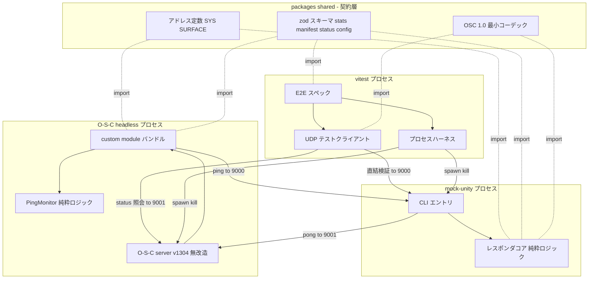
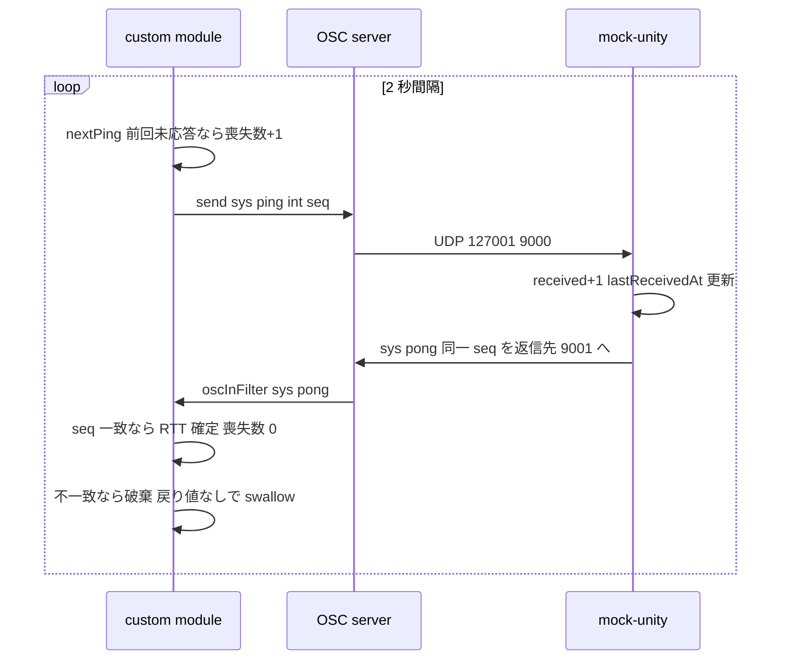
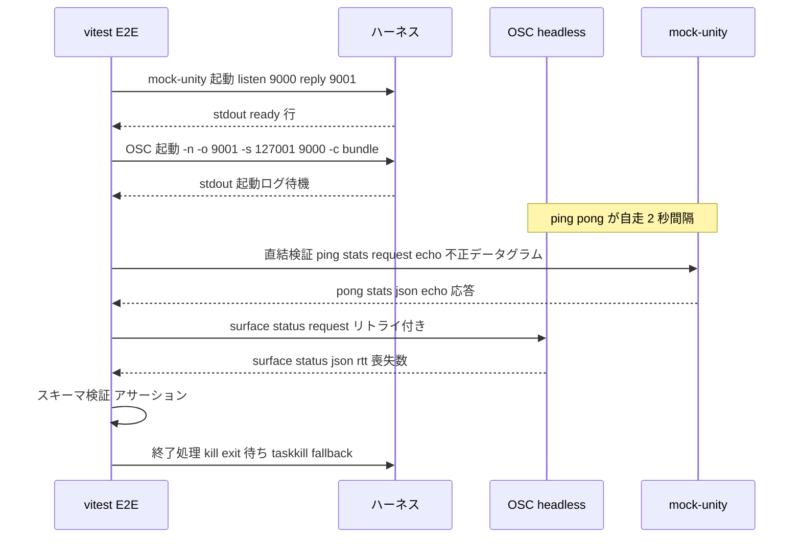

# Design Document — phase1-protocol-foundation

## Overview

**Purpose**: Phase 1 は OSC Surface の `/sys/*` プロトコル基盤を確立する。`packages/shared` のプロトコル契約(zod スキーマ + 最小 OSC 1.0 コーデック)、`packages/mock-unity` の OSC レスポンダ、`packages/custom-module` の到達性計測(2 秒間隔 ping / RTT / 連続喪失数)、および O-S-C headless + mock-unity のループバック E2E を提供する。

**Users**: プロトコル実装者・テスト作成者が単一の契約を共有して開発し、Phase 2(マニフェスト駆動 UI)・Phase 3(診断パネル)がこの基盤の上に構築される。

**Impact**: Phase 0 の骨組み(アドレス定数のみの shared、素通しの custom module、stub の mock-unity)を実装で埋める。O-S-C 本体(`vendor/open-stage-control`)は一切変更しない。

### Goals

- `/sys/*` ペイロード(stats / manifest)の zod スキーマを shared に定義し、単一の契約(single source of truth)とする
- OSC 1.0 標準のみに依存する mock-unity レスポンダで、実 Unity なしの全機能自動検証を可能にする
- custom module の 2 秒間隔 ping と RTT・連続喪失数の保持を、単体テスト可能な純粋ロジックとして実装する
- `corepack pnpm test` 一発で単体テスト + E2E(O-S-C headless + mock-unity ループバック)が完走する

### Non-Goals

- マニフェストハンドシェイクの実行と動的ウィジェット更新(Phase 2。本 Phase はスキーマ定義のみ)
- 診断パネル UI・デバッグモード・NDJSON 記録・サブネット判定(Phase 3)
- 実 Unity 接続手順書・uOSC 付録(Phase 4)
- UI 操作起点のエコーバック確定フローの自動テスト(headless に UI 駆動経路がないため手動検証で代替。research.md 参照)

## Boundary Commitments

### This Spec Owns

- `packages/shared`: `/sys/*` ペイロードスキーマ(stats / manifest)、surface 内部スキーマ(status / config)、OSC 1.0 最小コーデック、アドレス定数の拡張(`/surface/*`)
- `packages/mock-unity`: OSC レスポンダ本体(ping→pong、stats 応答、エコーバック、受信統計)と CLI 起動形態
- `packages/custom-module`: ping 送信ループ、RTT・連続喪失数の計測状態、`/sys/*`・`/surface/*` 受信メッセージのフィルタリング、config 読み込み
- `tests/`: E2E ハーネス(プロセス起動・停止・UDP テストクライアント)とループバック疎通スペック、ルート vitest 設定
- ドキュメント更新: `docs/VERIFICATION.md`(Phase 1 手順)、`docs/UNITY_PROTOCOL.md`(RTT/喪失保持仕様・互換性ノート)、`DESIGN.md`(D-006 以降)、`CLAUDE.md`(Phase 進捗)

### Out of Boundary

- `vendor/open-stage-control` 配下の一切(lockfile 含む)— 無改造の絶対規律
- `layouts/main.json` の拡張(Phase 1 は既存 Smoke Test フェーダーのままで足りる。診断パネルは Phase 3)
- マニフェスト受信時の `/EDIT` 変換ロジック(Phase 2)
- `boolFallbackToInt` の送信時変換ロジック(Phase 2 で bool 型ウィジェットと共に実装。config キーは既存のまま温存)
- `OscSurface/` Unity プロジェクト(ワークスペース管轄外)

### Allowed Dependencies

- `@osc-surface/shared` → 依存なし(zod のみ)。**全パッケージが依存してよい唯一の共有層**
- `@osc-surface/mock-unity` → shared、node:dgram(標準モジュールのみ。外部 OSC ライブラリ禁止)
- `@osc-surface/custom-module` → shared(定数・スキーマ・ping-monitor 用の型)。**shared の OSC コーデックは import 禁止**(OSC I/O は O-S-C 本体の責務)
- `tests/` → shared(コーデック・スキーマ)、mock-unity / O-S-C は子プロセスとしてのみ利用(コード import しない)
- 依存方向: `shared → { mock-unity, custom-module, tests }`。逆方向・パッケージ間の横断 import は違反

### Revalidation Triggers

- shared のスキーマ形状(stats / manifest / status / config)の変更 → Phase 2・3 の設計と `docs/UNITY_PROTOCOL.md` の再確認が必要
- `/sys/*`・`/surface/*` アドレスの追加・変更 → mock-unity・custom module・E2E の三者を同時更新
- mock-unity の返信先ルーティング規則の変更 → E2E トポロジと UNITY_PROTOCOL 互換性ノートの再確認
- config スキーマの変更 → E2E の起動手順と VERIFICATION.md の再確認

## Architecture

### Existing Architecture Analysis

Phase 0 で確立済みの制約(DESIGN.md D-001〜D-005、HANDOVER.md):

- O-S-C は Framagit upstream の submodule(v1.30.4 固定・無改造)。headless は `node vendor/open-stage-control/app -n ...` で起動し electron 不要(D-002)
- custom module は制限付きコンテキストで実行され、`module.exports = {...}` 直書きの単一 CJS バンドルのみ認識(D-003)。利用可能グローバルは `send` / `receive` / `settings` / `loadJSON` / `app` / `setInterval` / `process` 等
- `oscInFilter(data)` が戻り値を返さない場合、そのメッセージは破棄される(ウィジェットへ流れない)— システムメッセージ遮断の実現手段
- shared はビルドなし TS 直接参照(`main: src/index.ts`)— この提供形態を維持する(要件 1.4)
- pnpm は corepack 経由(D-004)。vitest はルート devDependencies に導入済みだが設定ファイルは未作成

### Architecture Pattern & Boundary Map



**Architecture Integration**:

- Selected pattern: 契約層(shared)を頂点とする一方向依存 + プロセス分離(O-S-C / mock-unity / テスト)。プロセス間の結合は OSC/UDP のみ
- Domain boundaries: `/sys/*` = Unity との対外契約、`/surface/*` = surface 内部(custom module ↔ 操作クライアント)の契約。後者は `docs/UNITY_PROTOCOL.md` に含めない
- Existing patterns preserved: D-003(esbuild 単一 CJS バンドル)を mock-unity にも適用、shared の buildless TS 維持
- New components rationale: OSC コーデックは mock-unity とテストの共用が必要なため shared に配置(research.md 判断参照)。custom module は O-S-C が OSC I/O を担うためコーデック不使用
- Steering compliance: steering 未整備のため CLAUDE.md の絶対規律(本体無改造・データ駆動・Unity が真実の源・OSC 1.0 標準のみ)を規範とする

### Dependency Direction

`shared(定数 → スキーマ → コーデック)` → `mock-unity / custom-module` → `tests(ハーネス → スペック)`。左のみ import 可。custom-module → コーデックの import はレビューでエラー扱いとする。

### Technology Stack

| Layer | Choice / Version | Role in Feature | Notes |
|-------|------------------|-----------------|-------|
| 契約・検証 | zod ^3.23(導入済み) | stats / manifest / status / config スキーマ | shared のみに依存を置く |
| OSC I/O(テスト系) | 自前 OSC 1.0 コーデック + node:dgram | mock-unity・テストクライアントの encode/decode | 外部 OSC ライブラリ不採用(research.md D-006 相当) |
| OSC I/O(本番系) | O-S-C v1.30.4(無改造) | custom module の send/receive | コーデック不要 |
| バンドル | esbuild ^0.24(導入済み) | custom-module / mock-unity の単一 CJS 化 | D-003 パターンの踏襲 |
| テスト | vitest ^3.0(導入済み・設定新規) | 単体 + E2E。ルート `test.projects` で unit / e2e 分割 | workspace ファイルは非推奨のため不使用 |
| ランタイム | Node >= 20 / corepack pnpm 10.13.1 | 全プロセス | 既定 |

新規外部依存の追加は**なし**(既存導入済みの zod / esbuild / vitest のみ)。

## File Structure Plan

### Directory Structure

```
packages/shared/src/
├── index.ts               # 既存: SYS 定数。SURFACE 定数と各モジュールの re-export を追加
├── schemas.ts             # 新規: StatsPayload / Manifest / SurfaceStatus / SurfaceConfig の zod スキーマ + 型
├── schemas.test.ts        # 新規: 受理・拒否ケースの単体テスト
├── osc-codec.ts           # 新規: OSC 1.0 最小コーデック(encode/decode、message + bundle)
└── osc-codec.test.ts      # 新規: 既知バイト列・ラウンドトリップ・不正入力の単体テスト

packages/mock-unity/src/
├── index.ts               # 書き換え: CLI エントリ(引数解釈 → サーバ起動 → シグナル処理 → ready 出力)
├── responder.ts           # 新規: レスポンダコア(受信メッセージ → 応答決定 + 受信統計。純粋ロジック)
├── responder.test.ts      # 新規: ping→pong / stats / エコーバック / parseErrors の単体テスト
└── server.ts              # 新規: node:dgram ソケット配線(受信 → decode → responder → encode → 送信)

packages/custom-module/src/
├── index.ts               # 書き換え: module.exports 配線(init / stop / oscInFilter / oscOutFilter)
├── ping-monitor.ts        # 新規: RTT・連続喪失数の状態機械(クロック注入・純粋ロジック)
├── ping-monitor.test.ts   # 新規: 計測仕様(3.1〜3.4)の単体テスト
├── config.ts              # 新規: config 解決(env 上書き + 既定相対パス)と zod 検証
└── osc-globals.d.ts       # 既存: 変更なし

tests/e2e/
├── helpers/process.ts     # 新規: 子プロセスハーネス(spawn / ready 待機 / 確実終了)
├── helpers/osc-client.ts  # 新規: UDP テストクライアント(送信 + タイムアウト付き応答待ち)
└── loopback.e2e.test.ts   # 新規: E2E 単一スペック(直結検証 + フルチェーン検証)

vitest.config.ts           # 新規: ルート設定。projects = unit / e2e
```

### Modified Files

- `packages/mock-unity/package.json` — esbuild devDependency と `build`(dist/mock-unity.js へバンドル)・`test` スクリプト追加
- `packages/shared/package.json` / `packages/custom-module/package.json` — `test` スクリプト追加(必要な場合のみ。ルート vitest が直接収集する構成なら不要。後述の Testing Strategy 参照)
- `package.json`(root) — `test` を「ワークスペースビルド → `vitest run`」に変更
- `docs/UNITY_PROTOCOL.md` — §1 に RTT・連続喪失数の保持仕様、`received` の計数規則、返信先ルーティングの互換性ノートを追記
- `docs/VERIFICATION.md` — Phase 1 手動検証手順を追記
- `DESIGN.md` — D-006(OSC コーデック自前実装)、D-007(`/surface/*` 内部名前空間と E2E 観測方式)を追記
- `CLAUDE.md` — Phase 1 進捗チェック更新

## System Flows

### ping/pong と計測(フルチェーン)



- 未応答 ping は常に最大 1 件保持(2 秒ウィンドウ)。次の ping 送信時点で未応答なら連続喪失数 +1 して新 seq に差し替える(research.md 決定)
- `/sys/*`・`/surface/*` は `oscInFilter` で戻り値を返さず破棄し、ウィジェットへ流さない(3.5)

### E2E 検証トポロジ



- 直結検証(テスト ↔ mock-unity)がエコーバック・stats 適合・パースエラー耐性を担い、フルチェーンは ping/pong 成立(RTT 記録・喪失 0)を担う。役割分担の根拠は research.md 参照
- 終了処理は `afterAll` + `try/finally` の二重防御で失敗時も必ず実行する(4.6)

## Requirements Traceability

| Requirement | Summary | Components | Interfaces | Flows |
|-------------|---------|------------|------------|-------|
| 1.1 | stats スキーマ | SharedSchemas | `StatsPayloadSchema` | — |
| 1.2 | manifest スキーマ | SharedSchemas | `ManifestSchema` | — |
| 1.3 | 検証エラーの原因特定 | SharedSchemas | zod issue(path 付き) | — |
| 1.4 | buildless TS 維持 | SharedSchemas / OscCodec | `main: src/index.ts` 継続 | — |
| 1.5 | スキーマ単体テスト | SharedSchemas | `schemas.test.ts` | — |
| 2.1 | ping→pong | MockResponder | `handlePacket` | ping/pong フロー |
| 2.2 | stats 応答 | MockResponder | `handlePacket` | E2E 直結 |
| 2.3 | エコーバック | MockResponder | `handlePacket` | E2E 直結 |
| 2.4 | 受信統計の集計 | MockResponder | `statsSnapshot` | — |
| 2.5 | パース不能耐性 | MockServer / MockResponder | `recordParseError` | E2E 直結 |
| 2.6 | OSC 1.0 標準のみ | OscCodec | `encodeMessage` / `decodePacket` | — |
| 2.7 | ポート・返信先指定と起動停止 | MockCli | CLI 引数 / ready 行 | E2E トポロジ |
| 3.1 | 2 秒間隔 ping | CustomModuleWiring | `init` の setInterval | ping/pong フロー |
| 3.2 | RTT 確定と喪失リセット | PingMonitor | `onPong` | ping/pong フロー |
| 3.3 | 喪失数の加算 | PingMonitor | `nextPing` | ping/pong フロー |
| 3.4 | 期限切れ pong 破棄 | PingMonitor | `onPong` 戻り値 false | ping/pong フロー |
| 3.5 | システムメッセージ遮断 | CustomModuleWiring | `oscInFilter` 戻り値なし | ping/pong フロー |
| 3.6 | config からの宛先読込 | ConfigLoader | `loadSurfaceConfig` | — |
| 3.7 | 計測ロジックの単体テスト | PingMonitor | `ping-monitor.test.ts` | — |
| 4.1 | headless + ループバック起動 | ProcessHarness / E2eSpec | `startProcess` | E2E トポロジ |
| 4.2 | ping/pong 成立の検証 | E2eSpec / SurfaceStatus | `/surface/status` 照会 | E2E トポロジ |
| 4.3 | エコーバック検証 | E2eSpec / OscTestClient | 直結検証 | E2E トポロジ |
| 4.4 | stats スキーマ適合検証 | E2eSpec / SharedSchemas | `StatsPayloadSchema.parse` | E2E トポロジ |
| 4.5 | `corepack pnpm test` 完走 | VitestConfig / RootScripts | `test.projects` | — |
| 4.6 | プロセス確実終了 | ProcessHarness | `stopAll` | E2E トポロジ |
| 5.1 | vendor 無改造 | 全体 | Out of Boundary 宣言 | — |
| 5.2 | アドレス定数の一元化 | SharedConstants | `SYS` / `SURFACE` | — |
| 5.3 | 環境依存値の config 化 | ConfigLoader / MockCli | config / CLI 引数 | — |
| 5.4 | 互換性ノートへの記録 | DocsUpdate | UNITY_PROTOCOL 互換性ノート | — |
| 6.1 | VERIFICATION 追記 | DocsUpdate | — | — |
| 6.2 | CLAUDE.md 進捗更新 | DocsUpdate | — | — |
| 6.3 | RTT/喪失仕様の詳細化 | DocsUpdate / PingMonitor | UNITY_PROTOCOL §1 | — |
| 6.4 | ライブラリ選定の記録 | DocsUpdate | DESIGN.md D-006 | — |

## Components and Interfaces

| Component | Domain/Layer | Intent | Req Coverage | Key Dependencies | Contracts |
|-----------|--------------|--------|--------------|------------------|-----------|
| SharedConstants | shared/契約 | `/sys/*`・`/surface/*` アドレス定数 | 5.2 | なし | State |
| SharedSchemas | shared/契約 | ペイロード・config の zod スキーマ | 1.1–1.5 | zod (P0) | Service |
| OscCodec | shared/契約 | OSC 1.0 最小 encode/decode | 2.6, 1.4 | なし | Service |
| MockResponder | mock-unity/コア | 受信 → 応答決定 + 受信統計(純粋) | 2.1–2.5 | shared (P0) | Service |
| MockServer | mock-unity/IO | UDP 配線・エラー境界・返信ルーティング | 2.5, 2.7 | node:dgram (P0), OscCodec (P0) | Service |
| MockCli | mock-unity/入口 | 引数解釈・起動停止・ready 通知 | 2.7, 5.3 | MockServer (P0) | Batch |
| PingMonitor | custom-module/コア | RTT・連続喪失数の状態機械(純粋) | 3.2–3.4, 3.7, 6.3 | なし | Service, State |
| ConfigLoader | custom-module/コア | config 解決と検証 | 3.6, 5.3 | SharedSchemas (P0) | Service |
| CustomModuleWiring | custom-module/入口 | O-S-C グローバルとの配線 | 3.1, 3.5, 4.2 | PingMonitor (P0), ConfigLoader (P0) | Event |
| OscTestClient | tests/ヘルパ | UDP テストクライアント | 4.3, 4.4 | OscCodec (P0) | Service |
| ProcessHarness | tests/ヘルパ | 子プロセスの起動・確実終了 | 4.1, 4.6 | node:child_process (P0) | Service |
| E2eSpec | tests/スペック | ループバック疎通検証 | 4.1–4.4 | 上記ヘルパ (P0) | — |
| VitestConfig | tests/基盤 | unit/e2e プロジェクト分割 | 4.5 | vitest (P0) | — |
| DocsUpdate | docs | ドキュメント・進捗更新 | 5.4, 6.1–6.4 | なし | — |

### shared(契約層)

#### SharedSchemas

| Field | Detail |
|-------|--------|
| Intent | `/sys/*` ペイロードと surface 内部データの zod スキーマ + 派生型 |
| Requirements | 1.1, 1.2, 1.3, 1.4, 1.5 |

**Responsibilities & Constraints**

- stats / manifest / surface status / surface config の 4 スキーマと `z.infer` 派生型を提供する唯一の場所(重複定義禁止)
- スキーマは `docs/UNITY_PROTOCOL.md` の記載と一致させる(乖離したらどちらかを直す)
- buildless TS(`main: src/index.ts`)を維持。zod 以外の依存を持たない

**Contracts**: Service [x]

##### Service Interface

```typescript
// packages/shared/src/schemas.ts
import { z } from 'zod'

/** /sys/stats の JSON ペイロード */
export const StatsPayloadSchema: z.ZodType<{
  received: number        // 受信メッセージ総数(0 以上の整数。/sys/* を含む全メッセージ)
  parseErrors: number     // OSC としてパース不能だったデータグラム数(0 以上の整数)
  lastReceivedAt: string  // 最終受信時刻(ISO-8601)。stats/request 自体も受信に数えるため応答時点で常に存在
}>

/** /sys/manifest の JSON ペイロード(Phase 1 はスキーマ定義のみ、実行は Phase 2) */
export const ManifestEntrySchema: z.ZodType<{
  address: string                    // '/' 始まりの OSC アドレス
  label: string
  type: 'i' | 'f' | 's' | 'b' | 'bool'
  widget: 'fader' | 'button' | 'toggle' | 'xy' | 'text'
  range?: [number, number]
  default?: number | string | boolean
  group?: string
}>
export const ManifestSchema: z.ZodType<{ version: 1; entries: ManifestEntry[] }>

/** /surface/status の JSON ペイロード(surface 内部契約。UNITY_PROTOCOL には含めない) */
export const SurfaceStatusSchema: z.ZodType<{
  lastRttMs: number | null        // 直近の RTT。pong 未受信なら null
  consecutiveLosses: number       // 連続喪失数(0 以上の整数)
  lastPongSeq: number | null      // 最後に採用した pong の seq
}>

/** config/surface.config.json */
export const SurfaceConfigSchema: z.ZodType<{
  unity: { host: string; sendPort: number; receivePort: number }
  debug: boolean
  boolFallbackToInt: boolean      // Phase 2 で使用。Phase 1 では読み捨て(検証のみ)
}>

export type StatsPayload = z.infer<typeof StatsPayloadSchema>
export type Manifest = z.infer<typeof ManifestSchema>
export type SurfaceStatus = z.infer<typeof SurfaceStatusSchema>
export type SurfaceConfig = z.infer<typeof SurfaceConfigSchema>
```

- Preconditions: 入力は `JSON.parse` 済みの unknown 値
- Postconditions: `safeParse` 失敗時は zod issue(`path` で原因フィールドを特定可能)を返す(1.3)
- Invariants: 整数フィールドは `z.number().int().nonnegative()`、`lastReceivedAt` は ISO-8601 検証、`address` は `/` 始まり、`version` は `z.literal(1)`

**Implementation Notes**

- Integration: `index.ts` から re-export し、既存の `SYS` 定数と同一入口に揃える。`SURFACE` 定数(`STATUS_REQUEST: '/surface/status/request'`, `STATUS: '/surface/status'`)も `index.ts` に追加(5.2)
- Validation: 受理・拒否(欠落・型不一致・許容外列挙値・負数・非 ISO 文字列)の両ケースを `schemas.test.ts` で網羅(1.5)
- Risks: UNITY_PROTOCOL との二重管理 → スキーマを正とし、ドキュメント側に「shared の zod 定義を正とする」旨が既に明記されていることを維持

#### OscCodec

| Field | Detail |
|-------|--------|
| Intent | OSC 1.0 メッセージ/バンドルの最小 encode/decode(テストハーネス系専用) |
| Requirements | 2.6, 1.4 |

**Responsibilities & Constraints**

- 対応範囲: 型タグ `i`(int32) / `f`(float32) / `s`(string) / `b`(blob)、message、bundle(`#bundle` + timetag は透過保持)。それ以外の型タグは decode 時に明示的エラー
- OSC 1.0 のパディング(4 バイト境界)・ビッグエンディアンに準拠。ライブラリ固有拡張を一切実装しない
- 利用者は mock-unity と tests のみ。**custom-module からの import は禁止**(依存方向規則)

**Dependencies**

- External: なし(Node 標準の `Buffer`/`DataView` のみ)

**Contracts**: Service [x]

##### Service Interface

```typescript
// packages/shared/src/osc-codec.ts
export type OscArg =
  | { type: 'i'; value: number }
  | { type: 'f'; value: number }
  | { type: 's'; value: string }
  | { type: 'b'; value: Uint8Array }

export interface OscMessagePacket { kind: 'message'; address: string; args: OscArg[] }
export interface OscBundlePacket { kind: 'bundle'; timetag: bigint; elements: OscPacket[] }
export type OscPacket = OscMessagePacket | OscBundlePacket

export class OscDecodeError extends Error {}   // パース不能を型で区別(2.5 の計数根拠)

export function encodeMessage(address: string, args: OscArg[]): Uint8Array
export function decodePacket(data: Uint8Array): OscPacket   // 不正入力は OscDecodeError を throw
```

- Preconditions: `address` は `/` 始まり
- Postconditions: `decodePacket(encodeMessage(...))` はラウンドトリップで同値。未対応型タグ・境界外・パディング違反は `OscDecodeError`
- Invariants: 出力バイト列長は常に 4 の倍数

**Implementation Notes**

- Validation: OSC 1.0 仕様書の既知バイト列(例: `/oscillator/4/frequency` + 440.0f)をテストベクタに採用。加えて E2E で O-S-C(独立実装)とのラウンドトリップにより自己整合バグを検出(research.md)
- Risks: bundle の再帰 decode で悪意ある入力による無限再帰 → 要素サイズ検証と深さ上限で防御

### mock-unity

#### MockResponder

| Field | Detail |
|-------|--------|
| Intent | 受信パケット → 応答メッセージ列の決定と受信統計の集計(ソケット非依存の純粋コア) |
| Requirements | 2.1, 2.2, 2.3, 2.4, 2.5 |

**Responsibilities & Constraints**

- 応答規則(この順で評価): `/sys/ping (i seq)` → `/sys/pong (i seq)`、`/sys/stats/request` → `/sys/stats (s json)`、その他の `/sys/*` → 応答なし(将来アドレスの誤エコー防止)、非 `/sys/*` → 同一アドレス・同一引数のエコーバック
- bundle 受信時は要素を展開して各メッセージに規則を適用(bundle 内メッセージも `received` に個別計数)
- 統計: 正常 decode したメッセージごとに `received` +1・`lastReceivedAt` 更新。`recordParseError()` で `parseErrors` +1(プロセス継続)
- `/sys/stats` の JSON は `StatsPayloadSchema` に適合させる(2.4)

**Dependencies**

- Outbound: SharedConstants / SharedSchemas / OscCodec 型 — 契約参照 (P0)

**Contracts**: Service [x]

##### Service Interface

```typescript
// packages/mock-unity/src/responder.ts
import type { OscPacket, OscMessagePacket } from '@osc-surface/shared'
import type { StatsPayload } from '@osc-surface/shared'

export interface Clock { now(): Date }

export class MockUnityResponder {
  constructor(clock: Clock)
  /** 正常 decode 済みパケットを処理し、返すべきメッセージ列(0..n 件)を返す */
  handlePacket(packet: OscPacket): OscMessagePacket[]
  /** パース不能データグラムの計上(2.5) */
  recordParseError(): void
  /** 現在の統計スナップショット(StatsPayloadSchema 適合) */
  statsSnapshot(): StatsPayload
}
```

- Preconditions: `handlePacket` には decode 成功済みパケットのみ渡す
- Postconditions: 例外を投げない(不明入力は応答なしで継続)
- Invariants: `received` / `parseErrors` は単調増加

**Implementation Notes**

- Validation: `responder.test.ts` で応答規則 4 系統 + 統計遷移を網羅(ソケット不要)
- Risks: エコーバックのループ(エコーがまたエコーされる)— mock-unity は受信に対してのみ応答し自発送信しないため、O-S-C 側が受信メッセージを再送しない限りループしない。E2E で確認

#### MockServer / MockCli

| Field | Detail |
|-------|--------|
| Intent | UDP ソケット配線(Server)と CLI 起動形態(Cli) |
| Requirements | 2.5, 2.7, 5.3 |

**Responsibilities & Constraints**

- MockServer: `node:dgram` で待受け → `decodePacket` → 成功時 `handlePacket` の応答を encode して送信 / `OscDecodeError` 時 `recordParseError()` のみ(プロセス継続)
- 返信先: `replyTo` 指定時はそこへ、未指定時は受信データグラムの送信元(rinfo)へ送る。既定運用(E2E・実 Unity 想定)は明示指定(research.md の互換性判断)
- MockCli: 引数 `--listen-port <n>`(必須)/ `--reply-host <host> --reply-port <n>`(任意・対で指定)を解釈。起動完了時に stdout へ 1 行 `MOCK_UNITY_READY {"listenPort":n}` を出力(テスト同期用の契約)。SIGINT/SIGTERM でソケットを閉じて exit 0
- esbuild で `dist/mock-unity.js` に単一バンドルし、`node` 直接実行(D-003 踏襲。research.md 決定)

**Contracts**: Service [x] / Batch [x]

##### Service Interface

```typescript
// packages/mock-unity/src/server.ts
export interface MockServerOptions {
  listenPort: number
  replyTo?: { host: string; port: number }   // 未指定時は datagram 送信元へ返信
  clock?: Clock
}
export interface MockServerHandle {
  close(): Promise<void>
  readonly responder: MockUnityResponder     // テストからの統計参照用
}
export function startMockServer(options: MockServerOptions): Promise<MockServerHandle>
```

##### Batch / Job Contract(CLI)

- Trigger: `node packages/mock-unity/dist/mock-unity.js --listen-port 9000 --reply-host 127.0.0.1 --reply-port 9001`
- Input / validation: ポートは 1–65535 の整数。不正時は stderr にメッセージを出し exit 1
- Output: stdout に ready 行(1 行 JSON)。以降はログのみ
- Idempotency & recovery: bind 失敗(EADDRINUSE)は exit 1。再起動はハーネス側の責務

**Implementation Notes**

- Integration: E2E は ready 行で起動同期。手動検証(VERIFICATION.md)でも同じ CLI を使う
- Risks: Windows の UDP ソケットで接続先不達時に `ECONNRESET` 相当のエラーイベントが発生することがある → `socket.on('error')` でログのみ(プロセス継続)

### custom-module

#### PingMonitor

| Field | Detail |
|-------|--------|
| Intent | RTT・連続喪失数の状態機械(O-S-C 非依存・クロック注入の純粋ロジック) |
| Requirements | 3.2, 3.3, 3.4, 3.7, 6.3 |

**Responsibilities & Constraints**

- 未応答 ping は常に最大 1 件保持(pong 待ちウィンドウ = ping 間隔の 2 秒)。この保持仕様が `docs/UNITY_PROTOCOL.md` §1 の詳細化内容(6.3)
- seq は 1 始まりの単調増加 int32(2 秒間隔では実用上枯渇しない)
- タイマーや送信は持たない(呼び出し側の責務)。全遷移が同期的で単体テスト可能(3.7)

**Contracts**: Service [x] / State [x]

##### Service Interface

```typescript
// packages/custom-module/src/ping-monitor.ts
import type { SurfaceStatus } from '@osc-surface/shared'

export class PingMonitor {
  /** 次に送るべき seq を発行。前回 seq が未応答のままなら連続喪失数を +1(3.3) */
  nextPing(nowMs: number): number
  /** pong 受信。保持中 seq と一致すれば RTT 確定・喪失数 0 で true(3.2)、不一致は破棄で false(3.4) */
  onPong(seq: number, nowMs: number): boolean
  /** SurfaceStatusSchema 適合のスナップショット(Phase 3 診断パネルの表示ソース) */
  snapshot(): SurfaceStatus
}
```

- Invariants: `consecutiveLosses >= 0`。`lastRttMs` は採用された pong でのみ更新。同一 seq の重複 pong は 2 回目以降 false

##### State Management

- State model: `{ pending: { seq, sentAtMs } | null, lastRttMs, consecutiveLosses, lastPongSeq }`
- Persistence & consistency: メモリのみ(O-S-C autoreload で消えるのは許容。reload 後に計測は自然再開)
- Concurrency strategy: 単一スレッド(Node イベントループ)前提。ロック不要

#### ConfigLoader / CustomModuleWiring

| Field | Detail |
|-------|--------|
| Intent | config 解決・検証(Loader)と O-S-C グローバルへの配線(Wiring) |
| Requirements | 3.1, 3.5, 3.6, 4.2, 5.3 |

**Responsibilities & Constraints**

- ConfigLoader: 検証は純粋関数 `parseSurfaceConfig(raw: unknown): SurfaceConfig`(`SurfaceConfigSchema.parse`)。読み込みパスは環境変数 `OSC_SURFACE_CONFIG`(絶対パス)があればそれを、なければ `dist/osc-surface.js` 基準の相対 `../../../config/surface.config.json` を使う。読み込みは注入された `loadJSON` 相当関数で行い、Loader 自体は O-S-C グローバルへ直接依存しない(単体テスト可能)
- CustomModuleWiring(`index.ts`, `module.exports` 直書き):
  - `init()`: config 読込 → 検証。成功時 `setInterval(2000)` で `PingMonitor.nextPing()` → `send(unity.host, unity.sendPort, SYS.PING, {type:'i', value: seq})`。失敗時はエラーログを出し ping ループを開始しない(O-S-C 自体は落とさない)
  - `oscInFilter(data)`:
    - `SYS.PONG` → 引数 1 個目が int なら `PingMonitor.onPong`。**戻り値なし**(swallow, 3.5)
    - `SURFACE.STATUS_REQUEST` → `send(data.host, data.port, SURFACE.STATUS, {type:'s', value: JSON.stringify(monitor.snapshot())})`。戻り値なし
    - その他の `/sys/*`・`/surface/*` → 戻り値なし(swallow)
    - それ以外 → `data` をそのまま返す(ウィジェットへ素通し)
  - `oscOutFilter(data)`: 素通し(Phase 1 では変換なし)
  - `stop()` / `unload()`: interval をクリア(autoreload 安全性)
  - フィルタ内は try/catch で保護し、例外で O-S-C サーバを巻き込まない

**Contracts**: Service [x] / Event [x]

##### Event Contract

- Published(送信): `/sys/ping (i seq)` — 2 秒間隔、宛先は config の `unity.host:sendPort`(3.1, 3.6)。`/surface/status (s json)` — status 照会元へのみ返信
- Subscribed(受信・oscInFilter): `/sys/pong (i seq)`、`/surface/status/request ()`。その他 `/sys/*` は破棄
- Ordering / delivery guarantees: UDP のため保証なし。順序逆転・喪失は PingMonitor の破棄規則で吸収

**Implementation Notes**

- Integration: アドレス比較は必ず `SYS` / `SURFACE` 定数で行う(5.2)。esbuild バンドルに shared の定数・スキーマ・PingMonitor が含まれる(コーデックは import しないためバンドルに入らないこと)
- Validation: Wiring 自体は E2E で検証(単体テスト対象は PingMonitor / parseSurfaceConfig)
- Risks: `loadJSON` の相対パス解決が想定と異なる場合 → init 時にエラーログで即検出できるようにし、E2E がフルチェーンで検知する

### tests(E2E ハーネス)

#### ProcessHarness / OscTestClient

| Field | Detail |
|-------|--------|
| Intent | 子プロセスの起動・確実終了(Harness)と OSC/UDP テストクライアント(Client) |
| Requirements | 4.1, 4.3, 4.4, 4.6 |

**Responsibilities & Constraints**

- ProcessHarness:
  - `spawn` は `shell: false`・引数配列で直接 node を起動(プロセスツリーを作らず Windows での kill を確実化)
  - ready 判定: stdout を行単位で監視し、正規表現(mock-unity: `MOCK_UNITY_READY`、O-S-C: custom module 読み込みログ)にタイムアウト付きでマッチ
  - 終了: `kill()` → `exit` イベントを待機(タイムアウト付き)→ 未終了なら Windows は `taskkill /PID <pid> /T /F`、他 OS は `SIGKILL`。登録済み全プロセスを `stopAll()` で必ず畳む(4.6)
  - 失敗診断のため子プロセスの stdout/stderr をバッファし、テスト失敗時に出力
- OscTestClient: `node:dgram` ソケットを 1 個 bind し、`encodeMessage` で送信・受信を `decodePacket` して返す。`request()` はタイムアウト + リトライ回数を指定可能(起動直後の照会レース対策)

**Contracts**: Service [x]

##### Service Interface

```typescript
// tests/e2e/helpers/process.ts
export interface SpawnSpec {
  command: string            // 'node' 固定運用
  args: string[]
  readyPattern: RegExp       // stdout 行マッチで起動完了
  readyTimeoutMs: number
}
export interface ManagedProcess { readonly pid: number; stop(): Promise<void> }
export class ProcessHarness {
  start(spec: SpawnSpec): Promise<ManagedProcess>
  stopAll(): Promise<void>   // 逆順で全停止。失敗しても残りを止め切る
}

// tests/e2e/helpers/osc-client.ts
export interface OscTestClient {
  send(host: string, port: number, address: string, args: OscArg[]): Promise<void>
  /** 送信後、フィルタに合致する最初の受信メッセージを返す。タイムアウトで reject */
  request(opts: {
    to: { host: string; port: number }
    message: { address: string; args: OscArg[] }
    expectAddress: string
    timeoutMs: number
    retries?: number
  }): Promise<OscMessagePacket>
  sendRaw(host: string, port: number, data: Uint8Array): Promise<void>  // 不正データグラム注入用(2.5 検証)
  close(): Promise<void>
}
```

**Implementation Notes**

- Integration: E2E で使うポートは固定(mock-unity 9000 / O-S-C OSC 入力 9001 / O-S-C HTTP 7080 — `config/surface.config.json` の既定と一致させ、config 上書きなしで動かす)。E2E は単一ファイル + `singleFork` で直列実行のため競合しない
- Validation: ハーネス自体の異常系(ready タイムアウト・kill フォールバック)は E2E の失敗メッセージで観測
- Risks: ポート占有時は EADDRINUSE / ready タイムアウトで失敗 → エラーメッセージに占有確認手順を含める(VERIFICATION.md にも記載)

#### E2eSpec / VitestConfig

| Field | Detail |
|-------|--------|
| Intent | ループバック疎通スペック(単一ファイル)とテスト実行基盤 |
| Requirements | 4.1, 4.2, 4.3, 4.4, 4.5 |

**Responsibilities & Constraints**

- `tests/e2e/loopback.e2e.test.ts` の構成(describe 2 系統・直列):
  1. **直結検証**(mock-unity 単独 spawn): ping→pong の seq 一致 / 通常メッセージのエコーバック(int・float・string 引数、同一アドレス・同一引数)/ 不正データグラム送信後も応答継続 / `/sys/stats` 応答が `StatsPayloadSchema.parse` に通り `parseErrors >= 1`・`received` が増加している(4.3, 4.4, 2.5)
  2. **フルチェーン検証**(mock-unity + O-S-C headless spawn): 起動後、ping 2 周期分(約 5 秒)待機 → `OscTestClient.request` で `/surface/status/request` を O-S-C の 9001 へ送信(リトライ付き)→ 応答 JSON を `SurfaceStatusSchema.parse` → `lastRttMs !== null && consecutiveLosses === 0 && lastPongSeq >= 1` を検証(4.1, 4.2)
- O-S-C 起動コマンド: `node vendor/open-stage-control/app -n -p 7080 -o 9001 -s 127.0.0.1:9000 -l layouts/main.json -c packages/custom-module/dist/osc-surface.js`
- VitestConfig(ルート `vitest.config.ts`):
  - `test.projects`: `unit`(include: `packages/*/src/**/*.test.ts`、並列可)/ `e2e`(include: `tests/e2e/**/*.e2e.test.ts`、`poolOptions.forks.singleFork: true`、`testTimeout`/`hookTimeout` 60s)
  - workspace ファイルは作らない(vitest 3.2 で非推奨。research.md)
- root `package.json`: `"test": "corepack pnpm -r run build && vitest run"`(バンドル生成 → 全テスト。4.5)。パッケージ個別の `test` スクリプトは廃し、ルート vitest が一括収集する(`pnpm -r run test` 方式は廃止)

**Implementation Notes**

- Validation: CI 想定のため人手操作・GUI・ネットワーク外部依存ゼロ。失敗時は子プロセスログを出力して原因追跡可能にする
- Risks: フルチェーンの時間依存(2 秒周期待ち)による flakiness → 固定 sleep でなく「status 照会をリトライし、条件成立までポーリング(上限 15 秒)」で吸収

### docs

#### DocsUpdate

| Field | Detail |
|-------|--------|
| Intent | Phase 1 完了条件のドキュメント反映 |
| Requirements | 5.4, 6.1, 6.2, 6.3, 6.4 |

**Responsibilities & Constraints**

- `docs/UNITY_PROTOCOL.md` §1 に追記(6.3): RTT・連続喪失数の保持仕様(未応答 1 件ウィンドウ・2 秒・期限切れ破棄)、`received` の計数規則(`/sys/*` 含む全パース成功メッセージ、bundle は要素ごと)、`lastReceivedAt` が応答時点で常に存在する根拠
- 同・互換性ノートに追記(5.4): 返信先は設定で明示する(データグラム送信元への返信をプロトコルの前提にしない)。実装中に新たな解釈割れが見つかった場合も同ノートへ追記し、本体改造が必要なら選択肢を添えてユーザーへ報告(実装時の手順として遵守)
- `docs/VERIFICATION.md` に Phase 1 手順を追記(6.1): mock-unity CLI 起動 → O-S-C headless 起動 → ブラウザで Smoke Test フェーダー操作 → mock-unity のエコーバックでウィジェット確定を目視確認 → `OscTestClient` 相当の手動 status 照会(または `corepack pnpm test`)。ポート占有時の確認手順も記載
- `DESIGN.md` に D-006(OSC コーデック自前実装・shared 配置。理由と捨てた選択肢は research.md の内容を要約)、D-007(`/surface/*` 内部名前空間と E2E 観測方式)を追記(6.4)
- `CLAUDE.md` の Phase 進捗で Phase 1 をチェック(6.2)。root `test` スクリプト変更に伴う開発コマンド記載の整合も確認

## Data Models

### Data Contracts & Integration

本機能はデータベースを持たない。契約は OSC メッセージとその JSON ペイロードのみ。

**OSC メッセージ契約(ワイヤ)**

| 方向 | アドレス | 型タグ | ペイロード検証 |
|---|---|---|---|
| Surface → Unity/mock | `/sys/ping` | `i` | — |
| Unity/mock → Surface | `/sys/pong` | `i` | seq 一致のみ(PingMonitor) |
| Surface → Unity/mock | `/sys/stats/request` | (なし) | — |
| Unity/mock → Surface | `/sys/stats` | `s` | `StatsPayloadSchema` |
| Client → Surface | `/surface/status/request` | (なし) | — |
| Surface → Client | `/surface/status` | `s` | `SurfaceStatusSchema` |
| 任意(非 `/sys/*`) | エコーバック | 受信と同一 | 同一アドレス・同一引数 |

- JSON ペイロードはすべて UTF-8 の OSC string 1 引数で運ぶ(OSC 1.0 の解釈割れがある配列引数を避ける方針の踏襲)
- スキーマバージョニング: manifest のみ `version: 1` を持つ。stats / status は Phase 内固定(変更時は Revalidation Triggers に従う)

## Error Handling

### Error Strategy

3 プロセス(O-S-C / mock-unity / vitest)がそれぞれ独立に縮退する。共通原則: **受信系は落とさない・送信系は投げない・テスト系は必ず畳む**。

### Error Categories and Responses

- **mock-unity(受信系)**: パース不能データグラム → `parseErrors` +1 のみで継続(2.5)。ソケットエラーイベント → ログのみ。CLI 引数不正・bind 失敗 → stderr + exit 1(fail fast)
- **custom module(常駐系)**: config 欠落・検証失敗 → 明確なエラーログを出し ping ループを開始しない(O-S-C 本体は稼働継続)。`oscInFilter` 内例外 → try/catch で握ってログ(1 メッセージの異常でサーバを巻き込まない)。pong の型不正(int 以外)→ 破棄
- **PingMonitor(計測)**: pong 喪失は異常ではなく計測対象(連続喪失数として表現)。未知 seq は黙って破棄(3.4)
- **E2E(テスト系)**: ready タイムアウト・照会タイムアウト → 子プロセスの stdout/stderr を添えて失敗報告。いかなる失敗経路でも `stopAll()` を実行(4.6)

### Monitoring

Phase 1 の観測手段は (a) custom module のコンソールログ(O-S-C stdout に合流)、(b) `/surface/status` 照会、(c) mock-unity の `/sys/stats`。リングバッファ・NDJSON 等の本格的な観測は Phase 3 の boundary。

## Testing Strategy

### Unit Tests(vitest `unit` プロジェクト・並列)

1. `schemas.test.ts` — 4 スキーマの受理ケースと拒否ケース(欠落・型不一致・許容外列挙値・負整数・非 ISO 日時)、zod issue の path で原因フィールドが特定できること(1.3, 1.5)
2. `osc-codec.test.ts` — OSC 1.0 仕様の既知バイト列との一致、encode→decode ラウンドトリップ(i/f/s/b・bundle)、不正入力(短すぎる・パディング違反・未知型タグ)で `OscDecodeError`(2.6)
3. `responder.test.ts` — ping→pong の seq 保存、stats 応答のスキーマ適合、非 `/sys/*` エコーバック、未知 `/sys/*` 無応答、`recordParseError` と `received`/`lastReceivedAt` の遷移(2.1–2.5)
4. `ping-monitor.test.ts` — RTT 確定と喪失リセット、未応答での喪失加算、期限切れ・未知・重複 pong の破棄、snapshot のスキーマ適合(3.2–3.4, 3.7)
5. `config` の parse 関数 — 正常 config の受理、欠落・型不正の拒否(3.6, 5.3)

### E2E Tests(vitest `e2e` プロジェクト・直列)

1. 直結検証: ping/pong・エコーバック・stats スキーマ適合・不正データグラム耐性(4.3, 4.4, 2.5, 2.7)
2. フルチェーン検証: O-S-C headless + custom module + mock-unity で ping/pong が自走し、`/surface/status` が `lastRttMs != null`・`consecutiveLosses == 0` を返す(4.1, 4.2)
3. クリーンアップ検証(暗黙): 全スペック終了後にプロセスが残らない・ポートが解放される(`stopAll()` の afterAll 実行。4.6)

### 実行形態

- `corepack pnpm test` = ワークスペース build(custom-module / mock-unity のバンドル生成)→ `vitest run`(unit + e2e)。人手操作なし・ヘッドレス完結(4.5)
- UI 起点のエコーバック確定は自動化対象外とし、`docs/VERIFICATION.md` の手動手順で担保(research.md の決定)
