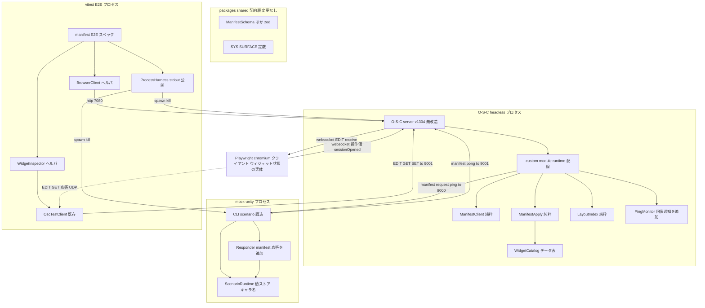
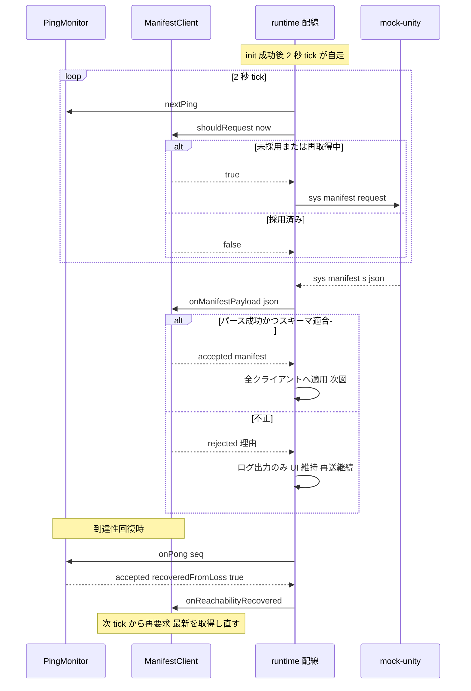
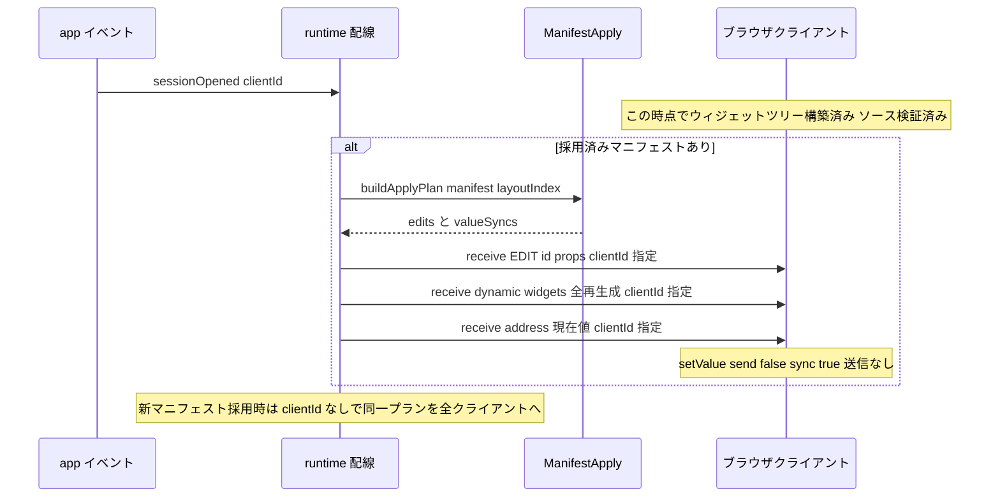
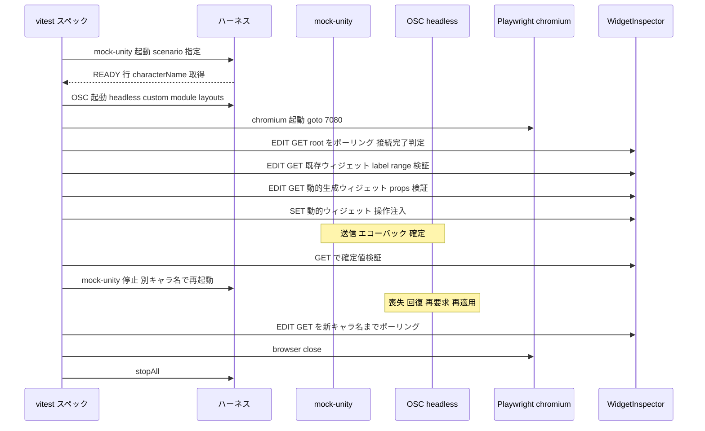

# Design Document — phase2-manifest-driven-ui

## Overview

**Purpose**: Phase 2 は OSC Surface のマニフェスト駆動 UI を実現する。custom module が Unity(開発・テストでは mock-unity)へ `/sys/manifest/request` を送信し、応答の `/sys/manifest (s json)` を zod 検証して採用し、O-S-C リモートコマンド(`/EDIT`)でレイアウトウィジェットのラベル・レンジを更新し、レイアウトに対応ウィジェットがないエントリはウィジェットを動的生成する。マニフェストの現在値は `receive()` による表示専用同期で UI に反映し、キャラクター名など実行時にしか決まらない値を人手設定なしで UI に取り込む。

**Users**: サーフェス利用者・運用者はブラウザを開くだけで Unity の実状態と一致した UI を得る。開発者は mock-unity のシナリオデータと Playwright 保持クライアントを使った E2E で全経路を自動検証する。

**Impact**: Phase 1 の基盤(shared のマニフェストスキーマ、module-runtime の DI 配線、PingMonitor、mock-unity レスポンダ、E2E ハーネス)を拡張する。O-S-C 本体(`vendor/open-stage-control`)は一切変更しない。

### Goals

- マニフェストハンドシェイク(要求・無制限再送・到達性回復時の再取得・zod 検証・不正応答時の稼働継続)を custom module に実装する
- マニフェスト → `/EDIT` コマンド列 + 値同期列への変換を、O-S-C 実行環境なしで単体テスト可能な純粋ロジックとして実装する(既存ウィジェット更新 + 動的生成の両方)
- mock-unity に「キャラ名が毎回変わる」シナリオを含むデータ駆動のマニフェスト応答を実装する
- Playwright 保持のヘッドレスブラウザクライアント + OSC リモートコマンド(`/EDIT/GET`・`/GET`・`/SET`)による E2E でハンドシェイクからウィジェット反映・操作確定までを自動検証する

### Non-Goals

- 診断パネル UI・デバッグモード・NDJSON 記録・サブネット判定(Phase 3)
- 実 Unity 接続手順書・uOSC 付録(Phase 4)
- `bool` 型の `T`/`F` タグ送信と `boolFallbackToInt` 変換の完全実装(Phase 2 の動的生成では `bool` → toggle を int 0/1 の値同期で扱う。送信時タグ変換の作り込みは実 Unity 接続時に確定)
- レイアウトエディタ経由の動的ウィジェット永続化(動的ウィジェットは表示キャッシュであり、セッションファイルへ保存しない)

## Boundary Commitments

### This Spec Owns

- `packages/custom-module`: マニフェストハンドシェイク状態機械(`manifest-client`)、レイアウト索引(`layout-index`)、ウィジェット対応表(`widget-catalog`)、適用プラン生成(`manifest-apply`)、runtime 配線拡張(`module-runtime`)、PingMonitor の回復遷移通知
- `packages/mock-unity`: シナリオ定義(スキーマ・読み込み・キャラ名生成・値ストア)、マニフェスト応答、CLI 拡張(`--scenario` / `--character-name`、READY 行の `characterName`)
- `layouts/main.json`: 動的生成先コンテナ(`dynamic` パネル)とマニフェスト対応済み既存ウィジェットの追加(データ変更)
- `tests/`: Playwright ブラウザクライアントヘルパ、OSC ベースのウィジェット検査ヘルパ、マニフェスト E2E スペック、ProcessHarness の stdout 公開拡張
- ドキュメント更新: `docs/UNITY_PROTOCOL.md` §2 詳細化 + 互換性ノート、`docs/VERIFICATION.md` Phase 2 手順、`DESIGN.md`(D-008 以降)、`CLAUDE.md` 進捗

### Out of Boundary

- `vendor/open-stage-control` 配下の一切(lockfile 含む)— 無改造の絶対規律(6.1)。`/EDIT` 等で実現できない要件が判明した場合は実装せずユーザーへ選択肢を添えて報告する(6.2)
- `packages/shared` のスキーマ変更(Phase 1 定義の `ManifestSchema` をそのまま単一契約として使う。変更が必要になった場合は互換性影響を記録して報告)
- Phase 1 の到達性計測・エコーバック・stats 応答の挙動変更(PingMonitor の戻り値拡張は情報追加のみで、計測仕様は不変)
- `OscSurface/` Unity プロジェクト(ワークスペース管轄外)

### Allowed Dependencies

- 依存方向(Phase 1 踏襲・変更なし): `shared → { custom-module, mock-unity } → tests`。左のみ import 可
- `custom-module` → shared のみ(`osc` npm 禁止・Playwright 禁止)。O-S-C グローバル(`send` / `receive` / `app` / `settings` / `loadJSON`)は DI 経由で注入し、純粋ロジックはグローバルへ直接依存しない
- `mock-unity` → shared、node:dgram、`osc` npm(コーデックのみ、Phase 1 制約を維持)
- `tests` → shared、`osc` npm、**`playwright`(新規 root devDependency。tests のみが使用)**。mock-unity / O-S-C は子プロセスとしてのみ利用
- シナリオ JSON・レイアウト JSON・widget-catalog 対応表は「データ」であり、案件固有分岐をコードに持ち込まない(6.4, 2.9, 4.5)

### Revalidation Triggers

- `ManifestSchema` の形状変更 → 本設計・`docs/UNITY_PROTOCOL.md` §2・mock-unity シナリオスキーマの三者同時再確認
- `dynamic` コンテナの id・配置規則の変更 → layout-index の除外規則と E2E 期待値の再確認
- `/EDIT`・`/EDIT/GET`・`/GET` の vendor 仕様変更(submodule 更新時)→ manifest-apply・widget-inspector の再検証
- PingMonitor の戻り値・状態形状の変更 → Phase 3 診断パネル設計の再確認
- mock-unity CLI 引数・READY 行 JSON の変更 → E2E ハーネスと VERIFICATION.md の再確認

## Architecture

### Existing Architecture Analysis

Phase 1 で確立済みの前提(phase1 design・DESIGN.md D-001〜D-007):

- custom module は esbuild 単一 CJS バンドル。`module-runtime.ts` が DI 形式(`CustomModuleRuntimeDeps`)で O-S-C グローバルを注入する構造 — Phase 2 は deps に `receiveFn`・`appEvents`・レイアウト読み込みを追加する
- `oscInFilter` は `/sys/*`・`/surface/*` を swallow(要件 1.7 は既存実装で成立)。`/sys/manifest` の処理は swallow 前にフックする
- `ManifestSchema`・`SYS.MANIFEST_REQUEST`・`SYS.MANIFEST` は shared に定義済み(6.3 — 重複定義しない)
- vendor v1.30.4 のソース検証で確定した事実(research.md 参照):
  - リモートコマンドは **ブラウザクライアント内で実行**され、ウィジェット状態はクライアントごとに存在する → クライアント接続ごとの再適用が必須
  - `app.on('sessionOpened', (data, client))` はクライアントのウィジェットツリー構築完了後に届く → 適用トリガとして安全
  - custom module の `receive('/EDIT', id, json, {clientId})` は `cm: 1` フラグ付きで特定クライアントに配信できる
  - `receive(address, value)` はクライアントで `setValue({send:false, sync:true})` になる → フィードバックループなしの表示同期(3.2)。`/SET` は Unity へ送信するため custom module からは使用禁止
  - slider 系はドラッグ中の外部値をキュー退避する → 要件 3.4 は vendor 挙動で成立

### Architecture Pattern & Boundary Map



**Architecture Integration**:

- Selected pattern: Phase 1 と同型の「純粋ロジック分離 + runtime 配線」(research.md Option C)。マニフェスト処理の全判断(再送要否・検証・適用プラン)は純粋モジュールが行い、runtime は O-S-C グローバルとの入出力配線のみを担う
- Domain boundaries: `/sys/*` = Unity 契約(shared)、`/EDIT` 等 = O-S-C クライアント契約(custom module と tests のみが使用し、UNITY_PROTOCOL には含めない)、シナリオ = mock-unity 内部契約
- New components rationale: ウィジェット状態がクライアントごとに存在するため、「採用済みマニフェストの保持 + sessionOpened ごとの適用」という状態管理が新規に必要。動的生成は `dynamic` コンテナへの `/EDIT` 宣言的全再生成に一本化(research.md 決定)
- Steering compliance: 本体無改造(6.1)・データ駆動(2.9, 4.5, 6.4)・Unity が真実の源(3.5)・OSC 1.0 標準のみ(4.6)を全決定の規範とする

### Dependency Direction

`shared` → `custom-module(widget-catalog → layout-index → manifest-apply → manifest-client → module-runtime → index)` / `mock-unity(scenario → responder → server → index)` → `tests(helpers → spec)`。左のみ import 可。custom-module から `osc` npm / `playwright` への import はレビューでエラー扱い。

### Technology Stack

| Layer | Choice / Version | Role in Feature | Notes |
|-------|------------------|-----------------|-------|
| 契約・検証 | zod ^3.23(既存) | マニフェスト・シナリオ・READY 行の検証 | shared スキーマは変更しない |
| リモートコマンド | O-S-C v1.30.4 `/EDIT` `/EDIT/GET` `/GET` `/SET`(無改造) | ウィジェット更新・生成・検証・操作注入 | クライアント内実行(research.md) |
| ブラウザ保持 | **playwright ^1.61(新規 root devDependency)** | E2E 中の O-S-C クライアント 1 個保持 | chromium headless。`playwright install chromium` が前提 |
| OSC I/O(テスト系) | `osc` npm ^2.4 + node:dgram(既存) | widget-inspector の encode/decode | Phase 1 使用制約を維持 |
| バンドル / テスト / ランタイム | esbuild ^0.24 / vitest ^3.0 / Node >= 20(既存) | 変更なし | E2E は `singleFork` 直列を維持 |

新規外部依存は **`playwright` のみ**(tests 専用)。custom-module・mock-unity に新規依存はない。

## File Structure Plan

### Directory Structure

```
packages/custom-module/src/
├── index.ts                  # 変更: receive / app / settings / loadJSON を runtime へ注入
├── module-runtime.ts         # 変更: マニフェストライフサイクル配線(下記 Components 参照)
├── module-runtime.test.ts    # 変更: マニフェスト配線の単体テスト追加
├── ping-monitor.ts           # 変更: onPong 戻り値に回復遷移情報を追加
├── ping-monitor.test.ts      # 変更: 回復遷移のテスト追加
├── manifest-client.ts        # 新規: 要求・再送・回復再要求・検証の状態機械(純粋)
├── manifest-client.test.ts   # 新規
├── layout-index.ts           # 新規: レイアウト JSON → address→widgetId 索引(純粋)
├── layout-index.test.ts      # 新規
├── widget-catalog.ts         # 新規: manifest widget 種別 → O-S-C ウィジェット型 + プロパティ雛形(データ表)
├── manifest-apply.ts         # 新規: マニフェスト + 索引 + 対応表 → /EDIT コマンド列 + 値同期列(純粋)
├── manifest-apply.test.ts    # 新規(widget-catalog の検証を兼ねる)
└── osc-globals.d.ts          # 変更: receive / app / settings のグローバル宣言追加

packages/mock-unity/src/
├── index.ts                  # 変更: --scenario / --character-name 解釈、READY 行に characterName
├── scenario.ts               # 新規: シナリオスキーマ(zod)・キャラ名生成・値ストア・マニフェスト構築
├── scenario.test.ts          # 新規
├── responder.ts              # 変更: /sys/manifest/request 応答 + 受信値の値ストア反映
├── responder.test.ts         # 変更: マニフェスト応答・値ストアのテスト追加
└── server.ts                 # 変更なし(responder 差し替えのみで対応)

packages/mock-unity/scenarios/
├── default.json              # 新規: 既存ウィジェット対応 + 動的生成 + キャラ名エントリを含む標準シナリオ(キャラ名候補は日本語を含む — マルチバイト文字列の経路を E2E で固定する)
└── invalid-manifest.json     # 新規: スキーマ違反応答を返すシナリオ(rawManifestOverride)

layouts/main.json             # 変更: dynamic コンテナパネル + マニフェスト対応既存ウィジェットを追加

tests/e2e/
├── helpers/process.ts        # 変更: ManagedProcess に stdout スナップショット公開を追加
├── helpers/browser-client.ts # 新規: Playwright chromium で O-S-C クライアントを保持
├── helpers/widget-inspector.ts # 新規: /EDIT/GET・/GET・/SET ベースのウィジェット検査・操作注入
└── manifest.e2e.test.ts      # 新規: Phase 2 E2E(ハンドシェイク〜反映〜操作確定〜異常系)
```

### Modified Files

- `package.json`(root) — `playwright` devDependency 追加。`test` スクリプトは変更なし(ブラウザインストールは前提手順としてドキュメント化)
- `vitest.config.ts` — e2e プロジェクトの `testTimeout` / `hookTimeout` を 120s へ引き上げ(ブラウザ起動 + mock 再起動を含むため)
- `config/surface.config.json` — 変更なし(宛先は既存キーで足りる)
- `docs/UNITY_PROTOCOL.md` — §2 マニフェストハンドシェイクの詳細化(再送・回復時再取得・現在値同期・エラー時の扱い)+ 互換性ノート(データグラムサイズ指針)(7.3, 6.5)
- `docs/VERIFICATION.md` — Phase 2 手動検証手順(7.1)
- `DESIGN.md` — D-008 以降の設計判断記録(7.4)
- `CLAUDE.md` — Phase 2 進捗更新 + Playwright セットアップコマンド追記(7.2)

## System Flows

### マニフェストハンドシェイク(要求・再送・回復・検証)



- 再送は ping と同じ 2 秒 tick に相乗りする(タイマーを増やさない)。「採用まで無制限」+「回復時再開」の 2 状態のみで、バックオフは行わない(research.md 決定)
- 不正マニフェスト(JSON パース不能・スキーマ違反)は zod issue の path を含めてログ出力し、直前の採用済みマニフェストと UI 状態を維持して再送を継続する(1.5)
- 喪失状態の定義: `consecutiveLosses >= 1`。回復 = 喪失状態で pong が採用された遷移(PingMonitor が通知)

### マニフェスト適用(クライアントごと + 採用時ブロードキャスト)



- 適用プランは「既存ウィジェットへの `/EDIT`(label・range)」「`dynamic` コンテナへの `/EDIT`(widgets 全差し替え)」「全エントリの値同期(`receive(address, 値)`)」の 3 部構成。値同期は既存・動的の区別なく同一経路で行う(実装が単純で、再生成後の値リセットも同時に解消する)
- 動的生成ウィジェットの props には `default` を含める(生成時に送信なしで初期化される — ソース検証済み)ため、値同期は冪等な上書きになる
- クライアント 0 接続時の採用は保持のみ(次の `sessionOpened` で適用される)

### E2E 検証トポロジ(Phase 2)



- ウィジェット状態の検証は全て OSC 経由(`/EDIT/GET`・`/GET`)。DOM 検査は行わない(ユーザー承認済み方針)。接続クライアントは Playwright の 1 個のみに保つため応答は常に 1 件
- `/SET` はテスト専用の「UI 操作の代替」として使用する(ユーザー操作と同一の送信 → エコーバック経路を通るため 5.3 の検証として妥当。custom module 側では使用しない)
- 固定ポート(9000 / 9001 / 7080)+ vitest `singleFork` 直列実行を維持(research.md 決定)

## Requirements Traceability

| Requirement | Summary | Components | Interfaces | Flows |
|-------------|---------|------------|------------|-------|
| 1.1 | 起動時の manifest 要求 | ManifestClient / RuntimeWiring | `shouldRequest` / tick 配線 | ハンドシェイク |
| 1.2 | 無応答時の無制限再送 | ManifestClient | `shouldRequest` / `onRequestSent` | ハンドシェイク |
| 1.3 | 回復時の再要求 | PingMonitor / ManifestClient | `PongOutcome.recoveredFromLoss` / `onReachabilityRecovered` | ハンドシェイク |
| 1.4 | JSON パース + zod 検証 | ManifestClient | `onManifestPayload` | ハンドシェイク |
| 1.5 | 不正時は不適用・ログ・継続 | ManifestClient / RuntimeWiring | `ManifestReceiveResult`(reason) | ハンドシェイク |
| 1.6 | 採用 → ウィジェット更新実行 | RuntimeWiring / ManifestApply | 採用時ブロードキャスト適用 | 適用 |
| 1.7 | システムメッセージ非素通し | RuntimeWiring(既存 oscInFilter) | swallow 規則(Phase 1 実装維持) | — |
| 2.1 | label の /EDIT 反映 | ManifestApply / LayoutIndex | `buildApplyPlan` → `EditCommand` | 適用 |
| 2.2 | range の更新 | ManifestApply | `EditCommand.props.range` | 適用 |
| 2.3 | 対応ウィジェットなし → 動的生成 | ManifestApply / WidgetCatalog | dynamic コンテナ `/EDIT` | 適用 |
| 2.4 | 生成ウィジェットの address 一致・同一規律 | ManifestApply | 生成 props(address・default) | 適用 / E2E |
| 2.5 | 再受信で更新・消滅分の削除・手動保護 | ManifestApply | 宣言的全再生成(dynamic 限定) | 適用 |
| 2.6 | エントリなしウィジェットは不変 | ManifestApply | 対応付けされた id のみ編集 | 適用 |
| 2.7 | group のセクション反映 | ManifestApply / WidgetCatalog | group → 子パネル + 見出し | 適用 |
| 2.8 | 変換の純粋ロジック単体テスト | ManifestApply / LayoutIndex / ManifestClient | vitest unit | — |
| 2.9 | 対応付け・種類対応のデータ駆動 | WidgetCatalog / LayoutIndex | 対応表 + レイアウト JSON 索引 | — |
| 3.1 | 現在値の表示反映 | ManifestApply / RuntimeWiring | `ValueSync` → `receive(address, 値)` | 適用 |
| 3.2 | フィードバックループ禁止 | RuntimeWiring | `receive()` のみ使用(`/SET` 禁止) | 適用 |
| 3.3 | エコーバック確定 | (vendor + Phase 1 挙動維持) | E2eSpec で検証 | E2E |
| 3.4 | ドラッグ中の受信値無視 | (vendor slider 挙動・検証済み) | VERIFICATION.md 手動確認 | — |
| 3.5 | Unity が真実の源 | 全体 | 値確定はエコーバックのみ | — |
| 4.1 | manifest 応答 | MockResponder / ScenarioRuntime | `/sys/manifest (s json)` | ハンドシェイク |
| 4.2 | default = mock 保持の現在値 | ScenarioRuntime(ValueStore) | `buildManifest` | — |
| 4.3 | 起動ごとのキャラ名生成 | ScenarioRuntime | キャラ名生成規則(データ) | — |
| 4.4 | 動的生成用エントリを含むシナリオ | scenarios/default.json | シナリオデータ | — |
| 4.5 | シナリオのデータ差し替え | ScenarioRuntime / MockCli | `--scenario <path>` | — |
| 4.6 | OSC 1.0 標準のみ | MockResponder(Phase 1 制約維持) | s タグ 1 引数 | — |
| 4.7 | キャラ名のテスト公開・固定指定 | MockCli / ProcessHarness | READY 行 JSON / `--character-name` | E2E |
| 5.1 | ハンドシェイク成立の E2E | E2eSpec / BrowserClient | 接続保持 + 反映観測 | E2E |
| 5.2 | ウィジェット状態の一致検証 | WidgetInspector | `/EDIT/GET` `/GET` | E2E |
| 5.3 | 動的ウィジェットの操作・確定検証 | WidgetInspector | `/SET` → エコーバック → `/GET` | E2E |
| 5.4 | キャラ名変化の反映検証 | E2eSpec | mock 再起動 + ポーリング | E2E |
| 5.5 | 不正マニフェスト時の継続検証 | E2eSpec / scenarios/invalid-manifest.json | 不変検証 + status 照会 | E2E |
| 5.6 | `corepack pnpm test` 完走 | VitestConfig(タイムアウト調整) | e2e プロジェクト | — |
| 5.7 | プロセス・ポートの確実解放 | ProcessHarness / BrowserClient | `stopAll` + `close` | E2E |
| 6.1 | vendor 無改造 | 全体 | Out of Boundary 宣言 | — |
| 6.2 | 実現不能時の報告 | 開発プロセス | Error Handling 参照 | — |
| 6.3 | shared 参照の一元化 | 全体 | `SYS` / `ManifestSchema` import | — |
| 6.4 | 案件値のデータ表現 | WidgetCatalog / scenarios / layouts / config | ハードコード禁止 | — |
| 6.5 | 互換性ノート記録 | DocsUpdate | データグラムサイズ指針ほか | — |
| 7.1 | VERIFICATION 追記 | DocsUpdate | — | — |
| 7.2 | CLAUDE.md 進捗更新 | DocsUpdate | — | — |
| 7.3 | UNITY_PROTOCOL §2 詳細化 | DocsUpdate | — | — |
| 7.4 | DESIGN.md 判断記録 | DocsUpdate | — | — |

## Components and Interfaces

| Component | Domain/Layer | Intent | Req Coverage | Key Dependencies | Contracts |
|-----------|--------------|--------|--------------|------------------|-----------|
| ManifestClient | custom-module/コア | 要求・再送・回復・検証の状態機械(純粋) | 1.1–1.5, 2.8 | SharedSchemas (P0) | Service, State |
| LayoutIndex | custom-module/コア | レイアウト JSON → address→widgetId 索引(純粋) | 2.1, 2.9 | なし | Service |
| WidgetCatalog | custom-module/データ | manifest widget → O-S-C ウィジェット雛形の対応表 | 2.3, 2.9, 6.4 | なし | State |
| ManifestApply | custom-module/コア | マニフェスト → /EDIT コマンド列 + 値同期列(純粋) | 2.1–2.7, 3.1, 2.8 | LayoutIndex (P0), WidgetCatalog (P0) | Service |
| PingMonitor(変更) | custom-module/コア | 回復遷移の通知追加 | 1.3 | なし | Service, State |
| RuntimeWiring(変更) | custom-module/入口 | マニフェストライフサイクルの配線 | 1.1, 1.3, 1.5–1.7, 3.1, 3.2 | ManifestClient (P0), ManifestApply (P0), O-S-C globals (P0) | Event |
| ScenarioRuntime | mock-unity/コア | シナリオ読込・キャラ名生成・値ストア・manifest 構築 | 4.2–4.5 | SharedSchemas (P0) | Service, State |
| MockResponder(変更) | mock-unity/コア | manifest 応答 + 値ストア反映 | 4.1, 4.2, 4.6 | ScenarioRuntime (P0) | Service |
| MockCli(変更) | mock-unity/入口 | --scenario / --character-name / READY 拡張 | 4.5, 4.7 | ScenarioRuntime (P0) | Batch |
| BrowserClient | tests/ヘルパ | Playwright で O-S-C クライアント 1 個保持 | 5.1, 5.7 | playwright (P0) | Service |
| WidgetInspector | tests/ヘルパ | /EDIT/GET・/GET・/SET による検査・操作注入 | 5.2, 5.3 | OscTestClient (P0) | Service |
| ProcessHarness(変更) | tests/ヘルパ | READY 行 stdout の公開 | 4.7, 5.7 | node:child_process (P0) | Service |
| E2eSpec | tests/スペック | マニフェスト E2E 一式 | 5.1–5.5 | 上記ヘルパ (P0) | — |
| DocsUpdate | docs | ドキュメント・進捗更新 | 6.5, 7.1–7.4 | なし | — |

### custom-module(コア: 純粋ロジック)

#### ManifestClient

| Field | Detail |
|-------|--------|
| Intent | マニフェストハンドシェイクの全判断(要求要否・受信検証・採用・回復再要求)を持つ純粋状態機械 |
| Requirements | 1.1, 1.2, 1.3, 1.4, 1.5, 2.8 |

**Responsibilities & Constraints**

- タイマー・送受信を持たない(呼び出し側 tick 駆動)。全遷移が同期的で単体テスト可能
- 状態は `requesting`(採用まで再送継続)/ `settled`(採用済み・再送停止)の 2 値 + 採用済みマニフェスト。初期状態は `requesting`
- 受信ペイロードの JSON パース → `ManifestSchema.safeParse` を唯一の受け入れ判定とする(1.4)。失敗時は理由と zod issue を返し、採用済みマニフェストを保持したまま `requesting` に留まる(1.5)
- `onReachabilityRecovered()` は採用済みでも `requesting` へ戻す(最新を取得し直す。1.3)。再受信した同一内容の再採用は冪等
- ログ洪水防止: 同一理由の連続拒否は初回のみ詳細ログ対象とする(結果に `isRepeat` を含め、出力判断は呼び出し側)

**Contracts**: Service [x] / State [x]

##### Service Interface

```typescript
// packages/custom-module/src/manifest-client.ts
import type { Manifest } from '@osc-surface/shared'

export type ManifestRejectReason = 'json-parse-error' | 'schema-error'

export type ManifestReceiveResult =
  | { accepted: true; manifest: Manifest }
  | { accepted: false; reason: ManifestRejectReason; detail: string; isRepeat: boolean }

export class ManifestClient {
  constructor(options?: { requestIntervalMs?: number })   // 既定 2000
  /** tick ごとに呼ぶ。要求送信すべきなら true(呼び出し側が /sys/manifest/request を送り onRequestSent を呼ぶ) */
  shouldRequest(nowMs: number): boolean
  onRequestSent(nowMs: number): void
  /** /sys/manifest の string 引数を検証。採用時は settled へ遷移し current を置換 */
  onManifestPayload(json: string): ManifestReceiveResult
  /** 到達性回復。settled でも requesting へ戻す */
  onReachabilityRecovered(): void
  /** 採用済み最新マニフェスト(未採用なら null) */
  current(): Manifest | null
}
```

- Preconditions: `onManifestPayload` には OSC string 引数の生値を渡す
- Postconditions: `accepted: true` 時のみ `current()` が更新される。拒否時は前回採用分が不変
- Invariants: `settled` 中は `shouldRequest` が常に false。`requesting` 中は `requestIntervalMs` 経過ごとに true

#### LayoutIndex

| Field | Detail |
|-------|--------|
| Intent | レイアウト JSON からアドレス → ウィジェット id の索引を構築する純粋関数(対応付けのデータ駆動化) |
| Requirements | 2.1, 2.9 |

**Responsibilities & Constraints**

- レイアウト JSON(`loadJSON` で読んだ unknown 値)を再帰走査し、`address` 明示のウィジェットは当該アドレス、`address: 'auto'`(または省略)のウィジェットは O-S-C 規約どおり `/<id>` をキーとして索引化する
- **`dynamic` コンテナ配下は索引から除外**する(動的生成領域は「既存ウィジェット」ではない)。除外対象のコンテナ id は引数で与える(データ駆動)
- 同一アドレスに複数 id が対応する場合は先勝ち + 警告リストに記録(呼び出し側がログ)

**Contracts**: Service [x]

##### Service Interface

```typescript
// packages/custom-module/src/layout-index.ts
export interface LayoutIndex {
  idByAddress: ReadonlyMap<string, string>
  warnings: readonly string[]
}
export function buildLayoutIndex(layoutJson: unknown, options: { excludeContainerIds: readonly string[] }): LayoutIndex
```

- Preconditions: 入力は O-S-C セッション JSON 互換の unknown 値(不適合ならウィジェットなしとして空索引 + warning)
- Postconditions: 例外を投げない

#### WidgetCatalog

| Field | Detail |
|-------|--------|
| Intent | manifest エントリからウィジェット定義を導く対応表(データであってコード分岐ではない) |
| Requirements | 2.3, 2.9, 6.4 |

**Responsibilities & Constraints**

- `ManifestEntry['widget']` → O-S-C ウィジェット型 + 基本プロパティ雛形の `Record`(定数データ)。ロジックは持たない
- 対応内容(v1.30.4 のウィジェット型に基づく): `fader` → `fader`、`button` → `button`(mode `push`)、`toggle` → `button`(mode `toggle`, on 1 / off 0)、`xy` → `xy`、`text` → `text`(表示専用)
- エントリ `type` → 値同期時の OSC 型タグの対応表(`i`→`i`, `f`→`f`, `s`→`s`, `bool`→`i`(0/1)。`b` は値同期対象外)も本モジュールが持つ
- `widget` はスキーマ上必須のため type ベース推論は現時点で不使用だが、対応表 `TYPE_FALLBACK_WIDGET` を将来の widget 省略時のフォールバックとして定義しておく(2.9 の趣旨に沿うデータ)

**Contracts**: State [x]

```typescript
// packages/custom-module/src/widget-catalog.ts
import type { ManifestEntry, OscArg } from '@osc-surface/shared'

export interface WidgetTemplate {
  oscType: string                                   // O-S-C の type プロパティ値
  baseProps: Readonly<Record<string, unknown>>      // mode 等の固定プロパティ
}
export const WIDGET_CATALOG: Readonly<Record<ManifestEntry['widget'], WidgetTemplate>>
export const TYPE_FALLBACK_WIDGET: Readonly<Record<ManifestEntry['type'], ManifestEntry['widget']>>
/** エントリの default 値を値同期用 OscArg へ変換(b 型・値なしは null) */
export function toValueSyncArg(entry: ManifestEntry): OscArg | null
```

#### ManifestApply

| Field | Detail |
|-------|--------|
| Intent | 検証済みマニフェスト + レイアウト索引 → 適用プラン(/EDIT コマンド列 + 値同期列)を生成する純粋関数 |
| Requirements | 2.1, 2.2, 2.3, 2.4, 2.5, 2.6, 2.7, 3.1, 2.8 |

**Responsibilities & Constraints**

- **既存ウィジェット更新**: 索引にあるエントリは `EditCommand { widgetId, props }` を生成。props は `label`(2.1)と、エントリに `range` があれば `{min, max}` 形式の `range`(2.2)のみ。それ以外のプロパティには触れない(2.6 は「対応付けされた id 以外に EditCommand を作らない」ことで成立)
- **動的生成**: 索引にないエントリを group ごとに集約し、`dynamic` コンテナの `widgets` 配列(group ごとの子パネル + 見出しラベル + ウィジェット群)を丸ごと構築して単一の `EditCommand { widgetId: 'dynamic', props: { widgets } }` にする(2.3, 2.5, 2.7)。group なしエントリは既定セクションへ
- 生成ウィジェット props: `id = dynamicWidgetId(address)`(決定的・衝突しない変換)、`address` = エントリの `address`(2.4)、`label`、`range`(あれば)、`default`(現在値。生成時に送信なしで初期化される — research.md 検証済み)。`target` は指定しない(サーバ既定ターゲット = config の宛先に送信され、手動配置と同一の送信・エコーバック規律で動く。2.4)
- **値同期**: 全エントリ(既存・動的とも)について `default` があれば `ValueSync { address, arg }` を生成(3.1)。`b` 型はスキップ
- レイアウト・マニフェスト以外の入力を持たない決定的純粋関数(2.8)。同一入力 → 同一プラン(冪等)

**Contracts**: Service [x]

##### Service Interface

```typescript
// packages/custom-module/src/manifest-apply.ts
import type { Manifest, OscArg } from '@osc-surface/shared'
import type { LayoutIndex } from './layout-index'

export interface EditCommand { widgetId: string; props: Record<string, unknown> }
export interface ValueSync { address: string; arg: OscArg }
export interface ApplyPlan {
  edits: EditCommand[]        // 既存ウィジェット更新 + dynamic コンテナ全再生成(常に生成: エントリ 0 件なら widgets: [] で空化)
  valueSyncs: ValueSync[]
  warnings: readonly string[] // b 型スキップ等の通知
}
export const DYNAMIC_CONTAINER_ID = 'dynamic'
export function dynamicWidgetId(address: string): string
export function buildApplyPlan(manifest: Manifest, layout: LayoutIndex): ApplyPlan
```

- Postconditions: `edits` には索引済み id と `DYNAMIC_CONTAINER_ID` 以外の widgetId が現れない(2.6 / 手動配置保護の静的保証)
- Invariants: dynamic 向け `EditCommand` は常にちょうど 1 件(全再生成 — 消滅エントリの削除が自然に成立。2.5)

**Implementation Notes**

- Integration: `/EDIT` の第 2 引数は JSON 文字列化して渡す(クライアント側で JSON5.parse される)。`widgets` 差し替えは `reuseChildren: false` の全再パースになる(vendor 検証済み)
- Validation: 単体テストで「既存のみ」「動的のみ」「混在」「group あり/なし」「再受信での削除」「range/default 省略」「b 型スキップ」を網羅(2.8)
- Risks: エントリ数が極端に多い場合の JSON サイズ・再パース時間 → WebSocket 経由のため UDP 制限は非該当。実装時に 100 エントリ規模で確認

#### PingMonitor(変更)

| Field | Detail |
|-------|--------|
| Intent | 既存の計測仕様は不変のまま、pong 採用時に「喪失状態からの回復」遷移を通知する |
| Requirements | 1.3 |

**Responsibilities & Constraints**

- `onPong` の戻り値を `boolean` から `PongOutcome` に拡張する(採用可否 + 回復遷移)。回復 = 採用直前の `consecutiveLosses >= 1` だった場合
- 計測仕様(未応答 1 件保持・2 秒ウィンドウ・破棄規則)と `snapshot()` は Phase 1 のまま不変(UNITY_PROTOCOL §1 の再記述は不要)

**Contracts**: Service [x] / State [x]

```typescript
// packages/custom-module/src/ping-monitor.ts(変更部分のみ)
export interface PongOutcome {
  accepted: boolean
  recoveredFromLoss: boolean   // accepted かつ直前 consecutiveLosses >= 1
}
export class PingMonitor {
  onPong(seq: number, nowMs: number): PongOutcome   // 変更: boolean → PongOutcome
  // nextPing / snapshot は変更なし
}
```

- 既存呼び出し箇所(module-runtime)と単体テストを戻り値変更に追随させる(ワークスペース内で完結。外部互換性なし)

### custom-module(入口)

#### RuntimeWiring(module-runtime.ts / index.ts の変更)

| Field | Detail |
|-------|--------|
| Intent | マニフェストライフサイクル(要求送信・受信・適用・クライアント追従)を O-S-C グローバルへ配線する |
| Requirements | 1.1, 1.3, 1.5, 1.6, 1.7, 3.1, 3.2 |

**Responsibilities & Constraints**

- `CustomModuleRuntimeDeps` へ追加: `receiveFn`(クライアント配信)、`appEvents`(`sessionOpened` / `close` 購読)、`loadLayout`(レイアウト JSON 読み込み。既定は `loadJSON(settings.read('load'))` 相当を注入)。全て DI で、純粋モジュールはグローバルへ依存しない
- `init()`: 既存処理に加え、レイアウト索引を構築(失敗時は空索引 + エラーログで継続)し、`ManifestClient` を開始。既存の 2 秒 tick 内で `shouldRequest` を評価し、true なら `send(unity.host, unity.sendPort, SYS.MANIFEST_REQUEST)`(1.1, 1.2)。init 直後にも `shouldRequest` を 1 回即時評価し、初回要求を最初の tick(約 2 秒後)まで待たせない
- `oscInFilter` 追加分岐(既存の swallow 規則の中で処理 — 1.7 は既存実装維持):
  - `SYS.MANIFEST` → 第 1 引数が string なら `ManifestClient.onManifestPayload`。採用時は `applyToAll()`、拒否時は `isRepeat` でなければ理由をログ(1.5, 1.6)。**戻り値なし(swallow)**
  - `SYS.PONG` → `onPong` の `recoveredFromLoss` が true なら `ManifestClient.onReachabilityRecovered()`(1.3)
- 適用実行 `applyTo(clientId?)`: `buildApplyPlan` の結果を順に配信 — `receiveFn('/EDIT', cmd.widgetId, JSON.stringify(cmd.props), JSON.stringify({ noWarning: true }), {clientId})` → 値同期 `receiveFn(sync.address, sync.arg, {clientId})`。clientId 省略時は全クライアント(採用時ブロードキャスト)
  - `/EDIT` には第 3 引数 opts `{noWarning: true}` を常に付与する(`remote-control.mjs:41`)。付与しないと vendor の `editor.pushHistory()` が `unsavedSession` を立て、マニフェスト適用後の全クライアントでリロード/クローズ時に確認ダイアログが出る(`editor/index.mjs:174-175, 1039`)
  - `receiveFn` の options は clientId を指定するときのみ渡す。`{clientId: undefined}` を渡すと vendor 側で options と認識されず OSC 引数として配信されてしまう(`osc/index.mjs:53`)
- `appEvents.on('sessionOpened', (data, client))` → 採用済みマニフェストがあれば `applyTo(client.id)`(クライアントごとの再適用 — ウィジェット状態はクライアント内にしか存在しないため)
- 値の反映は `receiveFn` のみを使用し `/SET` を使わない(3.2)。フィルタ・イベントハンドラ内は try/catch で保護(Phase 1 規律の踏襲)

**Contracts**: Event [x]

##### Event Contract

- Published(Unity 宛): `/sys/manifest/request ()` — 2 秒 tick で採用まで再送、回復時再開(1.1–1.3)
- Published(クライアント宛 receive 経由): `/EDIT (s widgetId, s propsJson, s optsJson)`(opts は常に `{noWarning: true}`)、各エントリ `address` への値同期(型タグは WidgetCatalog の対応表による)
- Subscribed(oscInFilter): `/sys/manifest (s json)`、`/sys/pong (i seq)`(既存)。app イベント: `sessionOpened` / `close`
- Ordering / delivery guarantees: 適用コマンド列は単一スレッドで同期送信されるため順序が保たれる。UDP 側(要求・応答)の喪失は再送で吸収

**Implementation Notes**

- Integration: `index.ts` で `receive` / `app` / `settings` グローバルを deps へ注入。`osc-globals.d.ts` に `receive` / `app`(EventEmitter 互換)/ `settings.read` の型宣言を追加
- Validation: 配線は module-runtime.test.ts(fake deps)で状態遷移を、実挙動は E2E で検証
- Risks: `settings.read('load')` のパス形式が想定と異なる場合 → init 時にログで即検出。E2E がフルチェーンで検知

### mock-unity

#### ScenarioRuntime / MockResponder(変更)/ MockCli(変更)

| Field | Detail |
|-------|--------|
| Intent | シナリオデータ駆動のマニフェスト応答(キャラ名生成・現在値ストア・不正応答)と CLI・READY 契約の拡張 |
| Requirements | 4.1, 4.2, 4.3, 4.4, 4.5, 4.6, 4.7 |

**Responsibilities & Constraints**

- ScenarioRuntime: シナリオ JSON を zod 検証して読み込み、起動時にキャラ名を確定(生成規則: 候補リスト + ランダムサフィックス。CLI の `--character-name` で固定上書き — 4.3, 4.7)。エントリ雛形の `{characterName}` プレースホルダを label / default(string 型)に展開する
- ValueStore(ScenarioRuntime 内): エントリ `default` で初期化。非 `/sys/*` メッセージ受信時(1 引数)に当該アドレスの現在値を更新(エコーバック動作は不変)。`buildManifest()` は現在値を `default` に埋めて `ManifestSchema` 適合の JSON を返す(4.2)
- 不正応答: シナリオの `rawManifestOverride: string` があれば検証をバイパスしてその文字列をそのまま応答する(不正ケースもデータで表現 — 4.5, 5.5)
- MockResponder: `SYS.MANIFEST_REQUEST` 受信 → `/sys/manifest (s json)` を返信(4.1)。応答は string 1 引数のみ(OSC 1.0 標準内 — 4.6)。マニフェスト非対応起動(シナリオなし)では従来どおり無応答(Phase 1 互換)
- MockCli: `--scenario <path>`(任意。指定時のみマニフェスト応答有効)/ `--character-name <name>`(任意)。READY 行を `MOCK_UNITY_READY {"listenPort":n,"characterName":"..."}` に拡張(シナリオなしなら characterName 省略。4.7)

**Contracts**: Service [x] / Batch [x]

##### Service Interface

```typescript
// packages/mock-unity/src/scenario.ts
import type { Manifest } from '@osc-surface/shared'

export interface ScenarioDefinition {
  characterName?: { candidates: string[]; randomSuffix?: boolean }
  entries: ScenarioEntry[]          // ManifestEntry 互換 + プレースホルダ許容
  rawManifestOverride?: string      // 指定時はこの文字列をそのまま応答(不正応答ケース用)
}
export const ScenarioSchema: z.ZodType<ScenarioDefinition>

export class ScenarioRuntime {
  constructor(definition: ScenarioDefinition, options?: { characterName?: string; random?: () => number })
  readonly characterName: string | null
  /** 受信メッセージから現在値を更新(非 /sys のみ) */
  recordValue(address: string, value: number | string | boolean): void
  /** 現在値入りマニフェスト JSON 文字列(rawManifestOverride 指定時はその文字列) */
  manifestJson(): string
}
```

##### Batch / Job Contract(CLI 拡張)

- Trigger: `node packages/mock-unity/dist/mock-unity.js --listen-port 9000 --reply-host 127.0.0.1 --reply-port 9001 --scenario packages/mock-unity/scenarios/default.json [--character-name ミク]`
- Input / validation: シナリオファイル読込・スキーマ検証失敗は stderr + exit 1(fail fast)
- Output: READY 行 1 行 JSON(characterName 含む)。以降ログのみ
- Idempotency & recovery: 再起動でキャラ名は再生成される(「毎回変わる」シナリオの根拠)。値ストアは初期化に戻る

**Implementation Notes**

- Validation: scenario.test.ts でプレースホルダ展開・キャラ名固定/生成・値ストア反映・rawManifestOverride を、responder.test.ts でマニフェスト応答系を単体検証
- Risks: シナリオデータと shared スキーマの乖離 → `manifestJson()` 生成時に `ManifestSchema.parse` で自己検証し、違反はシナリオ読込時に fail fast(rawManifestOverride は意図的にバイパス)

### tests(E2E ヘルパ・スペック)

#### BrowserClient / WidgetInspector / ProcessHarness(変更)

| Field | Detail |
|-------|--------|
| Intent | O-S-C クライアントの保持(Playwright)と、OSC リモートコマンドによるウィジェット検査・操作注入 |
| Requirements | 4.7, 5.1, 5.2, 5.3, 5.7 |

**Responsibilities & Constraints**

- BrowserClient: chromium headless を起動し `http://127.0.0.1:7080` を開いて接続を保持する。「接続完了」の判定は DOM に依存せず、呼び出し側が WidgetInspector の `/EDIT/GET` ポーリングで行う(検証面の OSC 一本化)。`close()` は browser close まで面倒を見る(5.7)。失敗時診断用に page console ログを収集する
- WidgetInspector: 既存 `OscTestClient` の上に構築。`/EDIT/GET (s target, s idOrAddress)` を O-S-C(9001)へ送り、`target`(テストクライアントの bind アドレス)への応答 `/EDIT/GET (s idOrAddress, s propsJson)` を受けて props を返す。`/GET` で現在値、`/SET` で操作注入(UI 操作の代替 — ユーザー操作と同一の送信 → エコーバック経路。5.3)。述語成立までのポーリング `waitForProps` を提供(適用タイミングの flakiness 吸収)
- ProcessHarness: `ManagedProcess` に `stdoutSnapshot(): string` を追加(READY 行 JSON から characterName を読むため — 4.7)。既存の起動・終了仕様は不変

**Contracts**: Service [x]

##### Service Interface

```typescript
// tests/e2e/helpers/browser-client.ts
export interface BrowserClientHandle {
  close(): Promise<void>
  consoleLogs(): readonly string[]
}
export async function openBrowserClient(url: string): Promise<BrowserClientHandle>

// tests/e2e/helpers/widget-inspector.ts
import type { OscArg } from '@osc-surface/shared'
export interface WidgetInspector {
  getProps(idOrAddress: string): Promise<Record<string, unknown>>       // /EDIT/GET
  getValue(idOrAddress: string): Promise<OscArg[]>                      // /GET
  set(idOrAddress: string, value: number | string): Promise<void>       // /SET(操作注入)
  waitForProps(
    idOrAddress: string,
    predicate: (props: Record<string, unknown>) => boolean,
    timeoutMs: number,
  ): Promise<Record<string, unknown>>
  close(): Promise<void>
}
export async function createWidgetInspector(oscTarget: { host: string; port: number }): Promise<WidgetInspector>

// tests/e2e/helpers/process.ts(追加分)
export interface ManagedProcess {
  readonly pid: number
  stop(): Promise<void>
  stdoutSnapshot(): string   // 追加: READY 行 JSON 読み取り用
}
```

- Preconditions: WidgetInspector 使用時は接続中ブラウザクライアントがちょうど 1 個(応答の一意性)
- Postconditions: `waitForProps` はタイムアウト時に最後の props と経過を含むエラーで reject

#### E2eSpec(manifest.e2e.test.ts)/ VitestConfig(変更)

| Field | Detail |
|-------|--------|
| Intent | マニフェスト駆動 UI の全経路 E2E |
| Requirements | 5.1, 5.2, 5.3, 5.4, 5.5, 5.6, 5.7 |

**Responsibilities & Constraints**

- describe 1(標準シナリオ・プロセス共有): mock-unity(default.json)→ O-S-C → ブラウザ → `/EDIT/GET` ポーリングで接続 + 適用完了を待つ
  1. 既存ウィジェット反映: label にキャラ名(READY 行から取得。日本語名を含む)・range がシナリオ値と一致(5.1, 5.2)
  2. 動的生成: 索引外エントリのウィジェットが `dynamic` 配下に生成され props(address・label・range・group パネル)が一致(5.2)
  3. 操作 → 確定: 動的ウィジェットへ `/SET` → mock-unity がエコーバック → `/GET` で確定値一致(5.3)
  4. キャラ名変化: mock-unity を停止 → **`/surface/status` を `consecutiveLosses >= 1` になるまでポーリングしてから** `--character-name` を変えて再起動 → 回復 → 再要求 → `waitForProps` で新キャラ名を確認。旧マニフェスト限定エントリの動的ウィジェット消滅も検証(5.4, 2.5)。喪失検出前に再起動すると `recoveredFromLoss` が発火せず再要求されない(フレーク源)ため、この待機は必須
- describe 2(不正シナリオ・独立プロセス): mock-unity(invalid-manifest.json)→ 適用が発生しない(既存ウィジェットの label が初期値のまま)+ `/surface/status` 照会が応答する(稼働継続)(5.5)
- クリーンアップ: afterAll + try/finally で browser close → stopAll(5.7)。Phase 1 スペックとは同一 e2e プロジェクト内で直列実行(5.6)
- VitestConfig: e2e の `testTimeout` / `hookTimeout` を 120s へ(ブラウザ起動 + mock 再起動 + 多段ポーリングを含むため)

**Implementation Notes**

- Integration: O-S-C 起動引数は Phase 1 と同一(`-n -p 7080 -o 9001 -s 127.0.0.1:9000 -l layouts/main.json -c ...`)。ポートは固定 + 直列で衝突なし
- Validation: 失敗時は子プロセス stdout/stderr + ブラウザ console ログを出力
- Risks: Playwright ブラウザ未インストール → 失敗メッセージに `corepack pnpm exec playwright install chromium` を含める

### docs

#### DocsUpdate

| Field | Detail |
|-------|--------|
| Intent | Phase 2 完了条件のドキュメント反映 |
| Requirements | 6.5, 7.1, 7.2, 7.3, 7.4 |

**Responsibilities & Constraints**

- `docs/UNITY_PROTOCOL.md` §2 詳細化(7.3): 要求は応答採用まで 2 秒間隔で無制限再送 / 到達性回復時に再要求(Unity は同一要求への重複応答を冪等に扱えばよい)/ 応答は現在値入り・受信側は zod 検証失敗時に不採用で継続 / 値の確定は引き続きエコーバックのみ / **Unity は起動時に `/sys/manifest` を要求なしで自発送信してよい**(サーフェスは非請求応答も冪等に受理する — Unity 高速再起動時に喪失検出をすり抜けても最新マニフェストが届く経路を確保)
- 同・互換性ノート(6.5): `/sys/manifest` は単一 UDP データグラム(OSC 1.0 に分割機構なし)。実用上限 ~60KB・フラグメント回避推奨 ~1.4KB、超過が必要な場合は本体改造やプロトコル拡張の選択肢を添えてユーザー判断へ返す。**文字列エンコーディング**: OSC 1.0 は文字列のエンコーディングを規定しないため「文字列は UTF-8」と明記する。相手ライブラリが UTF-8 非対応の場合の防御策として、JSON ペイロードの非 ASCII 文字を `\uXXXX` エスケープする ASCII-safe 化を選択肢に記載(日本語キャラ名が核心シナリオのため実測が必要)
- `docs/VERIFICATION.md`(7.1): Playwright セットアップ → mock-unity(シナリオ指定)起動 → O-S-C 起動 → 開発用軽量ブラウザで表示確認(キャラ名ラベル・動的ウィジェット・値同期)→ mock-unity 再起動でキャラ名変化を目視確認 → ドラッグ中の受信値無視(3.4)の手動確認。O-S-C 起動時は **`-s`(既定送信ターゲット)の指定が必須**で、`config/surface.config.json` の宛先と一致させる(動的ウィジェットは `target` 未指定 = `-s` 頼みのため。要件 2.4 の成立条件)。手動ウィジェットに `dyn` 接頭辞 id・`dynamic` id を使わない規約もここに明記
- `DESIGN.md`(7.4): D-008(動的生成 = dynamic コンテナへの宣言的全再生成)、D-009(クライアントごとの sessionOpened 適用)、D-010(値同期は receive のみ・/SET 禁止)、D-011(E2E は Playwright 保持 + OSC 検証)、D-012(mock シナリオのデータ駆動)を research.md の内容から記録
- `CLAUDE.md`(7.2): Phase 2 チェック + 開発コマンドに Playwright インストールを追記

## Data Models

### Data Contracts & Integration

データベースなし。契約は OSC メッセージ・JSON ペイロード・データファイルのみ。

**OSC メッセージ契約(Phase 2 追加・変更分)**

| 方向 | アドレス | 型タグ | ペイロード検証 | 備考 |
|---|---|---|---|---|
| Surface → Unity/mock | `/sys/manifest/request` | (なし) | — | 採用まで 2 秒間隔で再送・回復時再開 |
| Unity/mock → Surface | `/sys/manifest` | `s` | `ManifestSchema`(shared・変更なし) | 単一データグラム。現在値を `default` に含める |
| module → クライアント | `/EDIT` | (WebSocket 内部) | props は JSON 文字列 | O-S-C クライアント契約。UNITY_PROTOCOL 非掲載 |
| module → クライアント | エントリ `address` への値同期 | エントリ `type` に対応(bool は `i` 0/1) | — | `setValue({send:false, sync:true})` になる表示専用経路 |
| テスト → O-S-C → クライアント | `/EDIT/GET` `/GET` `/SET` | `s` ほか | — | テスト専用。`/SET` は UI 操作の代替 |

**シナリオ定義(mock-unity 内部契約・データファイル)**

- `packages/mock-unity/scenarios/*.json`。`ScenarioSchema`(zod)で読込時検証
- 構造: `characterName`(候補 + ランダムサフィックス規則)/ `entries`(ManifestEntry 互換 + `{characterName}` プレースホルダ)/ `rawManifestOverride`(不正応答ケース)
- 生成マニフェストは応答前に `ManifestSchema.parse` で自己検証(rawManifestOverride 時のみ意図的バイパス)

**動的ウィジェット id 規約**

- `dynamicWidgetId(address)`: アドレスの `/` を `_` に置換し接頭辞 `dyn` を付す決定的変換(例: `/avatar/blend/smile` → `dyn_avatar_blend_smile`)。レイアウト側は手動ウィジェットにこの接頭辞・`dynamic` id を使わない規約とし、layouts/main.json のコメント相当(VERIFICATION.md)に明記

## Error Handling

### Error Strategy

Phase 1 の原則(受信系は落とさない・送信系は投げない・テスト系は必ず畳む)を維持し、マニフェスト系は「不正入力で直前の正常状態を維持する」を加える。

### Error Categories and Responses

- **不正マニフェスト受信**(1.5): JSON パース不能 / スキーマ違反 → 不採用・zod issue の path 付きログ(同一理由の連続は抑制)・直前の採用済みマニフェストと UI を維持・再送継続。O-S-C 本体・ping ループは無影響
- **レイアウト索引の構築失敗**: 空索引 + エラーログで継続(全エントリが動的生成扱いになる縮退。既存ウィジェットは 2.6 により不変)
- **適用時の部分失敗**: `/EDIT` は存在しない id には何もしない(vendor 挙動)。適用結果はサーバから直接観測できないため、E2E の `/EDIT/GET` 検証と VERIFICATION.md の目視確認で担保
- **`/EDIT` で実現できない更新要件の発覚**(6.2): 回避策を独断実装せず、互換性ノートに差分を記録して選択肢付きでユーザーへ報告(開発プロセスの規律)
- **mock-unity のシナリオ不正**: 読込・検証失敗は stderr + exit 1(fail fast)。稼働中の値ストア更新は型不一致を黙って無視(受信系は落とさない)
- **E2E**: ブラウザ起動失敗・ポーリングタイムアウト → 子プロセスログ + ブラウザ console を添えて失敗報告。全経路で browser close と `stopAll()` を実行(5.7)

### Monitoring

観測手段は Phase 1 の 3 点(custom module ログ / `/surface/status` / `/sys/stats`)に加え、マニフェスト採用・拒否のログ行(採用 version・エントリ数・拒否理由)。リングバッファ等の本格観測は Phase 3。

## Testing Strategy

### Unit Tests(vitest `unit` プロジェクト・並列)

1. `manifest-client.test.ts` — 初回要求 / 間隔再送 / 採用で停止 / 不正(パース・スキーマ)で不採用 + 継続 + isRepeat / 回復で再開 / 再採用の冪等(1.1–1.5)
2. `layout-index.test.ts` — 明示 address・auto address の索引化 / dynamic 配下除外 / 重複アドレス警告 / 不正 JSON で空索引(2.1, 2.9)
3. `manifest-apply.test.ts` — 既存更新(label/range)/ 動的生成(id・address・default・group パネル)/ 混在 / 再受信での削除(widgets 全再生成)/ 対応なしウィジェット不変 / 値同期の型タグ変換・b 型スキップ(2.1–2.7, 3.1)
4. `ping-monitor.test.ts`(追加分)— 回復遷移(喪失 ≥ 1 → 採用で `recoveredFromLoss: true`)、非喪失時は false(1.3)
5. `module-runtime.test.ts`(追加分)— fake deps で「manifest 受信 → applyToAll 呼出」「sessionOpened → 当該クライアントのみ適用」「pong 回復 → 再要求」「/sys/manifest swallow」(1.6, 1.7)
6. `scenario.test.ts` / `responder.test.ts`(追加分)— プレースホルダ展開・キャラ名固定/生成・値ストア反映・manifest 応答のスキーマ適合・rawManifestOverride(4.1–4.5)

### E2E Tests(vitest `e2e` プロジェクト・直列)

1. 標準シナリオ: ハンドシェイク成立 → 既存ウィジェット反映 → 動的生成 → `/SET` 操作 + エコーバック確定 → mock 再起動でキャラ名変化 + 消滅エントリ削除(5.1–5.4)
2. 不正シナリオ: スキーマ違反応答で UI 不変 + 稼働継続(5.5)
3. クリーンアップ: 全経路で browser close + `stopAll()`(5.7)
4. Phase 1 既存スペックの無変更完走(隣接期待の回帰確認。5.6)

### 実行形態

- `corepack pnpm test` = ワークスペース build → `vitest run`(unit + e2e)。前提として初回のみ `corepack pnpm exec playwright install chromium`(CLAUDE.md / VERIFICATION.md に明記。5.6)
- UI ドラッグ中の受信値無視(3.4)は vendor 挙動(ソース検証済み)+ VERIFICATION.md の手動確認で担保(自動化対象外)
