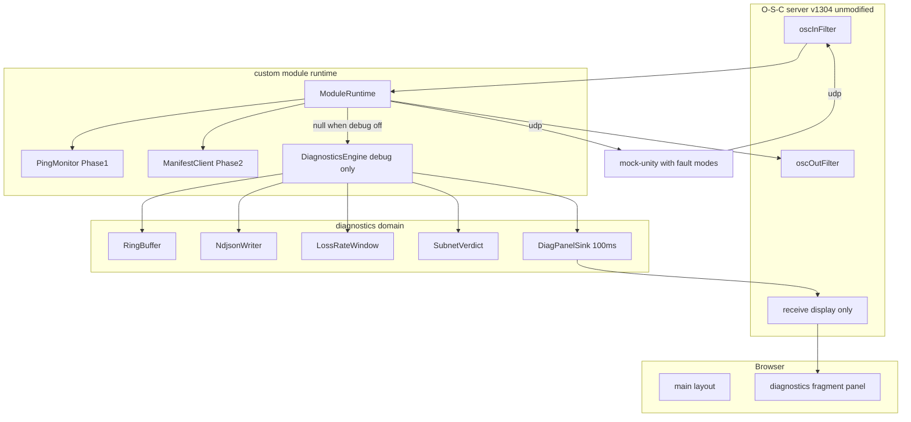
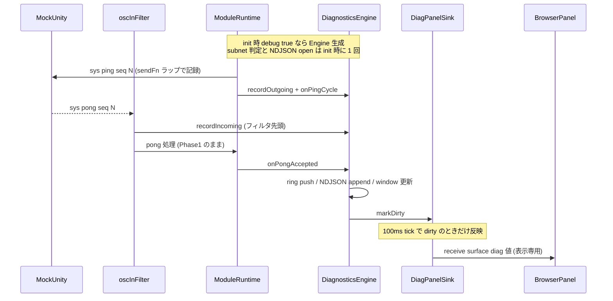
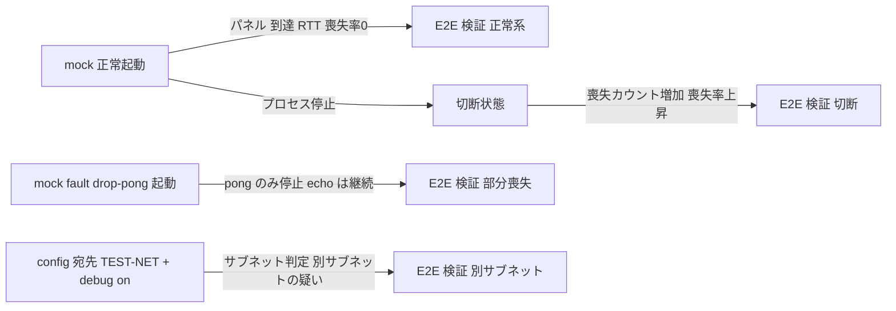

# 技術設計書 — Phase 3 診断パネルとデバッグモード

## Overview

**Purpose**: 本機能は、OSC Surface の運用者・開発者に対して「Unity と繋がっているか、どの程度の品質で繋がっているか、繋がらない原因はどこか」を計測に基づいて提示する診断機能を提供する。custom module に config フラグで切り替わるデバッグモードを導入し、有効時のみ送受信メッセージの記録(リングバッファ + NDJSON)、到達性・RTT・喪失率の集計、宛先サブネットの静的判定を行い、専用レイアウトの診断パネルへ 100ms 間引きで反映する。

**Users**: 運用者はブラウザ上の診断パネルで通信状態を一目で確認し、開発者は NDJSON ログと E2E テストで通信異常を事後解析・回帰検証する。

**Impact**: Phase 1/2 で構築済みの custom module(`module-runtime`)に診断ドメインを追加する。無効時は診断専用処理を完全にスキップし、既存のホットパス(ping/pong・stats・マニフェスト・値同期)の挙動とコストを変えない。O-S-C 本体(`vendor/open-stage-control` v1.30.4)は無改造。新規 npm 依存は追加しない(Node 標準 API のみ)。

### Goals

- config フラグ 1 つでデバッグモードを ON/OFF し、OFF 時はホットパス上の診断コストを null チェック 1 回に抑える
- ON 時に、送受信ワイヤトラフィックの直近 N 件記録・NDJSON 書き出し・到達性/RTT/喪失率・サブネット判定を診断パネルへ間引き反映する
- 喪失・切断・別サブネット・確率喪失・応答遅延・不正応答の異常系を mock-unity の故障注入と TEST-NET 宛て設定で再現し、vitest 単体 + E2E で自動検証する
- NDJSON ログの合計サイズを閾値監視し、超過時はブラウザ通知と診断パネル警告で削除を促し、パネルの削除ボタンで古いログを整理できるようにする

### Non-Goals

- `/sys/*` プロトコル仕様(`docs/UNITY_PROTOCOL.md`)自体の変更(ping/pong の挙動は Phase 1 のまま利用する)
- 能動的なネットワークプローブ(ARP/ICMP/DNS 解決)による疎通探索
- 実 Unity 接続手順(Phase 4)、O-S-C 本体の改変
- 実行中のデバッグモード動的切り替え(切り替えは再起動で反映)

## Boundary Commitments

### This Spec Owns

- custom module の診断ドメイン一式: `DiagnosticsEngine` とその構成要素(リングバッファ・NDJSON ライタ・喪失率ウィンドウ・サブネット判定・パネル反映スロットラ)
- `/surface/diag/*` 名前空間(診断パネル表示アドレスと JSON スナップショット観測点)の契約定義
- 診断パネルのレイアウト定義(`layouts/diagnostics.json`)と `layouts/main.json` への合流点(modal + fragment 参照)
- `SurfaceConfigSchema` の `diagnostics` 拡張(リングバッファ件数・喪失率ウィンドウ・NDJSON 出力先)
- mock-unity の故障注入モード(`--fault`)と、その E2E 検証

### Out of Boundary

- `PingMonitor` の内部仕様(2 秒間隔・未応答 1 件保持・不一致破棄)— Phase 1 確定仕様を snapshot 経由で読み取るのみで、変更しない(要件 3.5)
- `/surface/status` 契約(Phase 1)— 変更しない。診断スナップショットは別アドレス `/surface/diag` で提供する
- マニフェスト適用・値同期(Phase 2)— 診断は観測のみで介入しない
- `vendor/open-stage-control` 一式(lockfile 含む)— 無改造(要件 7.1)

### Allowed Dependencies

- `packages/shared` の型・zod スキーマ・アドレス定数(診断契約の正規定義もここに追加する)
- Phase 1/2 の `module-runtime` 依存注入シーム(`sendFn` / `receiveFn` / `setIntervalFn` / `now` / ログ関数)
- custom module コンテキストの `nativeRequire`(`node:os` / `node:fs` / `node:path`)— Phase 1 の `node:path` 取得と同一パターン
- O-S-C のリモートコマンドと表示専用経路(`receive()`)、fragment ウィジェット — 本体無改造の範囲(要件 7.1/7.2)

### Revalidation Triggers

- `/surface/diag` の JSON スナップショット形状(`DiagnosticsSnapshotSchema`)を変更したとき → E2E・手動検証手順(VERIFICATION.md)の再確認
- `SurfaceConfigSchema` の `diagnostics` 既定値変更 → 既存 config ファイルの再検証(`diagnostics` 省略時の後方互換を壊さないこと)
- `/surface/diag/*` ウィジェットアドレスの変更 → `layouts/diagnostics.json` と E2E の同時更新
- mock-unity の `--fault` モード追加・変更 → READY 行 JSON と E2E ヘルパの再確認
- Phase 1 の ping 間隔・喪失判定を変更する将来仕様変更 → 喪失率ウィンドウの既定値(W=30 ≒ 60 秒)の再検討

## Architecture

### Existing Architecture Analysis

- `module-runtime.ts` は全依存(送受信・タイマー・設定・ログ)を注入可能にした純粋なファクトリで、O-S-C グローバルへの接続は `index.ts` と default 実装に隔離されている。診断ドメインも同じ流儀(依存注入 + 単体テスト可能な純関数/クラス)で追加する
- 受信はすべて `oscInFilter` を通る。一方、custom module の `send()` は vendor 内部で `oscOutFilter` を**経由しない**(research.md 参照)。送信記録は `oscOutFilter`(ウィジェット発)と `sendFn` ラップ(module 発)の 2 系統が必要
- `receive()` は表示専用経路であり Unity への送信を発生させない(D-010)。診断パネル反映はこの経路のみを使う
- `/surface/*` は内部観測名前空間(D-007)。`oscInFilter` は既に `/surface/*` を Unity 系ルーティングから遮断している

### Architecture Pattern & Boundary Map



**Architecture Integration**:

- Selected pattern: 診断ファサード(`DiagnosticsEngine`)集約 + null ゲート。debug OFF 時はエンジンを生成せず、フックは `if (diag !== null)` のみ(要件 1.2)
- Domain boundaries: 診断ドメインは「観測と表示」のみを所有し、ping/manifest の制御ロジック(Phase 1/2)には介入しない。パネル反映は `receive()` 表示専用経路に限定(要件 5.6)
- Existing patterns preserved: 依存注入ファクトリ、`/surface/*` 観測名前空間(D-007)、`receive()` 表示専用(D-010)、E2E の OSC 一本化(D-011)、案件差分のデータ表現(D-012)
- New components rationale: 各構成要素は単独で単体テスト可能な最小責務(リング保持・逐次書き出し・窓集計・純関数判定・間引き)に分割する(要件 6.2)
- Steering compliance: `.kiro/steering/` は未整備のため、CLAUDE.md の絶対規律と DESIGN.md の既存判断(D-001〜D-012)を準拠先とする

**依存方向**(左からのみ import 可。違反はレビューでエラー扱い):

```
shared(型・スキーマ・定数) → 純粋部品(ring-buffer / subnet-check / link-health) → IO 部品(ndjson-writer / diag-panel-sink) → diagnostics-engine → module-runtime → index
```

### Technology Stack

| Layer | Choice / Version | Role in Feature | Notes |
|-------|------------------|-----------------|-------|
| Custom module | TypeScript + esbuild 単一 CJS バンドル(既存) | 診断ドメインの実装先 | D-003 の既存ビルドに乗る。新規 npm 依存なし |
| OS 情報 | `node:os`(`nativeRequire`) | `networkInterfaces()` によるサブネット静的判定 | 判定は純関数へ注入しテスト分離 |
| ファイル出力 | `node:fs`(`nativeRequire`) | NDJSON 追記ストリーム | 失敗時 degraded(書き出しのみ停止) |
| スキーマ | zod(既存依存) | 診断スナップショット・config 拡張の正規定義 | `packages/shared` に追加 |
| レイアウト | O-S-C fragment ウィジェット | 診断パネルの別ファイル化と include 合流 | `file` はセッション相対パス(vendor ソース確認済み) |
| テスト | vitest / Playwright + ProcessHarness(既存) | 単体 + E2E(headless ループバック) | ProcessHarness に `env` オプションを追加 |

主要な技術判断の根拠と代替案比較は `research.md`(Design Decisions)を参照。結論は本書の各所に反映済み。

## File Structure Plan

### Directory Structure

```
packages/shared/src/
├── index.ts                  # 変更: SURFACE_DIAG アドレス定数を追加
└── schemas.ts                # 変更: DiagnosticsSnapshot / MessageRecord / config diagnostics 拡張

packages/custom-module/src/
├── ring-buffer.ts            # 新規: 汎用リングバッファ(純粋)
├── subnet-check.ts           # 新規: サブネット静的判定(純関数)
├── link-health.ts            # 新規: 喪失率ウィンドウ + 到達性導出(純粋)
├── ndjson-writer.ts          # 新規: NDJSON 逐次追記(fs 注入)
├── ndjson-quota.ts           # 新規: ログ容量集計と削除対象選定(純関数)
├── diag-panel-sink.ts        # 新規: 100ms 間引きパネル反映(receiveFn 注入)
├── diagnostics-engine.ts     # 新規: 診断ファサード(上記を合成)
├── module-runtime.ts         # 変更: debug 分岐・記録フック・/surface/diag 応答・起動ログ
└── *.test.ts                 # 新規: 上記各ファイルの単体テスト

packages/mock-unity/src/
├── responder.ts              # 変更: FaultMode による応答フィルタ
└── index.ts                  # 変更: --fault CLI と READY 行への fault 出力

layouts/
├── diagnostics.json          # 新規: 診断パネル fragment(表示専用ウィジェット群)
└── main.json                 # 変更: modal + fragment 参照ウィジェットを追加

config/
├── surface.config.json       # 変更なし(debug: false のまま)
└── surface.debug.config.json # 新規: debug 有効のサンプル config

tests/e2e/
├── diagnostics.e2e.test.ts   # 新規: 正常・喪失・切断・別サブネットの E2E
└── helpers/process.ts        # 変更: SpawnSpec に env オプション追加
```

### Modified Files

- `packages/shared/src/index.ts` — `SURFACE_DIAG` 定数(diag request/diag/ウィジェットアドレス)の追加
- `packages/shared/src/schemas.ts` — `MessageRecordSchema` / `DiagnosticsSnapshotSchema` の追加、`SurfaceConfigSchema` へ optional `diagnostics`(既定値付き)を追加
- `packages/custom-module/src/module-runtime.ts` — `DiagnosticsEngine | null` の生成・フック・破棄。既存ロジックの制御フローは変更しない
- `packages/mock-unity/src/responder.ts` / `index.ts` — 応答フィルタと CLI フラグ(既存応答ロジックは無変更で、返信直前のフィルタのみ追加)
- `layouts/main.json` — modal ウィジェット(閉じた状態が既定)+ fragment 参照の追加のみ。既存パネル・`dynamic` コンテナは不変
- `tests/e2e/helpers/process.ts` — `env` 追加(省略時は従来挙動)
- `.gitignore` — `logs/` を追加(NDJSON 出力既定先)
- `docs/VERIFICATION.md` / `DESIGN.md` — Phase 3 の手動検証手順と設計判断の追記(実装完了時、要件 6.6)

## System Flows

### デバッグ有効時の記録とパネル反映



- ゲート条件: `E` への呼び出しはすべて `diag !== null` ガード内。debug OFF では Engine もタイマーも存在しない(要件 1.2/5.5)
- 喪失イベントは `PingMonitor.snapshot()` の `consecutiveLosses` 差分から導出する(`nextPing` 前後の比較)。PingMonitor 本体は無変更(要件 3.5)
- `receive()` はワイヤ送信ではないため記録対象外。記録の再帰は構造的に発生しない

### 故障注入と E2E 検証の構成



## Requirements Traceability

| Requirement | Summary | Components | Interfaces | Flows |
|-------------|---------|------------|------------|-------|
| 1.1 | config `debug` で ON/OFF 決定 | ModuleRuntime, SurfaceConfig 拡張 | `loadSurfaceConfig` → `createDiagnosticsEngine` 生成条件 | init |
| 1.2 | OFF 時は診断処理を一切実行しない | ModuleRuntime(null ゲート) | `diag: DiagnosticsEngine \| null` | 記録フロー(ガード) |
| 1.3 | OFF 時も Phase 1/2 機能は従来どおり | ModuleRuntime(既存フロー無変更) | 既存 API 不変 | — |
| 1.4 | 起動時にモードをログ出力 | ModuleRuntime | `logInfo` dep | init |
| 2.1 | 送受信の方向・時刻・アドレス・引数を記録 | DiagnosticsEngine, RingBuffer | `recordIncoming` / `recordOutgoing`, `MessageRecord` | 記録フロー |
| 2.2 | 直近 N 件保持・最古破棄・N は設定可能 | RingBuffer, config `diagnostics.ringBufferSize` | `RingBuffer<T>` | — |
| 2.3 | ON 時に NDJSON 書き出し | NdjsonWriter | `NdjsonWriter.append` | 記録フロー |
| 2.4 | OFF 時は NDJSON を一切生成しない | ModuleRuntime(Engine 不生成) | — | init |
| 2.5 | 書き出し失敗はログのみ・送受信継続 | NdjsonWriter(degraded) | error ハンドリング契約 | — |
| 2.6 | ログ容量の閾値監視と削除の促し | DiagnosticsEngine, NdjsonQuota, DiagPanelSink | `/NOTIFY` トースト + `logUsage` | パネル反映 |
| 2.7 | 削除操作で古いログを閾値 90% 分削除 | DiagnosticsEngine, NdjsonQuota, ModuleRuntime | `/surface/diag/purge` → `purgeLogs()` | — |
| 2.8 | 通知・削除操作で Unity へ送信しない | ModuleRuntime(oscOutFilter ガード) | 名前空間ガード | — |
| 3.1 | ping/pong 結果から到達性・RTT・喪失率を集計 | DiagnosticsEngine, LossRateWindow | `onPingCycle` / `onPongAccepted` / `snapshot` | 記録フロー |
| 3.2 | 一致 pong で RTT 確定・「到達」判定 | PingMonitor(既存)+ deriveReachability | `SurfaceStatus.lastRttMs` | — |
| 3.3 | 連続喪失 1 以上で「喪失」判定 | deriveReachability | `Reachability` union | — |
| 3.4 | 喪失率 = 直近 W 回窓の喪失割合 | LossRateWindow, config `diagnostics.lossRateWindow` | `LossRateWindow.stats` | — |
| 3.5 | ping/pong 仕様の無変更利用 | PingMonitor 無改変 + snapshot 差分導出 | 既存 `snapshot()` のみ使用 | 記録フロー注記 |
| 4.1 | 起動時に OS の IF 情報と宛先を照合 | SubnetCheck, OsInterfacesProvider | `evaluateSubnetVerdict` | init |
| 4.2 | 不一致なら「別サブネットの疑いあり」を提示 | SubnetCheck, DiagPanelSink | `SubnetVerdict.differentSubnet` | パネル反映 |
| 4.3 | ループバックは「同一ホスト」 | SubnetCheck | `SubnetVerdict.sameHost` | — |
| 4.4 | 静的照合のみ・プローブ禁止 | SubnetCheck(純関数) | 引数注入(副作用なし) | — |
| 5.1 | 診断パネルを別ファイルで提供 | `layouts/diagnostics.json` | fragment ファイル | — |
| 5.2 | include またはタブで合流 | `layouts/main.json`(modal + fragment) | fragment `file` 相対参照 | — |
| 5.3 | 診断指標を専用ウィジェットへ反映 | DiagPanelSink | `/surface/diag/*` アドレス契約 | パネル反映 |
| 5.4 | 100ms 間引き(100ms に 1 回以下) | DiagPanelSink | `DIAG_PANEL_UPDATE_INTERVAL_MS = 100` | パネル反映 |
| 5.5 | OFF 時はパネル更新を送らない | ModuleRuntime(Engine/Sink 不生成) | — | init |
| 5.6 | 表示専用・Unity へ送信させない | receive() 経路限定 + oscOutFilter の `/surface/` ガード | 名前空間ガード | 記録フロー |
| 6.1 | mock の故障注入(5 モード) | MockUnityResponder(FaultMode) | `--fault drop-pong / silent / random-loss / delay / corrupt` | 故障注入フロー |
| 6.2 | 診断判定ロジックの vitest 単体テスト | 各純粋部品の *.test.ts | — | Testing Strategy |
| 6.3 | 正常・喪失・切断・確率喪失・遅延の E2E でパネル表示検証 | diagnostics.e2e.test.ts, widget-inspector | `/GET` + `/surface/diag` | 故障注入フロー |
| 6.4 | サブネット判定の網羅単体テスト(実網非依存) | subnet-check.test.ts | テーブル駆動入力 | — |
| 6.5 | TEST-NET 宛て構成の E2E で「別サブネット」表示 | diagnostics.e2e.test.ts, ProcessHarness(env) | `OSC_SURFACE_CONFIG` | 故障注入フロー |
| 6.6 | VERIFICATION.md へ手動検証手順追記 | docs/VERIFICATION.md | — | — |
| 6.7 | corrupt 注入で停止せず継続を検証 | diagnostics.e2e.test.ts, responder | `--fault corrupt` | 故障注入フロー |
| 7.1 | vendor 無改造で全機能実現 | 全設計(fragment / receive / filter の範囲) | — | — |
| 7.2 | 本体改造が必要な場合は判断を仰ぐ | リスク管理(fragment 形式のフォールバック) | — | — |
| 7.3 | 案件差分はデータで表現 | config `diagnostics` / `--fault` / レイアウト JSON | — | — |

## Components and Interfaces

| Component | Domain/Layer | Intent | Req Coverage | Key Dependencies (P0/P1) | Contracts |
|-----------|--------------|--------|--------------|--------------------------|-----------|
| SharedDiagContracts | shared | 診断契約の正規定義(定数・zod) | 2.1, 3.1, 5.3, 7.3 | zod (P0) | State |
| RingBuffer | custom-module 純粋 | 直近 N 件保持・最古破棄 | 2.1, 2.2 | なし | Service |
| SubnetCheck | custom-module 純粋 | 宛先とインターフェースの静的照合 | 4.1–4.4, 6.4 | shared (P0) | Service |
| LinkHealth | custom-module 純粋 | 喪失率ウィンドウ・到達性導出 | 3.1–3.4 | shared (P0) | Service |
| NdjsonWriter | custom-module IO | NDJSON 逐次追記(degraded 対応) | 2.3–2.5 | node:fs (P0) | Service |
| DiagPanelSink | custom-module IO | 100ms 間引きのパネル反映 | 5.3–5.6 | receiveFn (P0) | Service |
| DiagnosticsEngine | custom-module | 診断ファサード(合成・スナップショット) | 1.2, 2.1, 3.1, 4.1, 5.3 | 上記部品 (P0), PingMonitor snapshot (P0) | Service, State |
| ModuleRuntime 変更 | custom-module | debug 分岐・フック・/surface/diag 応答 | 1.1–1.4, 2.4, 5.5, 5.6 | DiagnosticsEngine (P0) | Event |
| MockUnityFault | mock-unity | 故障注入(応答フィルタ + CLI) | 6.1 | responder (P0) | Service |
| DiagnosticsLayout | layouts | 診断パネル fragment と合流点 | 5.1, 5.2 | O-S-C fragment (P0) | State |
| E2EDiagnostics | tests | 異常系 E2E とハーネス拡張 | 6.3, 6.5 | ProcessHarness (P0), widget-inspector (P1) | — |

### shared

#### SharedDiagContracts

| Field | Detail |
|-------|--------|
| Intent | `/surface/diag/*` アドレス定数と診断データの zod スキーマを唯一の正として定義する |
| Requirements | 2.1, 3.1, 5.3, 7.3 |

**Responsibilities & Constraints**

- アドレス定数・`MessageRecordSchema`・`DiagnosticsSnapshotSchema`・config `diagnostics` 拡張を所有する
- custom module と E2E の双方がこの定義を import し、契約の二重定義を禁止する
- 既存スキーマ(`SurfaceStatusSchema` 等)は変更しない

**Dependencies**

- External: zod — スキーマ定義(P0)

**Contracts**: State [x]

##### State Management

```typescript
// packages/shared/src/index.ts への追加
export const SURFACE_DIAG = {
  REQUEST: '/surface/diag/request',      // 観測点: スナップショット要求(debug ON のみ応答)
  SNAPSHOT: '/surface/diag',             // 観測点: JSON スナップショット応答
  REACHABILITY: '/surface/diag/reachability',
  RTT: '/surface/diag/rtt',
  LOSS_RATE: '/surface/diag/loss-rate',
  SUBNET: '/surface/diag/subnet',
  MESSAGES: '/surface/diag/messages',
  LOG_USAGE: '/surface/diag/log-usage',
  PURGE: '/surface/diag/purge',          // 診断パネルの削除ボタン発。oscOutFilter で処理し外向き送出しない
} as const

// packages/shared/src/schemas.ts への追加(zod 定義。以下は導出型の形状)
export type RecordedArg =
  | { kind: 'value'; type: string; value: number | string | boolean; truncated?: true }
  | { kind: 'blob'; byteLength: number }          // blob は中身を持たず長さのみ記録
// 文字列値は 256 文字で打ち切り、打ち切り時に truncated: true を付す(記録行の肥大防止)

export type MessageRecord = {
  ts: string                                      // ISO-8601(オフセット付き)
  dir: 'in' | 'out'
  address: string
  args: readonly RecordedArg[]
  peer?: { host: string; port: number }
}

export type SubnetVerdict =
  | { kind: 'sameHost' }                                        // ループバック / 自 IF アドレス一致
  | { kind: 'sameSubnet'; matchedInterface: string }
  | { kind: 'differentSubnet'; checkedInterfaces: number }      // 「別サブネットの疑いあり」
  | { kind: 'indeterminate'; reason: 'hostname' | 'ipv6Destination' | 'noIpv4Interface' }

export type Reachability = 'unknown' | 'reachable' | 'lost'

export type DiagnosticsSnapshot = {
  reachability: Reachability
  lastRttMs: number | null
  consecutiveLosses: number
  lossRate: { windowSize: number; observed: number; lost: number; rate: number | null }
  subnet: SubnetVerdict
  logUsage: { totalBytes: number; limitBytes: number; overLimit: boolean }
  recentMessages: readonly MessageRecord[]        // 新しい順・パネル表示用の直近件数
}

// SurfaceConfigSchema 拡張(optional + 既定値。既存 config は無変更で有効)
export type SurfaceDiagnosticsConfig = {
  ringBufferSize: number      // 既定 200(1〜10000)
  lossRateWindow: number      // 既定 30(1〜1000)= 2 秒 ping で約 60 秒窓
  ndjsonDir: string           // 既定 'logs/diagnostics'(cwd 相対)
  ndjsonMaxTotalBytes: number // 既定 52428800(50MB)。超過で通知・削除促し
}
```

- Persistence & consistency: スキーマは shared が唯一の正。`/surface/diag` の応答と NDJSON 行はいずれも `MessageRecord` / `DiagnosticsSnapshot` に適合する
- Concurrency strategy: 単一プロセス・単一スレッドで共有可変状態なし

**Implementation Notes**

- Integration: `SurfaceConfigSchema` は `diagnostics: z.object({...}).default({})` 形で拡張し、`diagnostics` 省略時に全既定値が入る(後方互換)
- Validation: 既存 config(`surface.config.json`)がそのまま valid であることをスキーマ単体テストで固定する
- Risks: スナップショット形状の変更は Revalidation Trigger(E2E・VERIFICATION 連動)

### custom-module 純粋部品

#### RingBuffer

| Field | Detail |
|-------|--------|
| Intent | 容量固定の直近 N 件保持。上限超過で最古を破棄する |
| Requirements | 2.1, 2.2 |

**Contracts**: Service [x]

##### Service Interface

```typescript
export class RingBuffer<T> {
  constructor(capacity: number)          // capacity は 1 以上の整数(事前条件)
  push(item: T): void                    // O(1)。満杯時は最古を上書き
  toArray(): readonly T[]                // 古い順に size 件を返す(コピー)
  readonly capacity: number
  readonly size: number
}
```

- Preconditions: `capacity >= 1`(config スキーマで保証。違反は生成時に throw)
- Postconditions: `size <= capacity`。`push` 後、最新要素は必ず保持される
- Invariants: 保持順は挿入順(FIFO 破棄)

#### SubnetCheck

| Field | Detail |
|-------|--------|
| Intent | 宛先ホスト文字列と OS インターフェース情報の静的照合のみでサブネット判定を返す |
| Requirements | 4.1, 4.2, 4.3, 4.4, 6.4 |

**Responsibilities & Constraints**

- 純関数。ネットワーク副作用(送信・DNS 解決)を持たない(要件 4.4)
- IPv4 リテラルのみ判定対象。ホスト名・IPv6 リテラルは `indeterminate`(理由付き)で明示する
- 判定順序: (1) ループバック帯(127.0.0.0/8)または自 IF アドレスと一致 → `sameHost` / (2) いずれかの非 internal IPv4 IF で `(dest & netmask) == (addr & netmask)` → `sameSubnet` / (3) IPv4 IF が 1 つ以上あるのに全不一致 → `differentSubnet` / (4) それ以外 → `indeterminate`

**Dependencies**

- Inbound: DiagnosticsEngine — init 時に 1 回評価(P0)
- External: なし(インターフェース情報は引数で注入)

**Contracts**: Service [x]

##### Service Interface

```typescript
export interface NetworkInterfaceInfo {
  address: string
  netmask: string
  family: 'IPv4' | 'IPv6'
  internal: boolean
}

export function evaluateSubnetVerdict(
  destinationHost: string,
  interfaces: readonly NetworkInterfaceInfo[],
): SubnetVerdict

// os.networkInterfaces() → NetworkInterfaceInfo[] への変換アダプタ(nativeRequire は engine 側で解決)
export type OsInterfacesProvider = () => readonly NetworkInterfaceInfo[]
```

- Preconditions: なし(任意文字列を受け付け、不正入力は `indeterminate` に落とす)
- Postconditions: 戻り値は `SubnetVerdict` のいずれか 1 つ。副作用なし
- Invariants: 同一入力に対して決定的

**Implementation Notes**

- Validation: TEST-NET 帯(203.0.113.0/24)・ループバック・同一サブネット・/31・複数 NIC・IF ゼロ件をテーブル駆動で網羅(要件 6.4/6.5 の単体側)
- Risks: IPv4 文字列パースの端数表記(8 進など)は非対応と明記し、strict な 4 オクテット 10 進のみ受理する

#### LinkHealth

| Field | Detail |
|-------|--------|
| Intent | 確定した ping 結果の直近 W 件窓で喪失率を集計し、`SurfaceStatus` から到達性を導出する |
| Requirements | 3.1, 3.2, 3.3, 3.4 |

**Contracts**: Service [x]

##### Service Interface

```typescript
export type PingOutcome = 'answered' | 'lost'

export class LossRateWindow {
  constructor(windowSize: number)
  record(outcome: PingOutcome): void
  stats(): { windowSize: number; observed: number; lost: number; rate: number | null }
  // observed は窓内の確定結果数(最大 windowSize)。rate = lost / observed。observed 0 のとき null
}

export function deriveReachability(status: SurfaceStatus): Reachability
// consecutiveLosses >= 1 → 'lost'(要件 3.3)
// それ以外で lastPongSeq !== null → 'reachable'(要件 3.2)
// それ以外(初回 pong 前) → 'unknown'
```

- Preconditions: `windowSize >= 1`
- Postconditions: `record` は O(1)。窓超過分は最古の結果から押し出す
- Invariants: 未確定(応答待ち中)の ping は観測に含めない。RTT と連続喪失数の値は `PingMonitor.snapshot()` を唯一の源とし、本コンポーネントは複製保持しない(要件 3.5)

### custom-module IO 部品

#### NdjsonWriter

| Field | Detail |
|-------|--------|
| Intent | `MessageRecord` を 1 件 1 行の JSON でファイルへ逐次追記する。失敗しても呼び出し元を止めない |
| Requirements | 2.3, 2.4, 2.5 |

**Responsibilities & Constraints**

- debug ON の Engine 生成時にのみ生成される(OFF 時にファイル・ディレクトリを一切作らない = 要件 2.4 は生成条件で構造的に保証)
- 出力先: `<ndjsonDir>/osc-debug-<起動時刻(ファイル名安全な ISO 派生)>.ndjson`。`ndjsonDir` の相対パスは `process.cwd()` 基準(レイアウトパス解決と同じ規約)
- ディレクトリ作成失敗・ストリームエラー時: エラーを 1 回ログし degraded(以後 `append` は no-op)。リングバッファとパネル反映は影響を受けない(要件 2.5)

**Dependencies**

- External: `node:fs`(`mkdirSync` / `createWriteStream`)— アダプタ注入でテスト分離(P0)

**Contracts**: Service [x]

##### Service Interface

```typescript
export interface NdjsonFs {
  mkdirSync(dir: string, options: { recursive: true }): void
  createWriteStream(filePath: string, options: { flags: 'a' }): {
    write(chunk: string): boolean
    end(): void
    on(event: 'error', listener: (error: unknown) => void): void
  }
  readdirSync(dir: string): string[]                              // 容量監視・削除用
  statSync(filePath: string): { size: number; mtimeMs: number }
  unlinkSync(filePath: string): void
}

export interface NdjsonWriter {
  append(record: MessageRecord): void   // 失敗時も throw しない
  dispose(): void                       // ストリームを閉じる(stop/unload 用)
}

export function createNdjsonWriter(options: {
  dir: string
  now: () => Date
  fs: NdjsonFs
  logError: (message?: unknown, ...rest: unknown[]) => void
}): NdjsonWriter
```

- Preconditions: なし(open 失敗も内部で degraded 化)
- Postconditions: 成功時、1 レコード = 1 行(`JSON.stringify(record) + '\n'`)。行は `MessageRecordSchema` に適合
- Invariants: `append` / `dispose` は例外を外に漏らさない

#### NdjsonQuota

| Field | Detail |
|-------|--------|
| Intent | ログディレクトリの容量集計と削除対象ファイルの選定を純関数で行う |
| Requirements | 2.6, 2.7 |

**Responsibilities & Constraints**

- 入力(ファイル名・サイズ・更新時刻の一覧、閾値、使用中ファイル名)から、合計サイズ・超過判定・削除対象リストを決定的に返す。fs 操作は行わない(実行は DiagnosticsEngine が NdjsonFs で行う)
- 削除対象の選定: 使用中ファイルを除外し、古い順に累計サイズが「閾値の 90%」に達するまで(または対象が尽きるまで)選ぶ(承認済みの解釈A)

**Contracts**: Service [x]

##### Service Interface

```typescript
export interface LogFileInfo { name: string; size: number; mtimeMs: number }

export function summarizeLogUsage(
  files: readonly LogFileInfo[],
  limitBytes: number,
): { totalBytes: number; limitBytes: number; overLimit: boolean }

export function selectPurgeTargets(options: {
  files: readonly LogFileInfo[]
  limitBytes: number          // 削除量の目標 = limitBytes * 0.9
  currentFileName: string     // 使用中ファイル。常に除外
}): readonly string[]         // 古い順の削除対象ファイル名
```

- Invariants: 同一入力に対して決定的。`currentFileName` は結果に含まれない

#### DiagPanelSink

| Field | Detail |
|-------|--------|
| Intent | 診断スナップショットを 100ms 間隔の間引きで診断パネルウィジェットへ表示専用反映する |
| Requirements | 5.3, 5.4, 5.5, 5.6 |

**Responsibilities & Constraints**

- dirty フラグ方式: 状態変化時に `markDirty()`、100ms tick で dirty のときのみ全項目を `receiveFn` で送出しフラグを下ろす。tick あたり最大 1 回の反映(要件 5.4)
- 反映は `receive()` 表示専用経路のみ。widget アドレスは `SURFACE_DIAG` 定数を使用(要件 5.6、D-010)
- clientId を指定しないブロードキャスト反映とする。周期反映のため後続接続クライアントも次の dirty tick(ping 周期 2 秒以内)で最新化される(sessionOpened ハンドリング不要)

**Dependencies**

- Inbound: DiagnosticsEngine — dirty 通知とスナップショット供給(P0)
- Outbound: receiveFn(O-S-C `receive()`)— 表示反映(P0)

**Contracts**: Service [x]

##### Service Interface

```typescript
export const DIAG_PANEL_UPDATE_INTERVAL_MS = 100   // 要件 5.4 による固定値

export interface DiagPanelSink {
  markDirty(): void
  start(): void      // 100ms interval を開始(Engine 生成時に 1 回)
  dispose(): void    // interval を停止(stop/unload 用)
}

export function createDiagPanelSink(options: {
  getSnapshot: () => DiagnosticsSnapshot
  receiveFn: (address: string, ...args: unknown[]) => void
  setIntervalFn: (callback: () => void, ms: number) => TimerHandle
  clearIntervalFn: (handle: TimerHandle) => void
}): DiagPanelSink
```

- Postconditions: 反映内容 — reachability(`到達`/`喪失`/`未確立` の表示文字列)、RTT(ms 数値文字列)、喪失率(`x% (lost/observed)` 形式)、サブネット判定(verdict 別の表示文字列)、ログ使用量(`使用量/上限 MB`。超過時は警告表現)、直近メッセージ(新しい順の整形行を改行結合した 1 文字列)
- Invariants: 100ms 窓あたり `receiveFn` 送出バーストは最大 1 回。Unity への OSC 送信は発生しない

### custom-module 統合

#### DiagnosticsEngine

| Field | Detail |
|-------|--------|
| Intent | 診断部品を合成し、記録イベントの受け口とスナップショットの供給を一元化するファサード |
| Requirements | 1.2, 2.1, 3.1, 4.1, 5.3 |

**Responsibilities & Constraints**

- debug ON のときのみ生成される。生成時に (1) サブネット判定を 1 回評価(要件 4.1)、(2) NDJSON ライタ open、(3) Sink の 100ms interval 開始、(4) ログ容量の初回集計を行う
- ログ容量監視: 起動時と 60 秒間隔でログディレクトリの合計サイズを集計(NdjsonQuota + NdjsonFs)。非超過→超過の遷移時に 1 回だけ `/NOTIFY`(O-S-C 標準のトースト通知)を `receiveFn` で送出し、snapshot の `logUsage` を更新してパネル警告に反映する(要件 2.6)
- `purgeLogs()`: NdjsonQuota の選定結果に従い、使用中ファイルを除く古い NDJSON を削除量の累計が閾値の 90% に達するまで削除する(要件 2.7)。削除失敗はログして継続。事後条件: 削除完了直後にログ使用量を即時再集計し `markDirty()` する(60 秒周期を待たずにパネル警告が解消される。E2E テスト 8 の安定性要件)
- 記録イベント(`recordIncoming` / `recordOutgoing` / `onPingCycle` / `onPongAccepted`)を受けてリングバッファ・NDJSON・喪失率窓を更新し、Sink へ dirty 通知する
- OSC 引数 → `RecordedArg` 変換(blob は byteLength のみ、文字列は 256 文字打ち切り + `truncated` フラグ)を所有する
- 診断状態の唯一の保有者。ModuleRuntime は状態を持たず委譲のみ

**Dependencies**

- Inbound: ModuleRuntime — フック呼び出し(P0)
- Outbound: RingBuffer / LossRateWindow / NdjsonWriter / DiagPanelSink(P0)、PingMonitor `snapshot()` 読み取り(P0)
- External: `node:os` — `OsInterfacesProvider` の default 実装(`nativeRequire`)(P1)

**Contracts**: Service [x] / State [x]

##### Service Interface

```typescript
export interface DiagnosticsEngine {
  recordIncoming(address: string, args: readonly { type: string; value: unknown }[], host: string, port: number): void
  recordOutgoing(address: string, args: readonly { type: string; value: unknown }[], host: string, port: number): void
  onPingCycle(event: { previousLost: boolean }): void   // ping 送信時。前回 ping の喪失確定を通知
  onPongAccepted(): void                                 // pong 採用時(RTT は PingMonitor snapshot から取得)
  snapshot(): DiagnosticsSnapshot
  purgeLogs(): void                                      // 診断パネルの削除ボタン(oscOutFilter 経由)
  dispose(): void                                        // writer と sink を停止
}

export function createDiagnosticsEngine(deps: {
  config: SurfaceConfig                                  // debug: true 前提(呼び出し側が保証)
  getStatus: () => SurfaceStatus                         // PingMonitor.snapshot の委譲
  receiveFn: (address: string, ...args: unknown[]) => void
  interfacesProvider: OsInterfacesProvider
  fs: NdjsonFs
  now: () => number
  setIntervalFn: SetIntervalFn
  clearIntervalFn: ClearIntervalFn
  logError: LogFn
  logWarn: LogFn
}): DiagnosticsEngine
```

- Preconditions: `config.debug === true`(ModuleRuntime の生成条件で保証)
- Postconditions: `snapshot()` は `DiagnosticsSnapshotSchema` に適合する
- Invariants: 全 public メソッドは例外を外へ漏らさない(内部でログして継続。OSC 処理を止めない)

##### State Management

- State model: リングバッファ(直近 N 件)・喪失率窓(直近 W 結果)・サブネット判定(init 時確定の不変値)・dirty フラグ
- Persistence & consistency: NDJSON ファイルのみ永続。プロセス再起動でメモリ状態はリセット(診断はセッションスコープ)
- Concurrency strategy: 単一スレッド。interval コールバックも同一ループ上

#### ModuleRuntime 変更

| Field | Detail |
|-------|--------|
| Intent | 既存 runtime に diagnostics のライフサイクルとフックを最小差分で組み込む |
| Requirements | 1.1, 1.2, 1.3, 1.4, 2.4, 5.5, 5.6 |

**Responsibilities & Constraints**

- `init()`: config ロード後、`config.debug === true` のときだけ `createDiagnosticsEngine` を生成(要件 1.1/2.4/5.5)。モードをログ出力(要件 1.4、新規 `logInfo` dep・default `console.log`)
- 送信記録: debug ON のときのみ `deps.sendFn` を記録ラッパで包む(OFF 時は素通しで追加コストゼロ)。ウィジェット発の送信は `oscOutFilter` 内の `if (diag !== null)` フックで記録する(research.md: `send()` は `oscOutFilter` を通らない)
- 受信記録: `oscInFilter` 先頭の `if (diag !== null)` フック(pong/manifest 含む全受信)
- 記録除外規則: 送受信いずれのフックでも `/surface/` プレフィックスのメッセージは記録対象外とする(内部観測トラフィックであり、特に `/surface/diag` 応答は `recentMessages` を内包するため、記録すると応答が応答を含む再帰肥大を起こす。Data Models の「記録対象はワイヤトラフィックのみ」の構造的保証)
- ping フック: `sendPing()` 内で `nextPing` 前後の `snapshot().consecutiveLosses` 差分から `previousLost` を導出し `onPingCycle` へ、pong 採用時に `onPongAccepted` を呼ぶ。既存の制御フロー(manifest 再要求等)は変更しない(要件 1.3/3.5)
- `/surface/diag/request` 受信時: `diag !== null` なら `snapshot()` を JSON 文字列で `SURFACE_DIAG.SNAPSHOT` へ返信(D-007 の status パターン)。OFF 時は既存の `/surface/*` 一括破棄に落ちる(応答なし)
- `oscOutFilter`: `/surface/` プレフィックスの外向きメッセージを破棄する恒常名前空間ガード(要件 5.6/2.8 の構造的保証。debug 状態に依存しない。発動時は抑制付き警告ログ)。例外として `/surface/diag/purge`(診断パネルの削除ボタン発)は `diag !== null` のとき `purgeLogs()` の実行指示として処理してから破棄する(Unity へは届かない)
- `stop()` / `unload()`: `diag?.dispose()` を追加

**Contracts**: Event [x]

##### Event Contract

- Subscribed events: 既存どおり(`sessionOpened`)。診断用の新規イベント購読はなし(パネルは周期反映で追従)
- Published events: なし(`receive()` 表示反映は Sink 経由)
- Ordering / delivery guarantees: フック呼び出しは既存処理の前後に同期実行。診断フックの例外は Engine 内で吸収され、既存処理へ波及しない

**Implementation Notes**

- Integration: `CustomModuleRuntimeDeps` に `logInfo` / `interfacesProvider` / `diagFs` の optional dep を追加(default は console / `nativeRequire`)。既存テストは無変更で通ること
- Validation: debug OFF で (a) Engine が生成されない、(b) sendFn が素通し、(c) `/surface/diag/request` に応答しない、(d) NDJSON が生成されないことを spy で単体検証(要件 1.2/1.3/2.4/5.5)
- Risks: フック追加位置の誤りで記録漏れ → 単体テストで in/out 両方向の記録件数を検証

### mock-unity

#### MockUnityFault

| Field | Detail |
|-------|--------|
| Intent | 応答フィルタによる故障注入で「喪失(部分無応答)」「無応答(全断相当)」を再現する |
| Requirements | 6.1 |

**Responsibilities & Constraints**

- `FaultMode`: `none`(既定)/ `drop-pong` / `silent` / `random-loss`(率指定)/ `delay`(ミリ秒指定)/ `corrupt`
- `drop-pong`: `/sys/pong` 応答のみ抑止(echo・manifest・stats は継続)= ping 喪失の再現
- `silent`: 全応答を抑止。受信計数(`received` / `lastReceivedAt`)は継続 = ポートは開いているが応答しない状態の再現
- `random-loss`: `/sys/pong` 応答を指定率で間引く。E2E の再現性のため乱数ではなく率から導出した決定的巡回パターン(例: 0.3 → 10 サイクル中 3 回を等間隔で抑止)で実装する = 中間的な喪失率の再現
- `delay`: `/sys/pong` 応答の送出を指定ミリ秒遅らせる = RTT 悪化の再現
- `corrupt`: 応答を OSC として不正なバイト列に置き換えて送出する = 受信側(custom module)の頑健性検証用
- 切断(全断)は従来どおりプロセス停止で再現(D-011 の既存パターン)
- 応答生成ロジック(`handlePacket`)は無変更とし、返信リストへの出口フィルタ(抑止・遅延指示・置換)として適用する

**Dependencies**

- Inbound: CLI `--fault <mode>`(`index.ts`)→ responder へ注入(P0)

**Contracts**: Service [x]

##### Service Interface

```typescript
export type FaultMode =
  | { kind: 'none' }
  | { kind: 'drop-pong' }
  | { kind: 'silent' }
  | { kind: 'random-loss'; rate: number }   // 0 < rate < 1。決定的巡回パターンで抑止
  | { kind: 'delay'; ms: number }
  | { kind: 'corrupt' }

// CLI: --fault drop-pong | silent | corrupt | random-loss:0.3 | delay:150
// MockUnityResponder のコンストラクタ拡張(既存引数の後方互換を維持)
constructor(clock?: Clock, scenarioRuntime?: ScenarioRuntime, faultMode?: FaultMode)
```

- Postconditions: `silent` 時 `handlePacket` は常に `[]` を返すが `statsSnapshot()` の計数は進む。`drop-pong` / `random-loss` 時は `SYS.PONG` 宛の応答のみ抑止(random-loss は決定的パターン)。`delay` 時は応答に遅延指示を付与し送出側(index)がタイマーで遅延送出。`corrupt` 時は応答を不正バイト列へ置換
- READY 行 JSON に `fault`(モードとパラメータ)を含める(テストからの起動状態確認用)

### layouts / config

#### DiagnosticsLayout(summary-only)

- `layouts/diagnostics.json`(新規): O-S-C fragment ファイル。内容は表示専用ウィジェット群 — `diag_reachability` / `diag_rtt` / `diag_loss_rate` / `diag_subnet` / `diag_log_usage`(text)、`diag_messages`(text・複数行)。各ウィジェットは `SURFACE_DIAG` の対応アドレスを持ち、`interaction: false` を設定する。唯一の操作可能ウィジェットとして `diag_purge`(button、address `/surface/diag/purge`、label "古いログを削除")を置く — 押下は oscOutFilter が処理して破棄するため Unity へは届かない(表示専用原則の明示的例外、要件 2.7/2.8)。注意: target を持たないウィジェットの押下は OSC 送信ターゲット未設定の起動(`-s` なし)では oscOutFilter に到達しない(vendor `callbacks.mjs` の `sendOsc` 仕様)ため、`diag_purge` には明示 `target` を必ず設定する(宛先値は oscOutFilter で破棄されるため任意で安全)
- `layouts/main.json`(変更): `diag_modal`(type: modal、既定で閉、label "Diagnostics")内に `diag_fragment`(type: fragment、`file: "diagnostics.json"` セッション相対)を追加。既存パネル・`dynamic` コンテナは不変。診断ウィジェットは別ファイルにあるため Phase 2 の layout index(`main.json` を走査)には現れず、マニフェスト適用と構造的に干渉しない
- `config/surface.debug.config.json`(新規): `debug: true` + `diagnostics` 明示のサンプル。手動検証(VERIFICATION.md)と E2E の雛形に使う
- Implementation Note: fragment ファイルの `type` フィールド等の細部は実装冒頭に最小構成で表示確認する。fragment で表示できない場合は、診断パネルを `main.json` に直接置く代替(別ファイル要件は `/EDIT` 適用で満たす)へフォールバックし、判断を記録する(要件 7.2)

#### E2EDiagnostics(summary-only)

- `tests/e2e/helpers/process.ts`: `SpawnSpec` に optional `env: Record<string, string>` を追加(`process.env` にマージ。省略時従来挙動)
- `tests/e2e/diagnostics.e2e.test.ts`: Testing Strategy 参照。検証面は既存方針どおり OSC に一本化(widget-inspector の `/GET` と `/surface/diag`)し、DOM 検査はしない(D-011)

## Data Models

### Data Contracts & Integration

**`/surface/diag` スナップショット応答**(debug ON のみ)

| Method | Address | Request | Response | Errors |
|--------|---------|---------|----------|--------|
| OSC | `/surface/diag/request` → `/surface/diag` | 引数なし | `s` 1 引数: `DiagnosticsSnapshot` の JSON | debug OFF: 応答なし(既存の `/surface/*` 破棄) |

**NDJSON 物理フォーマット**

- 1 行 = `MessageRecord` 1 件の JSON(UTF-8、LF 区切り)。行単位で独立してパース可能
- ファイル名: `osc-debug-<起動時刻>.ndjson`(起動ごとに新規ファイル。追記モード)
- 記録対象はワイヤトラフィック(Unity との送受信)のみ。`receive()` によるクライアント表示更新・`/EDIT`・`/surface/*`(内部観測名前空間)は含まない
- blob 引数は `{ kind: 'blob', byteLength: n }` で内容を保存しない(行サイズの暴走防止)

**パネル表示契約**(`DiagPanelSink` → ウィジェット)

| アドレス | ウィジェット | 表示内容 |
|---|---|---|
| `/surface/diag/reachability` | text | `到達` / `喪失` / `未確立` |
| `/surface/diag/rtt` | text | 最新 RTT(ms)。未計測は `-` |
| `/surface/diag/loss-rate` | text | `x% (lost/observed)`。観測 0 件は `-` |
| `/surface/diag/subnet` | text | `同一ホスト` / `同一サブネット` / `別サブネットの疑いあり` / `判定不能(理由)` |
| `/surface/diag/log-usage` | text | `使用量/上限(MB)`。閾値超過時は警告表現を付す |
| `/surface/diag/messages` | text | 直近メッセージの整形行(新しい順)を改行結合 |
| `/surface/diag/purge` | button(パネル→module 方向) | ログ削除ボタン。oscOutFilter が処理し Unity へ送出しない |

スキーマの正規定義は `packages/shared`(SharedDiagContracts)を唯一の正とする。ドメインモデルは上記スナップショット形状(Components 章)と同一のため再掲しない。

## Error Handling

### Error Strategy

診断機能は「観測系の失敗が観測対象(OSC 送受信)を壊さない」ことを最優先とする。DiagnosticsEngine の全 public メソッドは例外を外へ漏らさず、内部でログして継続する。

### Error Categories and Responses

- **NDJSON 書き出し失敗**(ディレクトリ作成不可・ストリームエラー): エラーを 1 回ログ → 書き出しのみ degraded 停止。リングバッファ・パネル反映・OSC 処理は継続(要件 2.5)
- **ログ容量の閾値超過**: エラーではなく運用通知。非超過→超過の遷移時に 1 回だけ `/NOTIFY` トーストを送出し、パネル警告表示は超過中継続する。ログ削除の失敗(ロック中等)はログして継続(要件 2.6/2.7)
- **config 不正**: 既存の `loadSurfaceConfig` の失敗処理(ログ + runtime 停止相当)を踏襲。`diagnostics` の範囲逸脱は zod issue のパス付きメッセージで報告
- **サブネット判定不能**(ホスト名宛先・IPv6・IF ゼロ件): エラーではなく `indeterminate` という正常な判定結果として理由付きでパネルへ提示(暗黙の「同一サブネット」扱いをしない)
- **`/surface/*` の外向き送出検出**(レイアウト設定ミス): oscOutFilter で破棄し、抑制付き警告ログで気付かせる
- **診断フック内の予期しない例外**: Engine 内で捕捉・ログし、既存処理(pong 採用・manifest 適用)へ波及させない

### Monitoring

- 起動時にデバッグモード有効/無効・NDJSON 出力先・サブネット判定結果を INFO ログへ出力(要件 1.4)
- 同一理由の連続エラーはログ抑制(ManifestClient の既存パターンを踏襲)

## Testing Strategy

### Unit Tests(vitest、要件 6.2/6.4)

1. `ring-buffer.test.ts` — 容量境界(N 到達前後・最古破棄・toArray 順序)
2. `subnet-check.test.ts` — テーブル駆動: 同一サブネット/別サブネット(TEST-NET 203.0.113.x 含む)/ループバック/自 IF 一致/IPv6・ホスト名・IF ゼロ件の indeterminate/複数 NIC/狭いマスク境界。実ネットワーク非依存(引数注入)
3. `link-health.test.ts` — 喪失率窓(W 未満・W 超過の押し出し・rate null)、`deriveReachability` の 3 状態遷移
4. `ndjson-writer.test.ts` — 正常追記(1 件 1 行・スキーマ適合)、mkdir/stream 失敗時の degraded(throw しない・以後 no-op・エラーログ 1 回)
5. `ndjson-quota.test.ts` — 容量集計と超過判定、削除対象選定(古い順・使用中ファイル除外・累計が閾値の 90% に達したら停止・対象枯渇時は全対象)
6. `diag-panel-sink.test.ts` — fake timer で 100ms 間引き(連続 dirty でも tick あたり 1 バースト、dirty なし tick は無送出、dispose 後停止)
7. `diagnostics-engine.test.ts` — 記録イベント → ring/NDJSON/窓/dirty の連動、blob の byteLength 化と文字列 256 文字打ち切り、`/surface/*` の記録除外、snapshot のスキーマ適合、fake timer での容量監視(超過遷移時のみ `/NOTIFY` 1 回)と `purgeLogs` の削除実行・即時再集計
8. `module-runtime.test.ts`(追加)— debug OFF: Engine 不生成・sendFn 素通し・diag request 無応答・NDJSON 不生成(1.2/2.4/5.5)。debug ON: in/out 記録フック発火・ping 喪失導出・`/surface/diag/request` 応答・`/surface/diag/purge` の purge 実行と破棄・`/surface/*` 外向きガード。既存テストの無変更グリーン(1.3)
9. `responder.test.ts`(追加)— `drop-pong` / `silent` / `random-loss`(決定的パターン)/ `delay`(遅延指示)/ `corrupt`(不正バイト列)の応答挙動と受信計数継続、READY 行の `fault` 出力

### E2E Tests(O-S-C headless + mock-unity ループバック、要件 6.3/6.5)

1. **正常系**: debug config で起動 → 診断パネル(`/surface/diag/*` ウィジェット値)に 到達・RTT 数値・喪失率 0%・`同一ホスト`(127.0.0.1)が表示され、NDJSON ファイルが生成され各行が `MessageRecordSchema` でパースできる
2. **喪失(部分無応答)**: mock を `--fault drop-pong` で起動 → 到達性 `喪失`・喪失率上昇をパネルと `/surface/diag` で確認(echo 系は応答継続していることも確認)
3. **切断(全断)**: 正常起動 → mock プロセス停止 → 喪失表示へ遷移(既存 D-011 パターン。タイミング断定をせずポーリング検証)
4. **確率喪失**: mock を `--fault random-loss:0.5` で起動 → 喪失率表示が 0% より大きく 100% 未満の値になることを確認(決定的パターンにより安定)
5. **応答遅延**: mock を `--fault delay:150` で起動 → RTT 表示が 150ms 以上を示すことを確認
6. **不正応答**: mock を `--fault corrupt` で起動 → custom module が停止せず、診断パネルの更新と既存機能が継続することを確認(要件 6.7)
7. **別サブネット**: `unity.host: "203.0.113.10"`(TEST-NET)+ debug ON の一時 config を `OSC_SURFACE_CONFIG` で渡して O-S-C を起動 → パネルに `別サブネットの疑いあり` が表示される
8. **ログ容量と削除**: 小さな閾値の一時 config で起動し、ダミーの旧 NDJSON を事前配置 → パネルにログ使用量の警告が表示され、削除ボタン(`/SET` リモートコマンドで押下を模擬)で古いログが削除されて警告が解消することを確認(要件 2.6/2.7)
9. **デバッグ無効**: 既定 config で起動 → `/surface/diag/request` に応答がなく、NDJSON 出力先が生成されない(既存 Phase 1/2 E2E がそのままグリーンであることを回帰として利用)

### 手動検証(要件 6.6)

- 実装完了時、`docs/VERIFICATION.md` へ「debug ON でのパネル目視確認」「NDJSON の目視確認」「debug OFF での無変化確認」の手順を追記する

## Performance & Scalability

- **debug OFF(通常運用)**: ホットパスへの追加は `if (diag !== null)` の参照比較と、oscOutFilter の `/surface/` プレフィックス比較 1 回のみ。割り当て・計測・整形は一切発生しない(要件 1.2)
- **debug ON**: リングバッファ push は O(1)・容量固定(既定 200 件)。パネル反映は 100ms 窓あたり最大 1 バースト(実効は ping 周期 2 秒駆動の dirty 時のみ)。NDJSON はストリーム追記でホットパスをブロックしない。ログ容量集計は 60 秒間隔の readdir/stat のみで送受信経路に影響しない
- メモリ上限: リングバッファ(N 件)+ 喪失率窓(W 件)で固定。NDJSON はデバッグ中のみ増加するため、`.gitignore` 化と VERIFICATION.md での運用注意(長時間デバッグ時の容量)を記す

## Security Considerations

- NDJSON には OSC ペイロード(操作値・キャラクター名等)が平文で残る。LAN 内デバッグ用途のローカルファイルであり秘匿情報は想定しないが、`logs/` をリポジトリへコミットしない(`.gitignore`)
- サブネット判定はローカル情報の読み取りのみで、ネットワークへの探索送信を行わない(要件 4.4)
- `/surface/*` 名前空間の外向き遮断により、診断系アドレスが誤って Unity(または外部)へ到達する経路を塞ぐ
