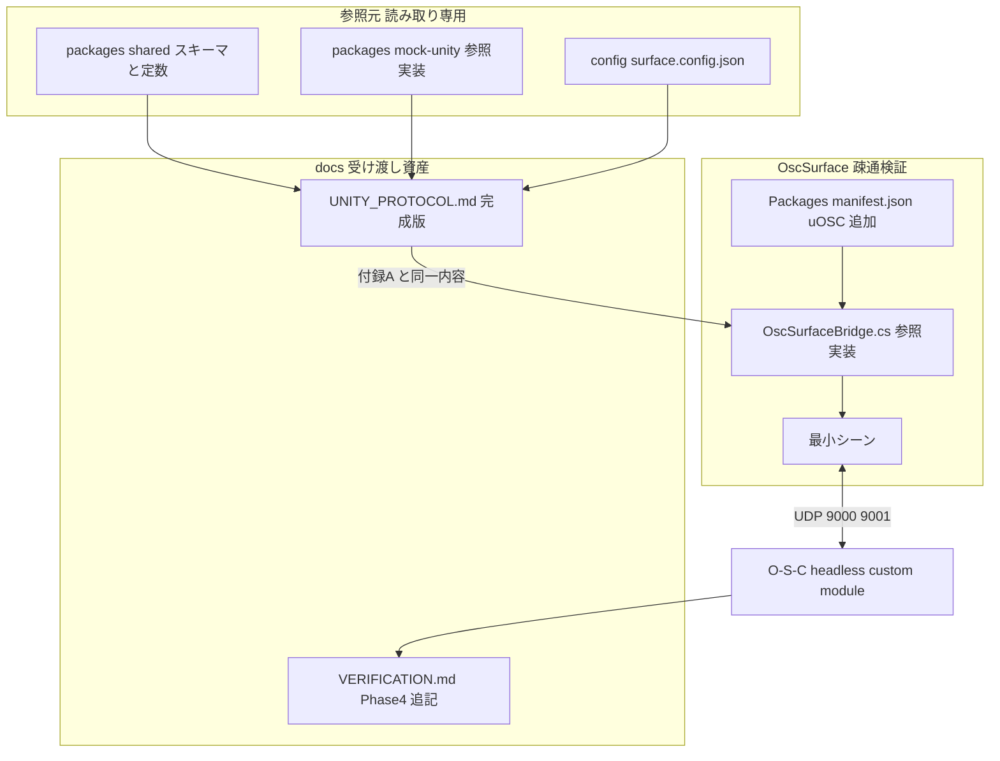
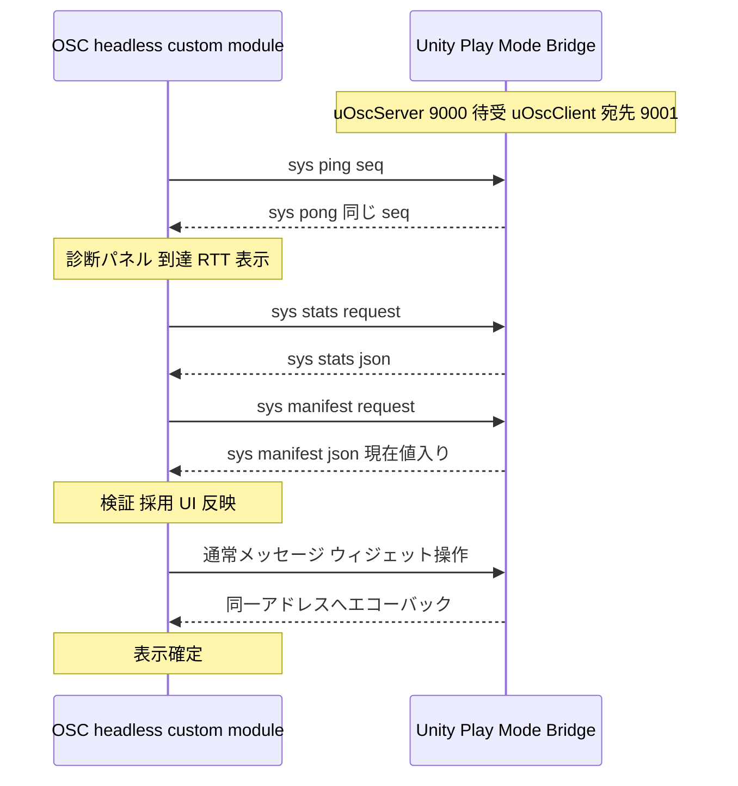

# 技術設計書 — phase4-unity-connection-guide

## Overview

**Purpose**: Phase 4 は `docs/UNITY_PROTOCOL.md` を「実 Unity 接続手順書」として完成させ、その手順書が机上で終わらないことを実機の Unity(Editor Play Mode)との疎通で裏付けるフェーズである。成果物の中心はコードではなくドキュメントであり、本設計書は「完成後の文書がどういう構造・契約を持つか」と「実機検証環境をどう最小構成で作るか」を定める。

**Users**: (1) 任意の OSC ライブラリ(独自 Fork 含む)で `/sys/*` を実装する Unity 実装者 — 本文のみで実装を完結できる。(2) uOSC 採用の実装者 — 付録の C# 1 ファイルをコピーしてそのまま使える。(3) Surface を実 Unity と接続する運用者 — 接続手順とトラブルシュートに従う。

**Impact**: `docs/UNITY_PROTOCOL.md` の暫定表記と付録プレースホルダ(A〜D)を解消して完成版にする。`docs/VERIFICATION.md` に Phase 4 手順を追記する。`OscSurface/` には uOSC 導入・参照実装 C#・最小シーンのみを追加する。`packages/` / `vendor/` / `layouts/` / `config/` は一切変更しない。

### Goals

- 本文のみで(付録なしで)`/sys/*` プロトコルを実装できるライブラリ非依存の擬似コード(受信統計・pong・マニフェスト生成)を本文に置く
- 実 Unity と Surface の接続手順(前提条件 → 段階的疎通確認 → 切り分け)を記述する
- uOSC(hecomi 版 v2 系、`com.hecomi.uosc@2.2.0`)の完全な C# 参照実装を付録に隔離し、本文擬似コードと節単位で対応付ける
- `OscSurface/` で実機 ping/pong 疎通(診断パネルの到達性が正常)を確認し、付録の C# がそのまま動くことを保証する
- 既存自動テスト(`corepack pnpm test`)を緑のまま維持する

### Non-Goals

- `/sys/*` プロトコルの拡張・変更(矛盾発見時は互換性ノートに記録してユーザー判断へ返す)
- `packages/` 配下・`vendor/open-stage-control`・`layouts/`・`config/` の変更
- `OscSurface/` のゲームロジック・既存シーンの作り込み(疎通検証用の追加のみ)
- 実機検証の自動テスト化(vitest / Playwright への組み込みはしない。実機検証は手動 + uloop MCP 支援)
- uOSC 以外のライブラリの動作検証(読み替え表とチェックリストの提供まで)

## Boundary Commitments

### This Spec Owns

- `docs/UNITY_PROTOCOL.md` の最終構成・本文擬似コード・接続手順・互換性チェックリスト・付録 A(uOSC)の内容
- `docs/VERIFICATION.md` の Phase 4 セクション
- `OscSurface/Assets/OscSurfaceBridge/` 配下(参照実装 C#・最小シーン)と `OscSurface/Packages/manifest.json` への uOSC 追加
- 付録 C# と `OscSurface/` 投入ファイルの内容一致という不変条件

### Out of Boundary

- `/sys/*` の仕様変更(Phase 1〜3 確定仕様は読み取り専用の前提)
- `packages/shared` のスキーマ変更(`ManifestSchema` / `StatsPayloadSchema` は正規定義として参照するのみ)
- mock-unity の挙動変更(擬似コードの「正」として参照するのみ)
- O-S-C 本体・レイアウト・config の変更
- `OscSurface/` の uloop MCP 設定や既存アセット

### Allowed Dependencies

- `packages/shared/src/schemas.ts` / `index.ts` — スキーマとアドレス定数の正規定義(文書から参照)
- `packages/mock-unity/src/responder.ts` ほか — 擬似コードの挙動の正(Req 1.4)
- `config/surface.config.json` / O-S-C headless 起動引数 — 接続手順のポート対応表の根拠
- uOSC `com.hecomi.uosc@2.2.0`(外部・付録と `OscSurface/` のみ)。**本文からの依存は禁止**
- uloop MCP(`io.github.hatayama.uloopmcp`)— 検証作業の道具。文書・成果物は依存しない

### Revalidation Triggers

- `/sys/*` のアドレス・引数・計数規則が変わった場合(文書全体の再検証)
- `ManifestSchema` / `StatsPayloadSchema` の形が変わった場合(擬似コード・付録 C#・デモマニフェストの再検証)
- `config/surface.config.json` のキー構成や O-S-C 起動引数の流儀が変わった場合(§5 接続手順の再検証)
- uOSC のメジャー更新を採用する場合(付録 A の API 対応・差異ノートの再検証)

## Architecture

### Existing Architecture Analysis

- `docs/UNITY_PROTOCOL.md` は Phase 1〜3 の確定仕様(§1 到達性・診断、§2 マニフェストハンドシェイク、§3 双方向同期、互換性ノート)を既に持つ。**これらの節は変更しない**。不足は「実装指針(擬似コード)」「接続手順」「チェックリスト」「付録」であり、追記・再編で完成させる
- 擬似コードの正は mock-unity の実証済み挙動(decode → bundle 再帰展開 → 展開後メッセージ単位の計数 → アドレスディスパッチ、返信先は設定で明示)である
- 検証の流儀は `docs/VERIFICATION.md` の既存パターン(前提 → 番号付き確認手順 → 停止と無変更確認)を踏襲する

### Architecture Pattern & Boundary Map



**Architecture Integration**:

- Selected pattern: ドキュメント中心 + 実機スモーク検証。「本文 = ライブラリ非依存の正」「付録 = uOSC 具体化」「OscSurface/ = 付録の実証」という 3 層の写像を保つ
- 依存方向: `packages/`(正規定義)→ `UNITY_PROTOCOL.md` 本文 → 付録 A → `OscSurface/` 投入ファイル。逆流(実機都合で本文を uOSC に寄せる)は禁止。実機で判明した差異は互換性ノートに記録して吸収する
- Steering compliance: O-S-C 無改造 / 案件差分はデータ / Unity が真実の源 / OSC 1.0 標準のみ — すべて本フェーズの制約としてそのまま適用

### Technology Stack

| Layer | Choice / Version | Role in Feature | Notes |
|-------|------------------|-----------------|-------|
| ドキュメント | Markdown(`docs/`) | 受け渡し資産の本体 | 言語は日本語。コードブロックは擬似コードと C# |
| Unity パッケージ | `com.hecomi.uosc` 2.2.0(npmjs スコープドレジストリ `com.hecomi`) | 付録参照実装の OSC ライブラリ | v2 系最新。導入は manifest.json への明示ピン(research.md 参照) |
| Unity 検証 | Unity Editor(OscSurface/)+ uloop MCP 3.0.0-beta.61 | コンパイル・Play Mode・ログ確認の自動化 | uloop は作業道具であり成果物は依存しない |
| Surface 側 | O-S-C v1.30.4 headless + 既存 custom module | 疎通相手(変更なし) | 起動引数は VERIFICATION.md Phase 2/3 と同一 |
| 回帰テスト | 既存 `corepack pnpm test`(vitest + Playwright) | 無変更確認 | 新規自動テストは追加しない |

## 完成後の UNITY_PROTOCOL.md 文書構造

本フェーズの中核となる「設計対象としての文書」の目次契約。既存節は無変更、太字が新規・変更箇所。

| 節 | 内容 | 状態 | Req |
|----|------|------|-----|
| ヘッダ | タイトルから「(暫定版)」を除去。冒頭注記から「Phase 4 で追記する」等の未完了表記を除去し、本文非依存・付録隔離の方針宣言に書き換え | **変更** | 5.2 |
| 前提 | Unity が真実の源 / UDP / config | 無変更 | — |
| §1 到達性・診断 | ping/pong・stats・計数規則 | 無変更 | 5.1 |
| §2 マニフェストハンドシェイク | 要求・再送・回復 / 検証・採用 / 値同期 | 無変更 | 5.1 |
| §3 双方向同期の規律 | エコーバック確定・ドラッグ中無視 | 無変更 | 5.1 |
| **§4 実装指針(擬似コード)** | 4.1 受信統計の持ち方 / 4.2 pong 実装 / 4.3 マニフェスト生成と応答。ライブラリ非依存、mock-unity の確定挙動と一致 | **新規** | 1.1–1.5, 4.1 |
| **§5 実 Unity 接続手順** | 5.1 前提条件とポート対応表 / 5.2 段階的疎通確認 / 5.3 接続できないときの切り分け | **新規** | 2.1–2.4 |
| **§6 ライブラリ互換性チェックリスト** | 利用ライブラリの適合確認項目と、不適合時の代替策(互換性ノート参照) | **新規** | 4.3, 4.4 |
| 互換性ノート | 既存 + **Phase 4 追記**(uOSC 差異のうちプロトコル解釈に関わるもの、実機検証で判明した事項) | **追記** | 1.5, 3.4, 5.4 |
| **付録 A: uOSC 参照実装** | A.1 導入(UPM)/ A.2 C# 全文(コピペ可能 1 ファイル)/ A.3 本文 §4 との節対応と読み替え表 / A.4 uOSC 固有の差異と制約 | **新規(A〜D プレースホルダを置換)** | 3.1–3.4, 4.2 |

**Key Decisions**:

- 現行プレースホルダの「付録 B〜D(擬似コード)」は **本文 §4 に昇格** させ、付録は A(uOSC)のみとする。1.1〜1.3 が擬似コードを本文に要求し、4.1 が「本文のみで実装完結」を要求するため、付録に擬似コードを残す構成は要件と両立しない(research.md の比較参照)。プレースホルダ A〜D の「実内容への置き換え」(5.2)はこの構成再編を含めて満たす
- uOSC への言及は付録 A と互換性ノート(差異の記録として)にのみ許す。**本文 §1〜§6 は uOSC の API・型・挙動に言及しない**(3.2)。§6 のチェックリストもライブラリ名を出さず一般形で書く
- 文書は 1 ファイルのまま完成させる(受け渡し資産の分割はしない)

### §4 擬似コード契約

擬似コードは特定言語の構文に寄せない手続き記述とし、以下の状態モデルと不変条件を規範として持つ。挙動の正は mock-unity(`responder.ts`)の実証済み実装である(1.4)。

**状態モデル**(4.1):

```
state:
  received: int = 0            // 正常 decode できた展開後メッセージ数
  parseErrors: int = 0         // decode 失敗データグラム数
  lastReceivedAt: timestamp    // 最後に正常 decode したメッセージの受信時刻(ISO-8601)
  currentValues: map<address, value>   // マニフェスト default 用の現在値
```

**受信処理の骨格**(4.1。全メッセージ共通の前段):

1. データグラムを decode。失敗 → `parseErrors += 1` して終了(`received` は増やさない)
2. bundle なら再帰展開し、**展開後の各メッセージごとに** 手順 3 以降を実行
3. `received += 1`、`lastReceivedAt = now()` を **ディスパッチ前に** 更新(`/sys/stats/request` 自身も計数される)
4. アドレスでディスパッチ: `/sys/ping` / `/sys/stats/request` / `/sys/manifest/request` / その他 `/sys/*`(計数のみ・応答なし)/ 通常メッセージ(値記録 + 同一アドレスへエコーバック)

**pong**(4.2): `/sys/ping (int seq)` 受信 → 受信した `seq` をそのまま `/sys/pong (int seq)` として **設定された返信先** へ即時返信。seq の解釈・保持はしない(喪失判定は Surface 側の責務)

**マニフェスト生成と応答**(4.3): エントリ定義(address / label / type / widget / range / group)+ `currentValues` から `default` を埋めて JSON 化 → `/sys/manifest (string json)` を `s` 1 引数・UTF-8・**単一データグラム** で送信。要求ごとに応答してよく(重複応答は Surface 側で冪等)、起動時の自発送信も可。JSON は ~1.4KB 以内推奨(既存互換性ノートを参照)

**不変条件**:

- 返信先は受信データグラムの送信元ではなく、設定(ホスト・ポート)で明示した宛先とする(2.3)
- 使用する OSC 機能は基本型タグ `i`/`f`/`s`/`b` と bundle/timetag のみ。bool は `i` の 0/1(5.3)。配列引数・カラー型・64bit 整数等が必要になる表現は使わず、必要が生じたら互換性ノートに代替と理由を記録(1.5)
- stats 応答の JSON は `StatsPayloadSchema`、マニフェストは `ManifestSchema`(いずれも `packages/shared`)に適合する。`lastReceivedAt` は ISO-8601 の UTC(`Z` 終端)を規範例とする

### §5 接続手順の設計

**前提条件(5.1 相当の内容)** — ポート対応表を中心に置く:

| 項目 | Surface 側(config / 起動引数) | Unity 側 |
|------|-------------------------------|----------|
| Surface → Unity 宛先 | `unity.host` : `unity.sendPort`(既定 127.0.0.1:9000)= O-S-C `-s host:port`(一致必須) | OSC 受信の待受ポート = `sendPort`(9000) |
| Unity → Surface 返信先 | `unity.receivePort`(既定 9001)= O-S-C `-o port`(一致必須) | OSC 送信の宛先 = Surface ホスト : `receivePort`(9001) |

同一マシン(Editor 検証、127.0.0.1)と LAN 分離(実 IP 指定)の両方の設定例を示す。返信先は設定で明示する前提(2.3)をここで再掲する。

**段階的疎通確認(2.2)**: ① ping/pong 成立(診断パネルの到達性 = 到達、RTT 表示)→ ② `/sys/stats` 取得(received が増えること)→ ③ マニフェスト採用(ラベル・動的ウィジェット反映)→ ④ 値のエコーバック確定(ウィジェット操作 → 表示確定)。各段階に「確認方法(診断パネル / NDJSON / O-S-C ログ)」と「失敗時に見る節」を併記する。

**切り分け(2.4)**: 症状 → 原因候補 → 参照先の表形式。最低限含める項目: 到達性が「喪失」のまま(ポート不一致 / ファイアウォールの UDP 受信ブロック / 別サブネット判定の確認)、pong は返るが stats が来ない、マニフェストが採用されない(スキーマ検証失敗ログの見方)、値が確定しない(エコーバック欠落)、Editor Pause 中の喪失表示(正常挙動)。診断手段は Phase 3 の既存機能(診断パネル・デバッグモード・NDJSON ログ)への参照とする。

### §6 チェックリストの設計(4.3, 4.4)

チェック項目(一般形・ライブラリ名なし): UTF-8 文字列の送受信 / 基本型タグ `i` `f` `s` `b` の対応 / bundle の受信展開(または bundle 非受信を前提にできること)/ 返信先ホスト・ポートの明示指定 / 想定ペイロードサイズ(~1.4KB、上限 ~60KB)のデータグラム送受信 / アドレスのリテラル一致のみでよい(パターンマッチング不要)/ 独自型変換(bool の `T`/`F` 強制等)の抑止可否。各項目に不適合時の代替策(ASCII-safe 化・0/1 表現など)を互換性ノートの該当項目への参照として付す。

## File Structure Plan

### Modified Files

- `docs/UNITY_PROTOCOL.md` — 上記目次契約どおりの追記・再編(既存 §1〜§3・互換性ノート本体は無変更、ヘッダと付録を置換)
- `docs/VERIFICATION.md` — 「Phase 4 — 実 Unity 接続手順書」セクションを追記
- `OscSurface/Packages/manifest.json` — スコープドレジストリ `com.hecomi` 追加 + `"com.hecomi.uosc": "2.2.0"` 追加
- `CLAUDE.md` — Phase 進捗の Phase 4 チェックボックス更新(完了時)
- `DESIGN.md` — Phase 4 の設計判断(D-014 以降: 付録構成の再編、uOSC 導入方式、bool 正規化、手書き JSON ビルダ)を追記

### New Files

```
OscSurface/Assets/OscSurfaceBridge/
├── OscSurfaceBridge.cs        # 付録 A.2 と同一内容の参照実装(唯一のソース)
└── OscSurfaceBridge.unity     # 最小シーン: GameObject 1 個 + uOscServer/uOscClient/Bridge
```

- `.meta` は Unity Editor(uloop の refresh / compile)に生成させる。外部スクリプトで作成する場合のみ、GUID はランダム 32 桁 hex を生成する(連番・ローテーション系列・既存 GUID 流用の禁止)
- **一致の不変条件**: `OscSurfaceBridge.cs` を正とし、付録 A.2 のコードブロックはその全文コピーとする。修正時は必ず両方へ反映する(7.1, 7.3)

## System Flows

段階的疎通確認(§5)と実機検証(Req 7)が共有するフロー:



- 疎通の合否判定は Surface 側の観測面(診断パネル / `/surface/status` / NDJSON)で行い、Unity 側は uloop でコンパイルエラー・実行時例外がないことを確認する
- 実機検証の最低ラインは ping/pong 成立(到達性正常)(7.2)。stats・マニフェスト・エコーバックは §5 手順の追試として同じセッションで確認する

## Requirements Traceability

| Requirement | Summary | 実現要素 |
|-------------|---------|----------|
| 1.1 | 受信統計の擬似コード | §4.1(状態モデル・受信処理骨格) |
| 1.2 | ping→pong の擬似コード | §4.2 |
| 1.3 | マニフェスト生成・応答の擬似コード | §4.3(default 埋め込み・UTF-8 単一データグラム) |
| 1.4 | 確定仕様との一致 | §4 不変条件(mock-unity の骨格を正とする。計数タイミング・重複応答・自発送信・エコーバック) |
| 1.5 | 解釈が割れる機能の回避 | §4 不変条件 + 互換性ノート追記の運用 |
| 2.1 | 接続の前提条件 | §5 ポート対応表(config ↔ O-S-C 引数 ↔ Unity 設定) |
| 2.2 | 段階的疎通確認 | §5 段階手順(ping/pong→stats→採用→エコーバック)+ System Flows |
| 2.3 | 返信先の明示設定 | §4 不変条件 + §5 前提条件での再掲 |
| 2.4 | 切り分け指針 | §5 トラブルシュート表(診断パネル・デバッグモード・NDJSON 参照) |
| 3.1 | uOSC 完全 C# 1 ファイル | 付録 A.2 + `OscSurfaceBridge.cs` |
| 3.2 | 本文の uOSC 非依存 | 目次契約(uOSC 言及は付録と互換性ノートのみ)+ 検証のレビュー観点 |
| 3.3 | 付録と本文の節対応 | 付録 A.3(A.2 の各領域 ↔ §4.1/4.2/4.3 対応表) |
| 3.4 | uOSC 差異の明記 | 付録 A.4(parseErrors 観測不能・bool T/F・メインスレッド遅延) |
| 4.1 | 本文のみで実装完結 | §1〜§6 で仕様+実装指針+手順+適合確認が閉じる構成 |
| 4.2 | 読み替え対応点の明示 | 付録 A.3 読み替え表(uOSC API ↔ 擬似コード操作) |
| 4.3 | 互換性チェック項目 | §6 チェックリスト |
| 4.4 | 不適合時の代替策 | §6 各項目 → 互換性ノート参照 |
| 5.1 | 確定仕様と無矛盾 | 既存 §1〜§3 無変更の原則 + 検証のレビュー観点 |
| 5.2 | 暫定表記の解消 | ヘッダ書き換え + 付録 A〜D プレースホルダ置換(構成再編を含む) |
| 5.3 | OSC 1.0 の範囲 | §4 不変条件(基本型タグ + bundle/timetag のみ) |
| 5.4 | 矛盾発見時の運用 | Error Handling(記録してユーザー判断へ返す) |
| 6.1 | mock-unity での追試手順 | VERIFICATION.md Phase 4(mock を実 Unity に見立てた §5 追試) |
| 6.2 | 自動テスト緑の確認 | VERIFICATION.md Phase 4(`corepack pnpm test`) |
| 6.3 | vendor / packages 無変更確認 | VERIFICATION.md Phase 4(`git status` 確認) |
| 6.4 | 本文 uOSC 混入のレビュー観点 | VERIFICATION.md Phase 4(付録外 uOSC 言及の検索確認) |
| 7.1 | uOSC 導入 + 参照実装投入 | manifest.json 変更 + `OscSurfaceBridge.cs` / シーン(付録 A.2 と同一内容) |
| 7.2 | 実機 ping/pong 疎通 | 実機検証フロー(Play Mode + O-S-C headless + 診断パネル正常) |
| 7.3 | 修正の両面反映と差異記録 | 一致の不変条件 + 互換性ノート追記の運用 |
| 7.4 | OscSurface/ 最小変更 | New Files の 3 点(manifest / C# / シーン)に限定 |

## Components and Interfaces

| Component | Domain | Intent | Req | Key Dependencies | Contracts |
|-----------|--------|--------|-----|------------------|-----------|
| UNITY_PROTOCOL.md 本文拡張(§4〜§6 + ヘッダ) | ドキュメント | 擬似コード・接続手順・チェックリストで本文を完結させる | 1.1–1.5, 2.1–2.4, 4.1, 4.3, 4.4, 5.2, 5.3 | shared スキーマ(P0)/ mock-unity 挙動(P0)/ config(P1) | — |
| UNITY_PROTOCOL.md 付録 A | ドキュメント | uOSC 具体例の隔離と読み替え可能性 | 3.1–3.4, 4.2 | 本文 §4(P0)/ OscSurfaceBridge.cs(P0 同一内容) | — |
| OscSurfaceBridge(C#) | Unity 検証 | 付録 A.2 の実体。実機疎通の被検体 | 3.1, 7.1–7.4 | uOSC 2.2.0(P0)/ Surface headless(P0 対向) | State |
| OscSurface プロジェクト設定 | Unity 検証 | uOSC 導入と最小シーン | 7.1, 7.4 | manifest.json(P0) | — |
| VERIFICATION.md Phase 4 手順 | 検証 | 追試・回帰・無変更確認・レビュー観点の手順化 | 6.1–6.4 | 既存 VERIFICATION 流儀(P1)/ uloop MCP(P2 道具) | — |

ドキュメント系コンポーネントの内容契約は前章「完成後の UNITY_PROTOCOL.md 文書構造」で定義済みのため、ここでは新しい境界を持つ `OscSurfaceBridge` と検証手順のみ詳細化する。

### Unity 検証

#### OscSurfaceBridge

| Field | Detail |
|-------|--------|
| Intent | 付録 A.2 と同一内容の uOSC 参照実装。§4 擬似コードの各節を 1:1 で具体化する |
| Requirements | 3.1, 3.3, 7.1, 7.2, 7.4 |

**Responsibilities & Constraints**

- `/sys/ping`→pong、`/sys/stats/request`→stats、`/sys/manifest/request`→manifest、通常メッセージ→値記録+同一アドレスエコーバック、その他 `/sys/*`→計数のみ、を単一 MonoBehaviour で担う
- 外部依存は uOSC のみ。JSON 生成はファイル内の私製ビルダ(optional フィールド省略と文字列エスケープを実装。research.md の決定参照)
- 追加アセット(prefab・ScriptableObject 等)を要求しない。コピペ 1 ファイル + コンポーネント 3 個のアタッチで完結する

**Dependencies**

- External: `uOSC.uOscServer`(受信・P0)/ `uOSC.uOscClient`(送信・P0)— 同一 GameObject に `RequireComponent`
- Outbound: Surface(O-S-C headless)— UDP 対向(P0)

**Contracts**: State [x]

##### クラス構造(公開面と節対応)

```csharp
// 付録 A.2 全文の構造契約。§ 対応コメントを実ファイルにも残す
[RequireComponent(typeof(uOSC.uOscServer), typeof(uOSC.uOscClient))]
public sealed class OscSurfaceBridge : MonoBehaviour
{
    [SerializeField] private string characterName;   // デモ用表示名(ラベルに埋め込む)

    // §4.1 受信統計
    private int received;
    private int parseErrors;                          // uOSC では観測不能のため常に 0(A.4 に明記)
    private string lastReceivedAt;                    // ISO-8601 UTC (Z 終端)
    // §4.3 現在値ストア
    private readonly Dictionary<string, object> currentValues;

    private void OnEnable();                          // onDataReceived 購読 + 起動時マニフェスト自発送信
    private void OnDataReceived(uOSC.Message message);// §4.1 計数 → ディスパッチ
    private void SendPong(int seq);                   // §4.2
    private void SendStats();                         // §4.1 stats JSON 応答
    private void SendManifest();                      // §4.3 現在値を default に埋めて応答
    private void HandleNormalMessage(uOSC.Message message); // 値記録 + 同一アドレスエコーバック
    private string BuildStatsJson();
    private string BuildManifestJson();
    private static string EscapeJsonString(string value);
    private static object NormalizeValue(object value); // bool → int 0/1 正規化
}
```

- Preconditions: uOscServer.port = config `unity.sendPort`(9000)、uOscClient の address/port = Surface ホスト : `unity.receivePort`(9001)をインスペクタで設定済み
- Postconditions: 受信 1 メッセージごとに計数更新がディスパッチに先行する。全送信は uOscClient 経由(= 設定された返信先固定)
- Invariants: 送信 args に C# `bool` を渡さない(0/1 の `int` に正規化)。使用型は int / float / string(/ 受信時の byte[] 許容)のみ

##### State Management

- State model: 受信統計 3 値 + `currentValues`。エントリ定義は mock-unity の `scenarios/default.json` と同構成の 5 エントリ(Smile / Character Name / Greeting / Visible / Wave)をファイル内定数として保持し、`characterName` をラベル・値に埋め込む — 既存レイアウト・E2E と同じ UI 反映(索引内更新 + 動的生成)が実機でも観測できる
- Persistence: なし(Play Mode 中のメモリのみ。Unity が真実の源であり、値は Unity 側の状態が正)
- Concurrency: uOSC の `onDataReceived` はメインスレッド配信のため排他不要。この単純化が uOSC 依存である点を付録 A.3 の読み替え表に明記(受信スレッド配信のライブラリでは統計・値ストアの排他が必要)

**Implementation Notes**

- Integration: 付録 A.3 の読み替え表は「uOscServer.onDataReceived ↔ 擬似コードの受信ハンドラ登録」「uOscClient.Send ↔ 返信先への送信」「bundle 自動展開 ↔ 骨格手順 2」「メインスレッド配信 ↔ 排他不要の前提」を最低限含める
- Validation: 実機で生成 JSON が Surface に採用されること(= `ManifestSchema` 適合)と、エコーバック型が `i`/`f`/`s` であること(NDJSON ログ)を確認
- Risks: pong がフレーム同期になるため RTT にフレーム時間が乗る(A.4 に注記)。Editor Pause 中は喪失表示(§5 トラブルシュートに記載)

### 検証

#### VERIFICATION.md Phase 4 手順

| Field | Detail |
|-------|--------|
| Intent | 文書の追試可能性・実機疎通・無変更・本文純度を確認する手順の追記 |
| Requirements | 6.1–6.4(実施自体は 7.2 と共有) |

**Responsibilities & Constraints** — 既存 Phase 節の流儀(前提 → 番号付き手順 → 停止・無変更確認)で以下を含める:

1. **mock-unity 追試**(6.1): UNITY_PROTOCOL.md §5 の接続手順を、mock-unity を実 Unity に見立てて上から実行できることの確認(既存 Phase 2/3 の起動コマンドを再利用)
2. **実機疎通**(7.2): OscSurface を Unity Editor で開く → uOSC 解決とコンパイル成功(uloop で確認可)→ 検証シーンで Play Mode → O-S-C headless 起動 → 診断パネルで到達性「到達」・RTT 表示 → stats / マニフェスト採用 / エコーバック確定を §5 手順どおり追試
3. **回帰**(6.2): `corepack pnpm test` 緑(process-harness ready-timeout の単独失敗は 1 回だけ再実行のうえ判定、の既存注記を踏襲)
4. **無変更確認**(6.3): `git status` で `vendor/open-stage-control` と `packages/` に差分なし。差分が docs / `OscSurface/` の最小変更(manifest.json・Bridge C#・シーン・関連 .meta)のみであること
5. **レビュー観点**(6.4): UNITY_PROTOCOL.md の付録 A・互換性ノート以外に uOSC への言及がないこと(`Select-String 'uOSC' docs/UNITY_PROTOCOL.md` の該当行が付録・互換性ノート内のみであることを目視確認)。付録 A.2 と `OscSurfaceBridge.cs` の内容一致(diff)

## Data Models

新規の永続データはない。文書が参照するデータ契約は既存の正規定義に固定する:

- `/sys/stats` ペイロード = `StatsPayloadSchema`(received / parseErrors / lastReceivedAt)。`lastReceivedAt` は offset 付き ISO-8601 必須のため、擬似コード・付録とも UTC `Z` 終端を規範例とする
- `/sys/manifest` ペイロード = `ManifestSchema`(version 1 / entries)。optional フィールド(range / default / group)は「省略」であり null を書かない(付録の JSON ビルダ要件)
- デモマニフェスト(付録・実機)のエントリは mock-unity `scenarios/default.json` と同構成 5 エントリ(値の初期値も同等)。プロトコル上の意味は §2 で定義済みのため、本フェーズでの追加定義はない

## Error Handling

- **仕様と実装の矛盾を発見した場合**(5.4): 独断で文書・実装のどちらも変更しない。差異と選択肢を UNITY_PROTOCOL.md 互換性ノートに記録し、ユーザー判断へ返す(既存の開発規律をそのまま適用)
- **実機検証で付録 C# の修正が必要になった場合**(7.3): 修正は `OscSurfaceBridge.cs`(正)→ 付録 A.2 の順で両方へ反映し、判明した差異(uOSC 挙動・Unity 環境要因)を互換性ノートまたは A.4 に記録する
- **実機疎通が成立しない場合**: §5 トラブルシュート表を自ら適用して切り分ける(手順書のセルフテストを兼ねる)。切り分け表に不足があれば表を補強してから完了とする
- **uOSC 導入が失敗した場合**(レジストリ障害等): 付録 A.1 に代替導入(git URL `#upm` / unitypackage)を記載し、検証はいずれかの経路で続行する

## Testing Strategy

自動テストの新規追加はなし。検証は以下の 4 面で行う(手順は VERIFICATION.md Phase 4 に固定):

- **回帰(自動)**: `corepack pnpm test` — workspace build / unit / E2E が無変更のまま緑
- **文書追試(手動)**: §5 接続手順を mock-unity で上から実行し、手順の欠落・誤りがないことを確認
- **実機スモーク(手動 + uloop)**: Unity Editor Play Mode ↔ O-S-C headless の ping/pong 成立(診断パネル正常)を最低ラインとし、stats → マニフェスト採用 → エコーバック確定まで追試
- **文書レビュー(手動)**: 本文の uOSC 非依存(検索確認)/ 暫定表記の残存なし / 既存 §1〜§3 が無変更であること(`git diff` で追記・置換箇所のみ確認)/ 付録 A.2 と投入ファイルの一致(diff)
