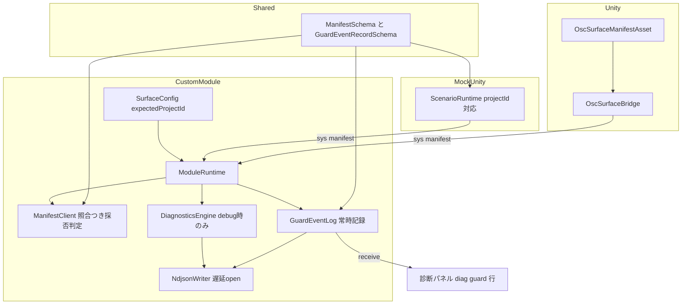
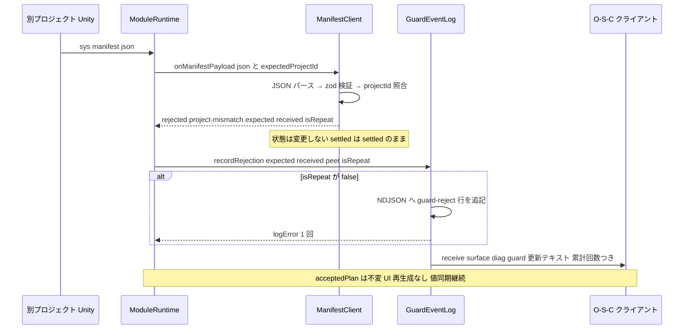
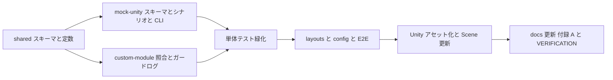

# Design Document — phase5-manifest-asset-guard

## Overview

**Purpose**: 本フィーチャーは (1) Unity 参照実装のマニフェスト定義を C# ハードコード配列から ScriptableObject アセットへ外出しし(資産化)、(2) マニフェストに必須のプロジェクト識別子 `projectId` を追加して Surface 側 config の `expectedProjectId` と照合する誤接続ガードを導入する。これにより、運用中の OSC コントロールサーフェス UI が LAN 内の別プロジェクト Unity のマニフェストで上書き再生成される事故を防ぎ、マニフェスト定義の Git 差分管理と別プロジェクトへの流用を可能にする。

**Users**: Unity 開発者はアセットのインスペクタ編集でマニフェスト定義を管理し、運用者は config の期待識別子設定と診断パネルによる拒否確認を利用する。

**Impact**: `packages/shared` の `ManifestSchema` に `projectId` を必須追加(version は 1 のまま。リリース前のため旧形式の受理なし)。custom module の採否ロジック・診断経路、mock-unity のシナリオ、Unity 参照実装、`docs/UNITY_PROTOCOL.md`(本文 + 付録 A)、E2E テストが連動して変わる。O-S-C 本体(`vendor/open-stage-control`)は無改造。

### Goals
- マニフェスト定義を ScriptableObject アセット(YAML / Force Text)で管理し、移行前と等価なマニフェストを送信できる
- `projectId` 必須化と `expectedProjectId` 照合により、不一致マニフェストの採用(UI 再生成・表示キャッシュ更新)を阻止する
- ガード拒否を debug 設定に関わらず常時 NDJSON に記録し、診断パネルに表示する
- `corepack pnpm test`(vitest + Playwright E2E)全件成功で完了とする

### Non-Goals
- O-S-C 本体への変更(絶対規律)
- 認証・暗号化などセキュリティ目的のアクセス制御(本ガードは誤接続防止であり悪意対策ではない)
- 値のエコーバック受信の遮断(アドレス偶然重複による別プロジェクトからの値更新は防がない。制限として文書化)
- マニフェスト以外の `/sys/*` メッセージへの識別子付与
- Unity エディタ拡張(専用インスペクタ等)の作り込み

## Boundary Commitments

### This Spec Owns
- `ManifestSchema` / `SurfaceConfigSchema` / 新設 `GuardEventRecordSchema` の形状(packages/shared)
- custom module のマニフェスト採否判定(スキーマ検証 + 識別子照合)と、ガード拒否イベントの常時記録経路(`GuardEventLog`)
- mock-unity のシナリオスキーマへの `projectId` 追加と誤接続模擬シナリオ・CLI 上書き
- Unity 参照実装のマニフェスト定義アセット(`OscSurfaceManifestAsset`)と Bridge の読み込み・送信ロジック
- `docs/UNITY_PROTOCOL.md` §2 の識別子仕様・照合ルール・制限、および付録 A の再構成
- `layouts/diagnostics.json` へのガード表示行の追加、`config/surface.config.json` の `expectedProjectId`

### Out of Boundary
- `/sys/ping`・`/sys/stats`・値エコーバックなど既存プロトコルの他要素の意味論
- 診断エンジンの既存機能(リングバッファ・RTT・サブネット判定・ロス率)の変更 — purge 保護対象の複数化と NDJSON レコード型の union 化のみ触れる
- マニフェスト適用計画(`manifest-apply.ts` / `widget-catalog.ts`)— 採否判定の上流でガードするため無変更
- O-S-C のレイアウト機構・`vendor/` 配下

### Allowed Dependencies
- 既存依存方向を踏襲: `shared` → `custom-module` / `mock-unity` / `tests`。逆流禁止
- custom module 内: `schemas(shared)` → `config` / `manifest-client` / `guard-event-log` → `module-runtime`。`guard-event-log` は `ndjson-writer` に依存してよいが `diagnostics-engine` に依存しない(debug 非依存を型レベルで保つ)
- Unity 側: `OscSurfaceBridge` → `OscSurfaceManifestAsset`(一方向)。アセットは Bridge を参照しない

### Revalidation Triggers
- `ManifestSchema` の形状変更(本仕様で `projectId` 必須化)→ mock-unity シナリオ・Unity 参照実装・付録 A・E2E の同時更新が必須(Migration Strategy 参照)
- `NdjsonWriter.append` のレコード型 union 化 → NDJSON を読むツール・テストは「`kind` フィールドの有無」で行種別を判別すること
- `selectPurgeTargets` の引数変更(`currentFileName` → `currentFileNames`)
- 診断パネルの新アドレス `/surface/diag/guard` 追加

## Architecture

### Existing Architecture Analysis
- **採否判定の単一関門**: マニフェスト受理は `ManifestClient.onManifestPayload` の JSON パース + zod 検証のみ(UNITY_PROTOCOL §2「これが唯一の受け入れ判定」)。識別子照合はこの関門に第 3 段として追加し、判定箇所を分散させない
- **診断は debug ゲート付き**: `DiagnosticsEngine` は `config.debug === true` のときのみ生成される。ガード拒否の常時記録はこのゲートの外に独立経路(`GuardEventLog`)を新設して満たす(research.md「Architecture Pattern Evaluation」案 B 採用)
- **二経路適用(D-009)**: 採用時ブロードキャスト + `sessionOpened` ごとのクライアント別適用。ガードのパネル表示も同じ二経路(状態変化時ブロードキャスト + sessionOpened 時のクライアント別発行)を踏襲する
- **シナリオ = データ + CLI 上書き(D-012)**: `--project-id` は `--character-name` と同型の従属フラグとして追加

### Architecture Pattern & Boundary Map



**Architecture Integration**:
- Selected pattern: 既存の「単一関門での採否判定」を維持し、照合を `ManifestClient` 内の第 3 段として追加。可観測性は debug ゲート外の独立コンポーネントで常時化
- 依存方向(強制): `shared` → `config` / `manifest-client` / `guard-event-log` / `ndjson-writer` → `diagnostics-engine` → `module-runtime`。左のレイヤのみ import 可。違反はレビューでエラー扱い
- Steering compliance: O-S-C 無改造、案件差分はデータ(アセット / config / シナリオ)、Unity が真実の源(ガードは表示キャッシュの保護であり値の確定規律は不変)、OSC 1.0 標準機能のみ(projectId は既存の `s` 型 JSON ペイロード内のフィールドであり型タグに変更なし)

### Technology Stack

| Layer | Choice / Version | Role in Feature | Notes |
|-------|------------------|-----------------|-------|
| Shared schema | zod(既存) | `projectId` 検証・`GuardEventRecordSchema` | 新規依存なし |
| Custom module | TypeScript + esbuild(既存) | 照合・常時記録・パネル発行 | 新規依存なし |
| Mock / E2E | osc npm + vitest + Playwright(既存) | シナリオ拡張・ガード検証 | 新規依存なし |
| Unity | Unity 6 + uOSC 2.2.0(既存) | ScriptableObject アセット + JSON 手書きビルダ(D-016) | Force Text 確認済み(`m_SerializationMode: 2`) |

## File Structure Plan

### New Files
```
packages/custom-module/src/
├── guard-event-log.ts           # 常時稼働のガード拒否記録(NDJSON + パネル発行)
└── guard-event-log.test.ts
packages/mock-unity/scenarios/
└── wrong-project.json           # 誤接続模擬(別 projectId + 別エントリ構成)
OscSurface/Assets/OscSurfaceBridge/
├── OscSurfaceManifestAsset.cs   # ScriptableObject 定義(+ .meta: ランダム GUID)
└── OscSurfaceManifest.asset     # 同梱定義アセット(現行 EntryDefs と同一内容 + projectId)(+ .meta)
tests/e2e/
└── manifest-guard.e2e.test.ts   # 識別子一致・不一致・未設定の E2E
```

### Modified Files
- `packages/shared/src/schemas.ts` — `ManifestSchema.projectId` 必須追加、`SurfaceConfigSchema.expectedProjectId` 任意追加、`GuardEventRecordSchema` 新設
- `packages/shared/src/index.ts` — `SURFACE_DIAG.GUARD = '/surface/diag/guard'` 追加
- `packages/custom-module/src/manifest-client.ts` — 拒否理由 `'project-mismatch'` 追加、`onManifestPayload` に照合オプション、状態保存規則
- `packages/custom-module/src/ndjson-writer.ts` — `append` のレコード型 union 化、ストリームの遅延 open 化
- `packages/custom-module/src/ndjson-quota.ts` — `selectPurgeTargets` の保護対象を `currentFileNames: readonly string[]` へ
- `packages/custom-module/src/diagnostics-engine.ts` — 保護ファイル名の受け渡し(`protectedFileNames` オプション)
- `packages/custom-module/src/module-runtime.ts` — `GuardEventLog` の常時生成・破棄、`applyManifest` への peer 伝搬と照合結果分岐、`sessionOpened` でのガード行再発行(既存の `acceptedPlan === null` 早期 return より**前**に実行すること — 設計レビューの観察事項)
- `packages/mock-unity/src/scenario.ts` — `ScenarioSchema.projectId` 必須追加、`manifestJson()` への反映
- `packages/mock-unity/src/index.ts` / `responder.ts` — `--project-id` フラグ(`--scenario` 必須)、READY ペイロードへ projectId 追加、起動時のマニフェスト自発送信(Unity OnEnable 相当)
- `packages/mock-unity/scenarios/default.json` / `invalid-manifest.json` — `projectId` 追加(default は `"osc-surface-demo"`)
- `config/surface.config.json` — `"expectedProjectId": "osc-surface-demo"` 追加
- `layouts/diagnostics.json` — `diag_guard` テキスト行(address `/surface/diag/guard`)追加
- `OscSurface/Assets/OscSurfaceBridge/OscSurfaceBridge.cs` — EntryDefs 削除、アセット参照 + JSON ビルダの projectId 対応
- `OscSurface/Assets/OscSurfaceBridge/OscSurfaceBridge.unity` — Bridge コンポーネントへ同梱アセットを割り当て
- `docs/UNITY_PROTOCOL.md` — §2(スキーマ・照合ルール・制限)、§4.3 擬似コード、互換性ノート、付録 A 再構成
- `docs/VERIFICATION.md` — Phase 5 手動検証手順の追記
- 既存テスト: `schemas`(shared)、`manifest-client.test.ts`、`module-runtime.test.ts`、`ndjson-writer.test.ts`、`ndjson-quota.test.ts`、`diagnostics-engine.test.ts`、`scenario.test.ts`、`index.test.ts`(mock)、既存 E2E の config 生成部

## System Flows

### 誤接続ガードの採否フロー



フロー上の決定:
- 照合はスキーマ検証**通過後**に行う(3.2)。スキーマ違反は従来どおり `schema-error` であり、識別子起因と混同しない
- `expectedProjectId` 未設定時は照合段をスキップし従来動作(3.5)
- project-mismatch では `ManifestClient` の状態を変更しない。settled 中は再要求が発生せず(3.6)、requesting 中は 2 秒間隔の再送が継続する
- NDJSON 追記と console エラーは `isRepeat === false` のときのみ(4.2)。パネル行は繰り返しでも累計回数を更新する(氾濫しない・観測は途切れない)
- 正しいマニフェスト採用時(accepted)は `lastRejectKey` がリセットされ、次の不一致は再び記録される

## Requirements Traceability

| Requirement | Summary | Components | Interfaces | Flows |
|-------------|---------|------------|------------|-------|
| 1.1 | ハードコード配列でなくアセットから読み込む | OscSurfaceManifestAsset, OscSurfaceBridge | `OscSurfaceManifestAsset` フィールド定義 | — |
| 1.2 | Scene 非依存・YAML テキストで Git 管理 | OscSurfaceManifest.asset | Force Text(確認済み) | — |
| 1.3 | projectId + エントリ一覧を保持しインスペクタ編集可 | OscSurfaceManifestAsset | Entry / enum 定義 | — |
| 1.4 | OnEnable で JSON シリアライズし自発送信 | OscSurfaceBridge | `BuildManifestJson` | — |
| 1.5 | アセット未割当・不能時はエラーのみ、送信しない | OscSurfaceBridge | `TryGetValidatedAsset` | — |
| 1.6 | 既存 EntryDefs と同一内容の同梱アセット | OscSurfaceManifest.asset | — | — |
| 2.1 | version 1 のまま projectId 必須を zod で検証 | shared schemas | `ManifestSchema` | — |
| 2.2 | 空でない任意文字列・OSC 1.0 の範囲内 | shared schemas / docs | `z.string().min(1)`(`s` 型 JSON 内) | — |
| 2.3 | 識別子欠落・不正はスキーマ検証で拒否 | ManifestClient | `schema-error` 経路 | 採否フロー |
| 2.4 | 検証結果の決定性 | shared schemas | 純粋関数の zod parse | — |
| 3.1 | config で expectedProjectId 設定可 | shared schemas / config | `SurfaceConfigSchema` | — |
| 3.2 | スキーマ通過後に照合 | ManifestClient | `onManifestPayload(json, options)` | 採否フロー |
| 3.3 | 一致時は従来どおり採用・UI 再生成 | ManifestClient / ModuleRuntime | `accepted` 経路 | 採否フロー |
| 3.4 | 不一致は拒否、UI 再生成・キャッシュ更新なし | ManifestClient / ModuleRuntime | `project-mismatch` 経路 | 採否フロー |
| 3.5 | 未設定時は照合スキップ | ManifestClient | options 省略時動作 | 採否フロー |
| 3.6 | 拒否中も採用済み UI と値同期を継続 | ManifestClient(状態不変)/ ModuleRuntime | 状態保存規則 | 採否フロー |
| 4.1 | debug に関わらず理由・期待・受信を NDJSON 記録 | GuardEventLog / NdjsonWriter | `GuardEventRecord` | 採否フロー |
| 4.2 | isRepeat 方式で重複抑制 | ManifestClient / GuardEventLog | rejectKey 規則 | 採否フロー |
| 4.3 | 診断パネルで拒否を確認可能 | GuardEventLog / layouts | `/surface/diag/guard` | 採否フロー |
| 5.1 | projectId 入りマニフェスト送信シナリオ | mock-unity Scenario | `ScenarioSchema` / default.json | — |
| 5.2 | 誤接続模擬シナリオ | wrong-project.json / `--project-id` | CLI 契約 | — |
| 5.3 | 一致時採用の E2E | manifest-guard.e2e | — | 採否フロー |
| 5.4 | 不一致時の非再生成 + NDJSON 記録の E2E | manifest-guard.e2e | — | 採否フロー |
| 5.5 | 未設定時採用の E2E | manifest-guard.e2e(+ 既存 loopback E2E) | — | — |
| 5.6 | 識別子なしマニフェストのスキーマ拒否の単体テスト | shared / manifest-client tests | — | — |
| 5.7 | `corepack pnpm test` 全件成功 | 全テスト | — | — |
| 6.1 | §2 へ識別子仕様・照合・制限を反映 | UNITY_PROTOCOL.md | — | — |
| 6.2 | 付録 A 全文更新と内容一致不変条件の維持 | UNITY_PROTOCOL.md 付録 A | ファイル集合の不変条件(再定義) | — |
| 6.3 | 互換性ノートへの判断記録 | UNITY_PROTOCOL.md | — | — |
| 6.4 | VERIFICATION.md への手動検証手順追記 | VERIFICATION.md | — | — |

## Components and Interfaces

| Component | Domain/Layer | Intent | Req Coverage | Key Dependencies | Contracts |
|-----------|--------------|--------|--------------|------------------|-----------|
| SharedSchemas | shared | projectId 必須化・config 拡張・ガードレコード定義 | 2.1–2.4, 3.1, 4.1 | zod (P0) | State |
| ManifestClient | custom-module | スキーマ検証 + 識別子照合の単一関門 | 2.3, 3.2–3.6, 4.2 | SharedSchemas (P0) | Service |
| GuardEventLog | custom-module | ガード拒否の常時 NDJSON 記録 + パネル発行 | 4.1–4.3 | NdjsonWriter (P0), receiveFn (P0) | Service, Event |
| NdjsonWriter / NdjsonQuota | custom-module | レコード union 化・遅延 open・purge 保護複数化 | 4.1 | fs (P0) | Service |
| ModuleRuntime | custom-module | 各部の結線(照合値の受け渡し・peer 伝搬・sessionOpened 再発行) | 3.3–3.6, 4.3 | 上記全部 (P0) | — |
| ScenarioRuntime / MockCli | mock-unity | projectId 対応シナリオと CLI 上書き | 5.1, 5.2 | SharedSchemas (P0) | Service |
| OscSurfaceManifestAsset | Unity | シリアライズ可能なマニフェスト定義アセット | 1.1–1.3, 1.6 | UnityEngine (P0) | State |
| OscSurfaceBridge | Unity | アセット読み込み・検証・JSON 送信 | 1.1, 1.4, 1.5 | Asset (P0), uOSC (P0) | Event |
| DiagnosticsLayout / Config | data | diag_guard 行・expectedProjectId 既定値 | 3.1, 4.3 | — | — |
| ProtocolDocs | docs | §2・§4.3・互換性ノート・付録 A・検証手順 | 6.1–6.4 | — | — |

### Shared(packages/shared)

#### SharedSchemas

| Field | Detail |
|-------|--------|
| Intent | プロトコル契約の単一の真実(projectId 必須・config 拡張・ガードレコード) |
| Requirements | 2.1, 2.2, 2.4, 3.1, 4.1 |

**Responsibilities & Constraints**
- `ManifestSchema` は `version: z.literal(1)` を維持したまま `projectId: z.string().min(1)` を必須追加する。旧形式(projectId なし)は検証失敗となる(リリース前のため意図どおり)
- `SurfaceConfigSchema` に `expectedProjectId: z.string().min(1).optional()` を追加。未設定 = 照合スキップの意味論はスキーマでなく `ManifestClient` が担う
- `GuardEventRecordSchema` を新設(shared に置き、custom module とテストの双方から同一契約で検証できるようにする)
- zod parse は純粋であり検証結果は入力に対して決定的(2.4)

**Contracts**: State [x]

##### State Management(スキーマ定義)
```typescript
// ManifestSchema(変更)
export const ManifestSchema = z.object({
  version: z.literal(1),
  projectId: z.string().min(1),          // 必須・空文字不可
  entries: z.array(ManifestEntrySchema),
})

// SurfaceConfigSchema(追加フィールドのみ)
expectedProjectId: z.string().min(1).optional()

// GuardEventRecordSchema(新設)
export const GuardEventRecordSchema = z.object({
  ts: iso8601Timestamp,
  kind: z.literal('guard-reject'),
  reason: z.literal('project-mismatch'),
  expectedProjectId: z.string().min(1),
  receivedProjectId: z.string().min(1),  // スキーマ検証通過後の値のため常に非空
  peer: z.object({
    host: z.string().min(1),
    port: z.number().int().min(1).max(65535),
  }).optional(),
})
export type GuardEventRecord = z.infer<typeof GuardEventRecordSchema>

// NDJSON 行の総和型(ndjson-writer が受ける)
export type DiagnosticsNdjsonRecord = MessageRecord | GuardEventRecord
```
- アドレス定数: `SURFACE_DIAG.GUARD = '/surface/diag/guard'` を `index.ts` に追加(`SurfaceDiagAddress` 型に自動反映)

**Implementation Notes**
- Integration: `MessageRecord` は無変更(既存 NDJSON 行形式・Phase 3 テストを保護)。行種別は `kind` フィールドの有無で判別する(research.md の決定)
- Risks: shared 変更は mock-unity / Unity / E2E を同時に壊す — Migration Strategy の update-together 制約に従う

### Custom Module(packages/custom-module)

#### ManifestClient

| Field | Detail |
|-------|--------|
| Intent | JSON パース → zod 検証 → 識別子照合の 3 段からなる採否判定の単一関門 |
| Requirements | 2.3, 3.2, 3.3, 3.4, 3.5, 3.6, 4.2 |

**Responsibilities & Constraints**
- 採否判定はこのクラスに集約し、`ModuleRuntime` は結果で分岐するのみ
- **状態保存規則**: `project-mismatch` 拒否では `state` を変更しない(settled → settled: 再要求なし = 3.6、requesting → requesting: 再送継続)。`json-parse-error` / `schema-error` は従来どおり `requesting` へ戻す
- 不一致時は `latestManifest` を更新しない(表示キャッシュの真実は採用済みマニフェストのまま)
- `expectedProjectId` は config 由来のため呼び出しごとに引数で受け取る(クラスを config 非依存に保つ)

**Dependencies**
- Inbound: ModuleRuntime — 受信ペイロードの判定依頼 (P0)
- External: SharedSchemas — `ManifestSchema` (P0)

**Contracts**: Service [x]

##### Service Interface
```typescript
export type ManifestRejectReason = 'json-parse-error' | 'schema-error' | 'project-mismatch'

export type ManifestReceiveResult =
  | { accepted: true; manifest: Manifest }
  | { accepted: false; reason: 'json-parse-error' | 'schema-error'; detail: string; isRepeat: boolean }
  | {
      accepted: false
      reason: 'project-mismatch'
      detail: string                 // 例: 'expected="osc-surface-demo"; received="other-app"'
      isRepeat: boolean
      expectedProjectId: string
      receivedProjectId: string
    }

class ManifestClient {
  onManifestPayload(
    json: string,
    options?: { expectedProjectId?: string },
  ): ManifestReceiveResult
  // shouldRequest / onRequestSent / onReachabilityRecovered / current は既存シグネチャ維持
}
```
- Preconditions: `json` は `/sys/manifest` の `s` 型第 1 引数
- Postconditions: `accepted: true` のとき `state === 'settled'` かつ `lastRejectKey === null`。`project-mismatch` のとき state・`latestManifest` は呼び出し前と同一
- Invariants: isRepeat 判定キーは `${reason}:${detail}`。`project-mismatch` の `detail` は expected / received 両方を含む(別の不一致元が現れたら抑制が解ける = 4.2)

**Implementation Notes**
- Validation: `options.expectedProjectId` が `undefined` のとき照合段をスキップ(3.5)。照合は `result.data.projectId !== expectedProjectId` の厳密文字列比較(正規化・大文字小文字の同一視はしない — docs に明記)
- Risks: なし(純粋ロジック。既存テストの結果型分岐が discriminated union 化で要更新)

#### GuardEventLog

| Field | Detail |
|-------|--------|
| Intent | ガード拒否イベントの常時 NDJSON 記録と診断パネル行の発行(debug 非依存) |
| Requirements | 4.1, 4.2, 4.3 |

**Responsibilities & Constraints**
- `init()` で debug 判定の**外**で常に生成され、`stop()` / `unload()` で破棄される
- 専用 NDJSON ファイル `osc-guard-<ISO タイムスタンプ安全形>.ndjson`(`config.diagnostics.ndjsonDir` 配下)に `GuardEventRecord` を追記。ファイル名は生成時に確定、ストリームは初回追記まで開かない(イベントゼロの起動で空ファイルを作らない)
- パネル発行は `receiveFn` 直接呼び出し(`DiagnosticsEngine` / `DiagPanelSink` に依存しない)
- `isRepeat === true` のイベントは NDJSON 追記と console エラーを抑制し、パネルの累計回数表示のみ更新する

**Dependencies**
- Inbound: ModuleRuntime — 拒否イベントの通知・sessionOpened 時の再発行 (P0)
- Outbound: NdjsonWriter — 追記 (P0)、receiveFn — パネル更新 (P0)
- External: SharedSchemas — `GuardEventRecordSchema` (P1)

**Contracts**: Service [x] / Event [x]

##### Service Interface
```typescript
export interface GuardEventLog {
  recordRejection(event: {
    expectedProjectId: string
    receivedProjectId: string
    isRepeat: boolean
    peer?: { host: string; port: number }
  }): void
  publishTo(clientId: string): void   // sessionOpened 時に現在のガード行をそのクライアントへ発行
  getCurrentFileName(): string        // purge 保護用
  dispose(): void
}

export function createGuardEventLog(deps: {
  ndjsonDir: string
  fs: NdjsonFs
  now: () => number
  receiveFn: (address: string, ...args: unknown[]) => void
  logError: (message?: unknown, ...rest: unknown[]) => void
}): GuardEventLog
```
- Preconditions: `recordRejection` は `ManifestReceiveResult` の `project-mismatch` 分岐からのみ呼ばれる
- Postconditions: `isRepeat === false` なら NDJSON に 1 行追記 + `logError` 1 回。いずれの場合もパネル行を更新
- Invariants: 記録失敗(fs 例外)は既存 `NdjsonWriter` の degrade 方式で握りつぶし、採否判定・UI 継続を妨げない

##### Event Contract
- Published: `receive('/surface/diag/guard', text)` — ブロードキャスト(状態変化時)および `{ clientId }` 付き(sessionOpened 時)
- 表示テキスト仕様: 初期値 `-`。拒否発生後は `"<ts> 拒否 expected=\"A\" received=\"B\" @ host:port (計N回)"`(N は本セッションの累計拒否回数。isRepeat も加算)
- Ordering / delivery: O-S-C の `receive()` に準拠(結果整合。取りこぼしは次イベントで上書き)

**Implementation Notes**
- Integration: `oscOutFilter` の `/surface/*` 遮断は OSC 出力の話であり `receive()` 経路には影響しない(Phase 3 と同構造)
- Validation: 追記前に `GuardEventRecordSchema.parse` で自己検証(契約ドリフト検出)
- Risks: debug 有効時はログディレクトリに `osc-debug-*` と `osc-guard-*` が併存 — quota 集計は `.ndjson` 拡張子ベースのため自動包含。purge 保護は次コンポーネントで対応

#### NdjsonWriter / NdjsonQuota(変更)

| Field | Detail |
|-------|--------|
| Intent | レコード型の union 化・遅延 open・purge 保護対象の複数化 |
| Requirements | 4.1 |

**Responsibilities & Constraints**
- `append(record: DiagnosticsNdjsonRecord): void` — JSON.stringify + 改行のみ(既存挙動維持)
- 遅延 open: `createWriteStream` / `mkdirSync` を初回 `append` まで遅延(常時生成する GuardEventLog 用。DiagnosticsEngine 側の使用にも同一挙動を適用 — ping 直後にメッセージが流れるため実利用上の差は無視できる)
- `selectPurgeTargets(options: { files; limitBytes; currentFileNames: readonly string[] })` — 書き込み中ファイルの複数保護(Windows での open 中 unlink 失敗回避)
- `createDiagnosticsEngine` の deps に `protectedFileNames?: readonly string[]` を追加し、purge 時に自身の現行ファイル + 受け取った保護名を除外する

**Contracts**: Service [x](上記シグネチャ変更のみ)

**Implementation Notes**
- Validation: 既存 `ndjson-writer.test.ts` は「生成時に mkdir / createWriteStream」を検証しているため遅延 open へ書き換え。`ndjson-quota.test.ts` は `currentFileNames` 化に追随
- Risks: 遅延 open により「ディレクトリ作成不能」の検出が初回追記時に遅れる — degrade 通知のタイミングが変わるだけで安全性は同等

#### ModuleRuntime(変更)

| Field | Detail |
|-------|--------|
| Intent | 照合値の受け渡し・peer 伝搬・ガードログの生成と結線 |
| Requirements | 3.3, 3.4, 3.5, 3.6, 4.3 |

**Responsibilities & Constraints**
- `init()`: config 読み込み成功後、debug 判定より**前**に `guardEventLog = createGuardEventLog(...)` を常時生成。debug 有効時は `createDiagnosticsEngine` に `protectedFileNames: [guardEventLog.getCurrentFileName()]` を渡す
- `oscInFilter` の `/sys/manifest` 分岐: `applyManifest(manifestJson, { host: data.host, port: data.port })` へ peer を伝搬
- `applyManifest`: `manifestClient.onManifestPayload(json, { expectedProjectId: config.expectedProjectId })` を呼び、結果で分岐:
  - `accepted` → 従来どおり `buildApplyPlan` → 適用(3.3)
  - `reason === 'project-mismatch'` → `guardEventLog.recordRejection(...)`(3.4。`acceptedPlan` 不変)
  - その他の拒否 → 従来どおり `!isRepeat` のときのみ `logError`
- `onSessionOpened`: 既存の `applyPlanToClient` に加えて `guardEventLog.publishTo(clientId)` を呼ぶ(D-009 の二経路を踏襲)
- `stop()` / `unload()` / `init()` 再入時: `guardEventLog.dispose()` を diagnostics と同様に実施

**Contracts**: なし(結線のみ。新規公開契約を持たない)

**Implementation Notes**
- Integration: config 読み込み失敗時(`config === null`)はガードログも生成されない — マニフェスト受信自体が成立しないため許容
- Risks: `module-runtime.test.ts` に guard 分岐・sessionOpened 再発行・dispose のテスト追加が必要

### Mock Unity(packages/mock-unity)

#### ScenarioRuntime / MockCli

| Field | Detail |
|-------|--------|
| Intent | projectId 対応マニフェストの生成と誤接続模擬手段の提供 |
| Requirements | 5.1, 5.2 |

**Responsibilities & Constraints**
- `ScenarioSchema` に `projectId: z.string().min(1)` を必須追加(`rawManifestOverride` 使用時も定義ファイルとしては必須 — 一貫性優先)
- `#buildManifest()` が `projectId` を含める。CLI `--project-id <id>` は `--character-name` と同型(`--scenario` 必須、`ScenarioRuntimeOptions.projectId` で上書き)
- **起動時自発送信(設計レビュー反映)**: ソケット待受開始後、Unity 参照実装の OnEnable と同様にマニフェストを 1 回自発送信する(§2 は要求前送信を許容済み)。プロトコル忠実度が上がり、誤接続 E2E(5.4)が「誤 mock を起動しただけで不一致マニフェストが届く」実シナリオそのままで成立する
- READY 行ペイロードに解決済み `projectId` を追加(E2E からの観測用)
- シナリオデータ:
  - `default.json` → `"projectId": "osc-surface-demo"`(Unity 同梱アセット・config 既定値と一致)
  - `invalid-manifest.json` → `"projectId": "osc-surface-demo"` 追加(rawManifestOverride は不変)
  - `wrong-project.json`(新規)→ `"projectId": "another-project"` + default と**異なるエントリ構成**(例: `/other/knob/level` の fader 1 件)。E2E が「UI が上書きされない」ことをエントリ差分で検証できるようにする

**Contracts**: Service [x](CLI 契約は上記のとおり)

**Implementation Notes**
- Validation: `--project-id` を `--scenario` なしで指定した場合はエラー(`--character-name` と同文言パターン)
- Risks: shared 変更と同一バッチで更新しないと `ScenarioRuntime` コンストラクタの `ManifestSchema.parse` が全シナリオで失敗する(Migration Strategy)

### Unity(OscSurface/)

#### OscSurfaceManifestAsset

| Field | Detail |
|-------|--------|
| Intent | Unity シリアライズ可能なマニフェスト定義(projectId + エントリ一覧) |
| Requirements | 1.1, 1.2, 1.3, 1.6 |

**Responsibilities & Constraints**
- `ScriptableObject` 派生・`[CreateAssetMenu]` 付き。Scene/Prefab 非埋め込みの単独 `.asset`(Force Text 済みのため YAML)
- データ保持のみ。ロジック(JSON 化・トークン置換・currentValues)は持たない
- `object Initial` の置き換えは判別子方式: `DefaultKind`(None/Int/Float/String/Bool)+ 型別フィールド(research.md の決定)

**Contracts**: State [x]

##### State Management(アセット構造)
```csharp
[CreateAssetMenu(menuName = "OSC Surface/Manifest Asset", fileName = "OscSurfaceManifest")]
public sealed class OscSurfaceManifestAsset : ScriptableObject
{
    public string projectId = "";
    public List<Entry> entries = new List<Entry>();

    public enum EntryType { Int, Float, String, Blob, Bool }        // ワイヤ表現: i / f / s / b / bool
    public enum WidgetType { Fader, Button, Toggle, Xy, Text }      // ワイヤ表現: 小文字名
    public enum DefaultKind { None, Int, Float, String, Bool }

    [Serializable]
    public sealed class Entry
    {
        public string address;
        public string label;
        public EntryType type;
        public WidgetType widget;
        public bool hasRange;
        public float rangeMin;
        public float rangeMax;
        public DefaultKind defaultKind;   // None = default キー省略
        public int defaultInt;
        public float defaultFloat;
        public string defaultString;
        public bool defaultBool;
        public string group;              // 空文字 = group キー省略
    }
}
```
- 同梱アセット `OscSurfaceManifest.asset`: `projectId = "osc-surface-demo"`、エントリは現行 EntryDefs 5 件と同一内容(1.6)
- `.meta` の GUID: Unity Editor(uloop 経由)での生成を第一候補。手書き時は必ずランダム 32 桁 hex(連続・ローテーションパターン禁止 — ユーザーグローバルルール)

#### OscSurfaceBridge(変更)

| Field | Detail |
|-------|--------|
| Intent | アセットの検証付き読み込みと projectId 入りマニフェストの送信 |
| Requirements | 1.1, 1.4, 1.5 |

**Responsibilities & Constraints**
- `[SerializeField] private OscSurfaceManifestAsset manifestAsset;` を追加し、`EntryDefs` 静的配列と `EntryDef` struct を削除
- 検証付き読み込み(1.5): `manifestAsset == null`、`projectId` が null/空、エントリの `address` 空などの読み込み不能条件で `Debug.LogError` を出し、**マニフェスト送信を行わない**(OnEnable の自発送信・`/sys/manifest/request` 応答の両方)。ping/pong・stats・エコーバックは影響を受けず動作継続
- `Awake`: アセットのエントリから `DefaultKind != None` のものを `{characterName}` 置換のうえ `currentValues` に充填(現行と同じ意味論。トークン置換と現在値充填は Bridge 側の責務)
- `BuildManifestJson`: `{"version":1,"projectId":<Quote(projectId)>,"entries":[...]}` の順で手書きビルダ(D-016 踏襲)。enum → ワイヤ文字列変換関数を持ち、未知値は `LogError` + 送信中止
- `RecordValue` / `TypeMatches`: アセットのエントリ走査に置き換え(意味論不変)

**Contracts**: Event [x](`/sys/manifest` 送信ペイロードに projectId が加わる。他の送信契約は不変)

**Implementation Notes**
- Integration: `OscSurfaceBridge.unity` の Bridge コンポーネントに同梱アセットを割り当てる(Scene 変更)。割り当ては Editor 操作(uloop)を第一候補、失敗時は YAML 直編集(アセット GUID 参照の追記)
- Validation: 実機確認は VERIFICATION.md の Phase 5 手順(等価マニフェスト・アセット差し替え反映)
- Risks: Editor 操作の既知の罠(uloop 自己ロック・scoped registry モーダル)— MEMORY 記録の回避手順に従う

### Data / Docs

#### DiagnosticsLayout / Config(変更)
- `layouts/diagnostics.json`: `diag_messages` の上に `diag_guard`(variable/text 系ウィジェット、`address: "/surface/diag/guard"`、`default: "-"`、ラベル「誤接続ガード」)を追加。既存 `diag_*` 行の定義パターンを踏襲
- `config/surface.config.json`: `"expectedProjectId": "osc-surface-demo"` を追加(未設定運用も可能だが、リポジトリ既定はガード有効)

#### ProtocolDocs(変更)

| Field | Detail |
|-------|--------|
| Intent | プロトコル仕様と参照実装ドキュメントの整合維持 |
| Requirements | 6.1, 6.2, 6.3, 6.4 |

**Responsibilities & Constraints**
- §2: スキーマブロックへ `projectId: string`(必須・空でない・人間が決める任意文字列)を追記。新規小節「誤接続ガード」を追加し、(a) Surface config `expectedProjectId`(任意)、(b) スキーマ検証**通過後**の厳密文字列比較、(c) 不一致は不採用で採用済み UI 継続、(d) 拒否は debug に関わらず NDJSON + 診断パネルへ記録、(e) **制限**: 値のエコーバックは防がない(アドレス偶然重複による値更新は防げない)、(f) **制限**: 状態保護は識別子不一致の拒否のみ。スキーマ不正なマニフェストによる拒否では再要求が発生し UI 再適用があり得る、を明文化
- §4.3: 擬似コードへ projectId 出力とアセット未割当時の送信中止を反映
- 互換性ノート(Phase 5 追記): projectId は JSON ペイロード内のフィールドであり OSC 型タグは `s` 1 引数のまま(ライブラリ互換性に影響なし)。照合は Unicode 正規化なしのバイト等価比較であることを記録(6.3)
- 付録 A 再構成(6.2): A.2 を「A.2.1 OscSurfaceBridge.cs 全文」「A.2.2 OscSurfaceManifestAsset.cs 全文」とし、**内容一致不変条件は各 C# ファイルとリポジトリ実ファイルの全文一致**に再定義。同梱 `.asset` は YAML 例示(抜粋)として掲載し、`m_Script` GUID がプロジェクト固有のため不変条件対象外であることを明記。A.3 対応表も 2 ファイル構成へ更新
- VERIFICATION.md: Phase 5 手順(識別子一致で UI 生成 / 不一致で非生成 + NDJSON・パネル確認 / アセット差し替えでマニフェスト内容が変わることの確認)を追記(6.4)

## Data Models

### Data Contracts & Integration
- **ワイヤ契約**(`/sys/manifest`): OSC `s` 型 1 引数の JSON。ルートに `projectId` が加わる以外は Phase 2 と同一。bool の 0/1 送受・任意フィールドのキー省略規則も不変
- **NDJSON 行契約**: 既存 `MessageRecord` 行(`osc-debug-*.ndjson`)は不変。新規 `GuardEventRecord` 行(`osc-guard-*.ndjson`)は `kind: "guard-reject"` を持つ。行種別は `kind` フィールドの有無で判別
- **スキーマ進化方針**: リリース前のため後方互換なしの必須化(version 据え置き)。リリース後の次回以降の破壊的変更は version インクリメントを要する(docs 互換性ノートに記録済みの方針を維持)

## Error Handling

### Error Strategy
- **採否判定エラー(custom module)**: 3 分類の discriminated union(`json-parse-error` / `schema-error` / `project-mismatch`)。前 2 者は従来どおり requesting へ戻し再送で自己回復、後者は状態不変で採用済み UI を保護。いずれも throw しない
- **既知の制限(設計レビューで検討・最小主義を選択)**: 採用済み(settled)状態でスキーマ検証に落ちるマニフェストを受信した場合、従来どおり requesting へ戻るため、再要求 → 正規 Unity の応答による UI 再適用が発生し得る。状態保護の対象は `project-mismatch` のみ。壊れたマニフェストを送る実装は現存せず(送信者はスキーマ準拠の mock-unity と参照実装のみ)、発生には第三者実装の不具合を要するため許容する。docs/UNITY_PROTOCOL.md §2 誤接続ガード節に制限として明記する(6.1/6.3)
- **ガード記録エラー**: NDJSON 書き込み失敗は `NdjsonWriter` の degrade 方式(初回のみ logError、以後 no-op)。記録失敗が採否判定・UI 継続を阻害しないこと(Fail Fast より Graceful Degradation を優先する既存方針を踏襲)
- **Unity アセットエラー(1.5)**: `manifestAsset` 未割当・projectId 空・エントリ不正 → `Debug.LogError` + マニフェスト送信中止。他機能(ping/stats/エコーバック)は継続。Surface 側は要求再送を続けるだけで異常伝播しない
- **config エラー**: `expectedProjectId` に空文字を設定した場合は `SurfaceConfigSchema` 検証エラーとなり既存の config エラー経路(init 中断 + logError)に乗る

### Monitoring
- ガード拒否: NDJSON(常時)+ `/surface/diag/guard` パネル行(常時)+ console エラー(非リピート時のみ)
- debug 有効時は加えて受信 `/sys/manifest` メッセージ自体が recentMessages / `osc-debug-*.ndjson` に記録される(既存機能)
- **容量の許容判断**: debug 無効時は purge 機構が存在しないため `osc-guard-*.ndjson` は無期限蓄積となるが、1 拒否 1 行 + isRepeat 抑制により増加は僅少であり許容する(設計レビューの観察事項)

## Testing Strategy

### Unit Tests(vitest)
- shared: projectId 欠落・空文字・非文字列のマニフェストが検証失敗すること(2.3, 5.6)、`GuardEventRecordSchema` の受理/拒否、`SurfaceConfigSchema.expectedProjectId` の任意性と空文字拒否(3.1)
- manifest-client: 一致で accepted(3.3)/ 不一致で `project-mismatch` + expected/received 付き(3.4)/ 未設定でスキップ(3.5)/ settled 中の不一致で `shouldRequest` が false のまま(3.6)/ requesting 中の不一致で再送継続 / isRepeat キーが expected+received を含む(4.2)
- guard-event-log: 非リピートで NDJSON 1 行 + logError 1 回、リピートで追記なし + パネル累計更新、遅延 open(イベントゼロでファイル未作成)、fs 例外での degrade
- ndjson-writer / ndjson-quota: union レコードの直列化、遅延 open、`currentFileNames` 複数保護
- module-runtime: debug 無効でも guard 記録が動く結線、peer 伝搬、sessionOpened での `publishTo`、dispose
- mock-unity scenario / cli: projectId 必須検証、`--project-id` 上書きと `--scenario` 必須制約、READY ペイロードの projectId、起動時自発送信(待受開始後にマニフェスト 1 回送信)

### E2E Tests(Playwright + O-S-C headless + mock-unity)
- 一致採用: `expectedProjectId` 設定 + default シナリオ → 動的 UI 生成を widget-inspector で確認(5.3)
- 不一致拒否: 一致 mock で採用後、`wrong-project.json` の第 2 mock を**別の待受ポートで**起動(reply 先は Surface の受信ポート)。起動時自発送信により不一致マニフェストが届く → UI が wrong-project のエントリに置き換わらないこと、`osc-guard-*.ndjson` に `kind: "guard-reject"` 行、`/surface/diag/guard` ウィジェット値の更新を確認(5.4)。debug 無効 config で実施し「常時記録」を検証
- 未設定採用: `expectedProjectId` なしの一時 config で採用されること(5.5。既存 mock-unity-loopback E2E も projectId 入りシナリオ + 未設定 config のまま通ることで補強)
- 全体: `corepack pnpm test` 緑(5.7)

### Manual Verification(docs/VERIFICATION.md へ追記)
- 実 Unity: 同梱アセットで移行前と等価なマニフェスト送信(1.6)、アセット未割当時のエラーと送信停止(1.5)、アセット編集 → 再有効化で UI へ反映、`expectedProjectId` 不一致設定でパネルに拒否表示

## Migration Strategy

`ManifestSchema` の必須フィールド追加は横断的破壊変更であり、以下の順序制約を tasks 生成時に反映する:



- **update-together 制約**: A〜D は単一の実装バッチとして扱う。A のみをコミットした状態では `ScenarioRuntime`(コンストラクタで `ManifestSchema.parse`)と既存 E2E が全滅するため、中間状態でのテスト実行を成功条件にしない
- Unity 側(F)は TS 側と独立に検証可能(mock-unity が Surface 側の受け口を先に検証済みのため)。ただし付録 A(G)は F の最終コードと一致した時点で更新する(6.2 の不変条件)
- ロールバック: リリース前のためデータ移行はなし。git revert で単一バッチごと戻せる粒度を保つ
